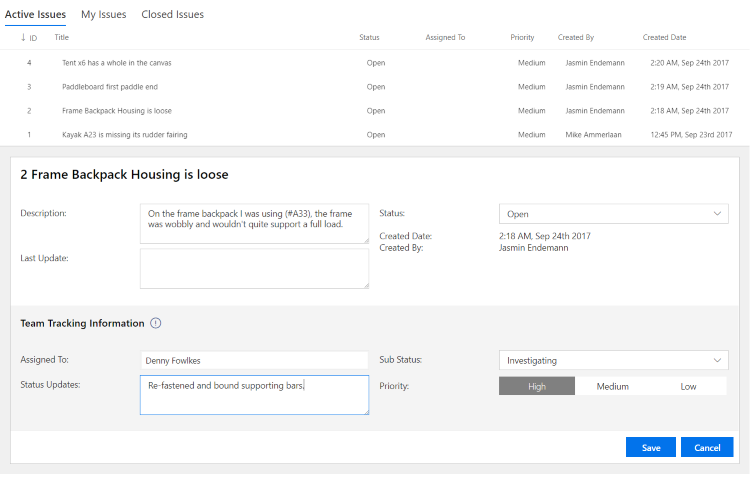

## Change Request web parts



The Change Request management web parts provide a simple tracking tool for change requests for your team.  A change request could serve as the foundation for a wide range of processes, from website issue tracking to equipment repair and beyond.  The Change Request management tool is customizable so that you can tailor the parts to your scenario.

There are two web parts included with Change Request Management:

	* A "My Change Requests" web part is a submission tool for users across your organization to submit new change requests.
	* A "Change Requests Management" web part lets a triage time view all of the inbound requests, assign them to team mates, and otherwise discuss them.

### Installation

When you add the web part for the first time, a user will need to create the backing lists within the site that support storage of Change Request entries.  A user with list creation permissions within the site will need to click the "Create Lists" button that shows up within the web part.

### Data

Behind the scenes, the Change Request Management part uses two separate lists.  The Change Request list stores items as they are opened by users.  A separate Change Request Discussions list contains the discussion items and assignments for every Change Request item.  With this, you can independently secure the Discussion items to just your team, to keep private conversations about an item separate from the core item itself. 


The Change Request Management web part provides the ability for the Change Request Triage team to address and manage change requests.

The My Change Requests web part allows you to submit change requests.

The Change Request web parts rely on the CommunityAppsLibrary NPM package which provides common functions used to set up and configure the SharePoint lists the web parts use.

### Building the code

```bash
git clone the repo
npm i
npm i -g gulp
gulp
```

This package produces the following:

* lib/* - intermediate-stage commonjs build artifacts
* dist/* - the bundled script, along with other resources
* deploy/* - all resources which should be uploaded to a CDN.

### Build options

gulp clean
gulp serve
gulp bundle
gulp package-solution

