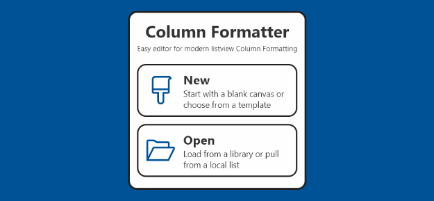

# Column Formatter

Easy editor for modern listview Column Formatting

## Summary

Modern listviews support the addition of [custom formatting](https://docs.microsoft.com/en-us/sharepoint/dev/declarative-customization/column-formatting) for most field types. This is an awesome feature designed to make custom formatting simpler and less administratively difficult than packaged solutions. Unfortunately, the tooling is still very minimal.

**Column Formatter has been designed to give the full power of VS Code editing while providing easy to use templates and wizards all within the browser!** The goal is to make writing and applying Column Formatting easier and quicker for both developers and end users.

Column Formatter is a client-side webpart for use within Office 365.

**Please see the [full documentation](./docs/documentation/docs/index.md) to get started!**

- [Setup & Configuration](./docs/documentation/docs/setup.md)
- [Getting Started](./docs/documentation/docs/getting-started.md)
- [Using the Editor](./docs/documentation/docs/editor/index.md)
- [Wizards & Templates](./docs/documentation/docs/wizards/index.md)
- [About](./docs/documentation/docs/about/index.md)
- [License](./docs/documentation/docs/about/license.md)

## Used SharePoint Framework Version 

## Applies to

* [SharePoint Framework](https://dev.office.com/sharepoint)
* [Office 365](https://dev.office.com/sharepoint/docs/spfx/set-up-your-development-environment)

## Prerequisites
 
* Office 365

## Solution

Solution|Author(s)
--------|---------
Column Formatter | Chris Kent ([thechriskent.com](https://thechriskent.com), [@thechriskent](https://twitter.com/thechriskent))

## Version history

Version|Date|Comments
-------|----|--------
1.2|March 22, 2018|See [Changelog](./CHANGELOG.md#120---2018-03-22) for details
1.1|January 8, 2018|See [Changelog](./CHANGELOG.md#110---2018-01-08) for details
1.0|December 12, 2017|Initial release

## Disclaimer
**THIS CODE IS PROVIDED *AS IS* WITHOUT WARRANTY OF ANY KIND, EITHER EXPRESS OR IMPLIED, INCLUDING ANY IMPLIED WARRANTIES OF FITNESS FOR A PARTICULAR PURPOSE, MERCHANTABILITY, OR NON-INFRINGEMENT.**

---

## Minimal Path to Awesome

- Clone this repository
- Move to right solution folder 
- in the command line run:
  - `npm install`
  - `gulp serve`

> Additional details can be found in the [Minimal Path to Awesome](docs/projectguides/mpa.md) project guide.

## Features

Full information about how to install and use Column Formatter can be found in the [Full Documentation](./docs/documentation/docs/index.md).

Column Formatter was created using SPFx, react, redux, the monaco editor, and several other technologies.

If you'd like to contribute (yes, please!), please see the [project guides](./docs/projectguides/index.md).

