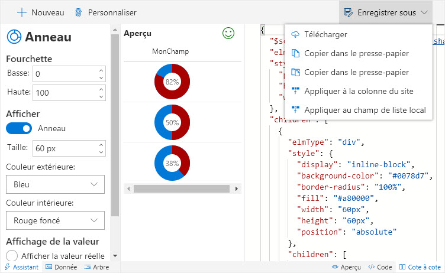
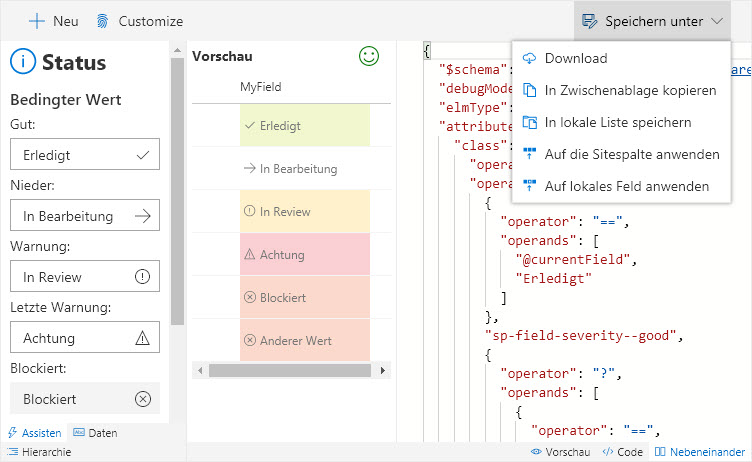

# Localization

Column Formatter supports English, French, and German. Your localization settings should auto detect your language and change the interface accordingly.

There are cases where text length varies greatly from language to language. We have attempted to address these through localized styles but please submit any areas where we've fallen short as issues so that we can get it corrected.

Interested in having Column Formatter in your language? Why not translate it? It's actually not as hard as you might think and we're happy to walk you through it. Just reach out through the [issues list](https://github.com/SharePoint/sp-dev-solutions/issues) or [Twitter](https://twitter.com/thechriskent). Thanks!

## French (fr-fr)

> Translation provided by [PooLP](http://www.poolp.net/)

## German (de-de)

> Translation provided by [Thomas Goelles](http://www.modernworkplacesolutions.rocks/)

