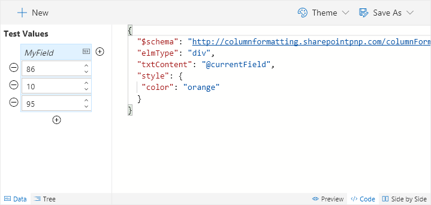
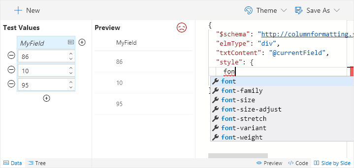
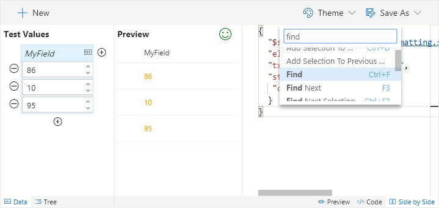

# Editing Code

The included editor is a custom build of the Monaco Editor which is a derivative of Visual Studio Code. There are a lot of really powerful features that make writing your Column Formats quick and easy.

## Intellisense and format correction
As you type, suggested keywords will display to help guide you in writing your code.

Syntax errors will be highlighted as they are detected. Hover over either the frowny face in the preview pane or the red squiggly in the editor to get a hint for what the problem may be.

### Command Palette

You also have access to the command palette (press F1) that will provide you with many advanced features.

## Additional Features

There are a lot of other great features, here are a few highlights:

 - Code Folding
 - Theme Selection
 - Auto Trim Whitespace
 - Find & Replace
 - Hot Keys
 - Verbose Syntax
    - Richer suggestions than in standard VS Code for Column Formatting
 - As you type validation
 - As you type **live** preview
 - Go to line
 - and more!

## Related Items

- **[Properties](./properties.md)** - Overview of the property pane options
- **[Using the Editor](./index.md)** - Overview of the editing interface
- **[Save Options](./saving.md)** - Overview of the various save options
- **[Sample Data](./sample-data.md)** - Overview of how to customize your sample data
- **[Elements Tree](./tree.md)** - Overview of what the Tree view provides

> Go [Home](../index.md)

