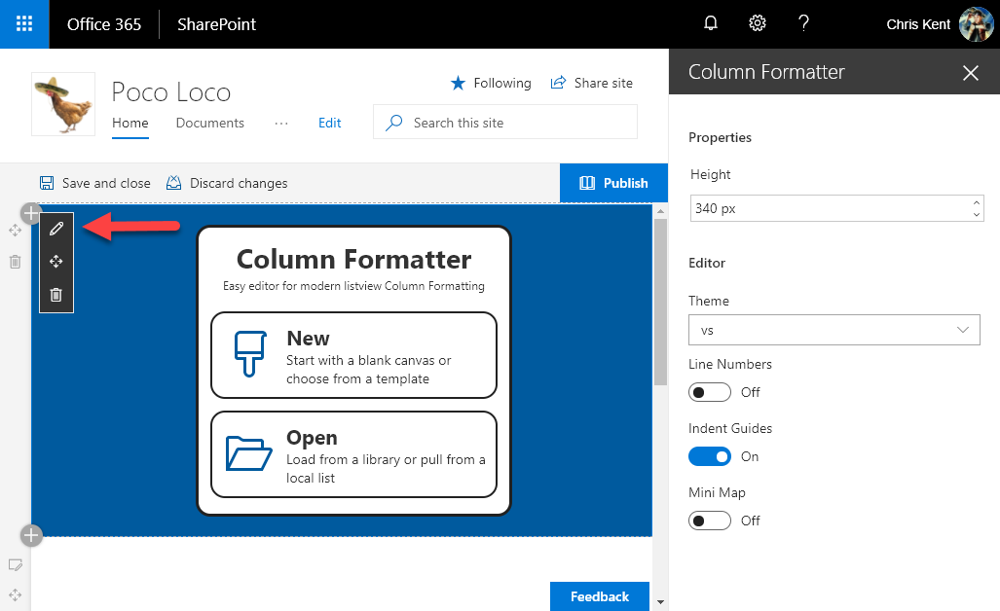
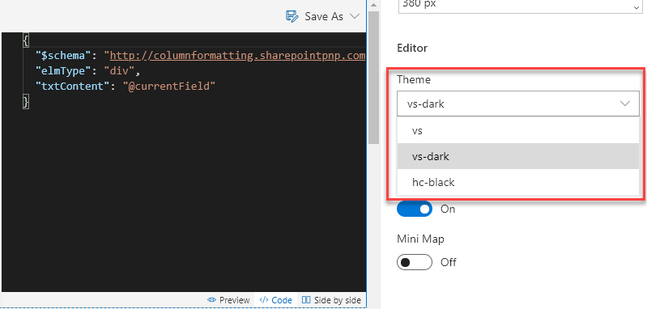
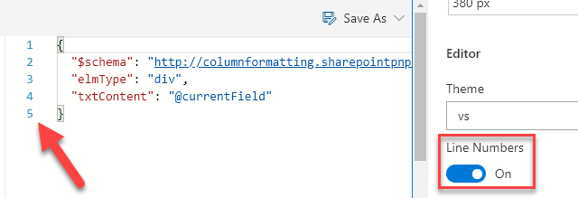
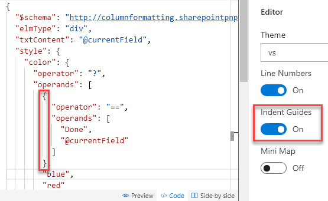
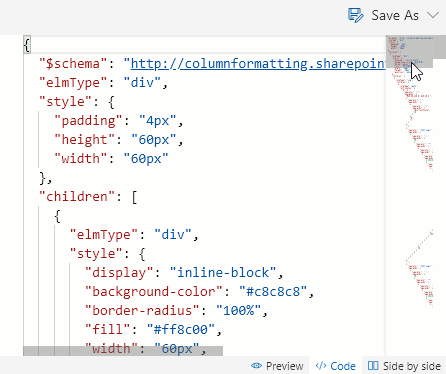

# Properties

There are several properties available in the property pane to help customize the editing experience. To open the property pane, click the pencil icon while the page is in Edit mode and the property pane will open on the right side of the page.

## Height

By default, Column Formatter attempts to minimize it's height requirements to be sensitive to other page contents. However, you can adjust this to be taller (this makes editing much easier) by adjusting the Height property.

This works really nicely with [Full-Width sections](../setup.md) where Column Formatter is the only webpart on the page.

## Theme

The theme controls the colors used in the editor.

## Line Numbers

You can optionally enable line numbers in the editor. This is especially helpful when working with longer formats.

## Indent Guides

You can optionally disable the indent guides shown in the editor. However, these make it a lot easier to see where sections line up.

## Mini Map

You can optionally enable the Mini Map navigation/preview in the editor. This is especially helpful for quickly scrolling through long formats.

## Related Items

- **[Using the Editor](./index.md)** - Overview of the editing interface
- **[Save Options](./saving.md)** - Overview of the various save options
- **[Sample Data](./sample-data.md)** - Overview of how to customize your sample data
- **[Elements Tree](./tree.md)** - Overview of what the Tree view provides

> Go [Home](../index.md)

