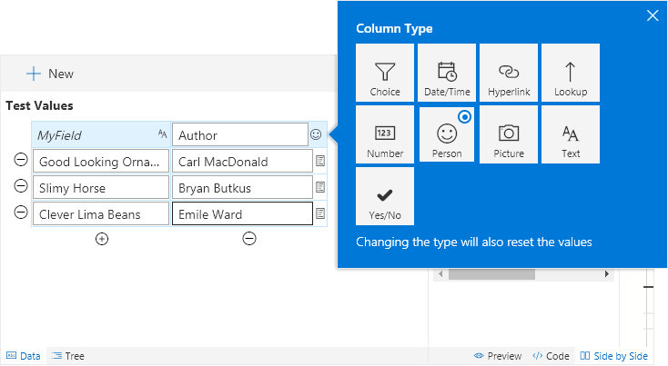

# Sample Data

The data pane lets you change the data used for the live preview and ensures you are testing all scenarios to get exactly the behavior you expect. The values are randomly generated, but you can easily change any of them.

You can add or remove rows as necessary (as long as you have at least one). You can also add additional columns. Column Formatting will only be applied to the first field. Secondary fields are available since you can reference other field values within the same row. See the **# Trending** template for an example.

You can change the additional columns by clicking the type icon in the data pane header row for the column.

You can edit sub properties (such as a person's email address or a lookup id) by clicking the subproperties icon next to each row value. Not all field types have subproperties.

## Related Items

- **[Using the Editor](./index.md)** - Overview of the editing interface
- **[Properties](./properties.md)** - Overview of the property pane options
- **[Editing Code](./code-editor.md)** - Details of the Code editor and features
- **[Save Options](./saving.md)** - Overview of the various save options
- **[Elements Tree](./tree.md)** - Overview of what the Tree view provides

> Go [Home](../index.md)

