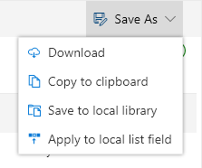
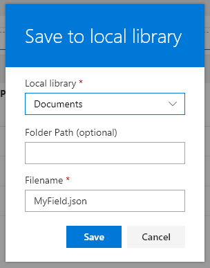
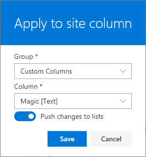
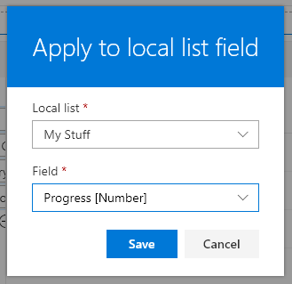

# Save Options

You have several options available to save your work. Select the **Save-As** menu in the top-right to see your options.

### Download
Choose **Download** to have a json file generated and saved to your downloads folder. This makes it easy to check into code repositories or edit elsewhere.

### Copy to clipboard
Choose **Copy to clipboard** to have the json code available to paste. This can be used to paste directly in a listview dialog format pane. However, Apply to list is even easier.

### Save to a local library
Choose **Save to a local library** to save the json file to a document library on the site. Choose your library from the list of options, provide a folder path if desired, and change the filename as needed then press **Save**.

### Apply to site column
Choose **Apply to site column** to save your Column Format into a site column that can then be used in multiple lists. Choose the site column group from the list of groups, then choose the desired field.

Toggle the _Push changes to lists_ option to update all lists where the chosen site column is in use. Disable this option to only update the site column definition itself. Generally, this is a very quick operation, but if your site column is used in many lists this could take some time to complete.

### Apply to local list field
Choose **Apply to local list field** to save your Column Format directly to a list field (have it applied in the modern listview). Choose your list from the list of options, then choose the desired field, then press Save.

Lookup and Person fields can only be saved to Lookup and Person fields respectively (since they rely on subproperties for their base display). Other field types may not always be compatible with your formatting depending on what you're doing so use your best judgement (for instance, if you are using the Date() function on then @currentField, you'll need to ensure you're only applying your format to a DateTime field).

## Related Items

- **[Using the Editor](./index.md)** - Overview of the editing interface
- **[Properties](./properties.md)** - Overview of the property pane options
- **[Editing Code](./code-editor.md)** - Details of the Code editor and features
- **[Sample Data](./sample-data.md)** - Overview of how to customize your sample data
- **[Elements Tree](./tree.md)** - Overview of what the Tree view provides

> Go [Home](../index.md)

