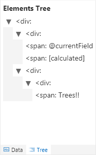

# Elements Tree

The tree pane is provided as a way to visualize the hierarchy of your html elements. The elements are shown with their children nested underneath. Additionally, a guess at what the txtContent will be for an element is made and displayed to make it easy to find your nodes in a complex format structure.

## Related Items

- **[Using the Editor](./index.md)** - Overview of the editing interface
- **[Properties](./properties.md)** - Overview of the property pane options
- **[Editing Code](./code-editor.md)** - Details of the Code editor and features
- **[Save Options](./saving.md)** - Overview of the various save options
- **[Sample Data](./sample-data.md)** - Overview of how to customize your sample data

> Go [Home](../index.md)

