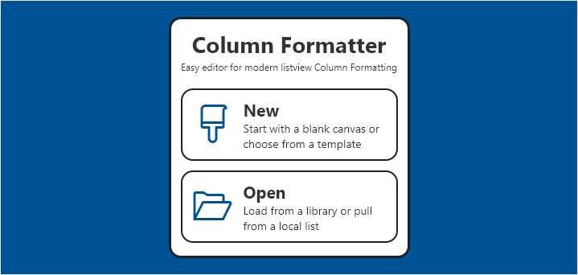
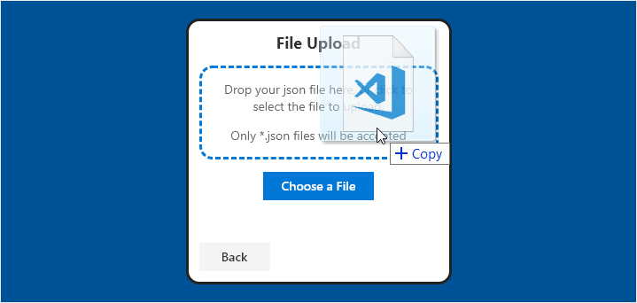

# Getting Started

When you first open Column Formatter you are given the option to start a **New** project (either from scratch as a blank canvas or using one of the provided templates / wizards) or you can continue from an existing project by choosing **Open**.

### Starting a new project

Choose **New** on the welcome screen.

The first thing you'll need to do is select the type of column you are targeting in the **Column Type** dropdown. This will filter the available templates and customize the starting code and sample data as appropriate.

You can either start from a template (see the Templates section below) or start from scratch (blank canvas).

### Opening an existing project

Choose **Open** on the welcome screen.

You can load an existing Column Formatting json file from a document library or by uploading a file. You can also load the Column Formatting values from an existing local list field.

#### Loading from a local list

Choose **Load from a local list** and click **Next**.

Choose the list and then the corresponding field. Only visible lists are shown (Hidden = false) and only fields that can accept column formatting are shown. Click **OK** to load the formatting from your list field.

#### Uploading a file from your computer

Choose **Load from a file**, pick the **Column Type**, choose **Upload a file** and click **Next**.

You can either drag a \*.json file directly on to the window and release in the dashed rectange, or click the button to browse for the file.

## Up Next

- **[Using the Editor](./editor/index.md)** - Overview of the editing interface
- **[Wizards & Templates](./wizards/index.md)** - Details on the available Wizards & Templates

> Go [Home](./index.md)

