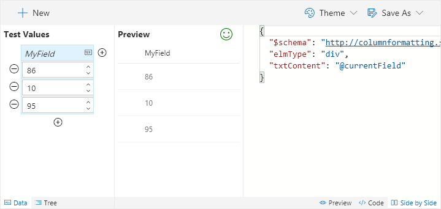

# Easy editor for modern listview Column Formatting

Column Formatter is a client-side webpart that makes creating and applying column formatting in O365 easy and approachable. Column Formatter is advanced enough that you can use it to write "code", but it's simple enough that anyone can use it without having to write a single line!

## Introduction

Modern listviews support the addition of [custom formatting](https://docs.microsoft.com/en-us/sharepoint/dev/declarative-customization/column-formatting) for most field types. This is an awesome feature designed to make custom formatting simpler and less administratively difficult than packaged solutions.

Unfortunately, the tooling is still very minimal. Users are given a simple text field within a panel to paste the **JSON code** and a preview and save button. The panel is clearly not designed to enable editing meaning that not only do users have to write code, they have to find someplace to do it.

The official suggestion is to use VS Code which will provide some auto completion using the standard schema. However, there are several downsides to this approach:
 - Requires a desktop client to be installed
   - Non developers that may have hung on past the initial mention of JSON are mostly gone by now
 - Once you do get VS Code up and running and begin editing your JSON:
   - The intellisense and syntax checking are *very* limited (using the default schema)
   - There is no preview of your format (unless you copy and paste in the listview panel)
   - While some examples exist, there's still a huge learning curve

### Why Column Formatter
Column Formatter has been designed to give the full power of VS Code editing while providing easy to use templates and wizards all within the browser! The goal is to make writing and applying Column Formatting easier and quicker for both developers and end users.

Column Formatter has a ton of great features, but where it really shines is the ability to **integrate it directly on your site** (it's a client-side webpart). This brings the tooling to where users are and enables cool features like loading and saving directly to the list fields you want to target.

Not only do users have access to many of the features they would have had to install VS Code for, the **schema validation (intellisense and syntax checking)** is based on a [verbose schema](https://thechriskent.com/2017/11/22/a-verbose-schema-for-sharepoint-column-formatting-proposal/) that provides far more assistance than the default.

Even more importantly, through the use of **wizards** it's possible that users won't have to touch or even see code at all to be able to take advantage of the powerful column formatting features of Office 365 modern listviews!

## Documentation Table of Contents

- [Setup & Configuration](./setup.md)
- [Getting Started](./getting-started.md)
- [Using the Editor](./editor/index.md)
  - [Properties](./editor/properties.md)
  - [Editing Code](./editor/code-editor.md)
  - [Save Options](./editor/saving.md)
  - [Sample Data](./editor/sample-data.md)
  - [Elements Tree](./editor/tree.md)
- [Wizards](./wizards/index.md)
  - [# Trending](./wizards/number-trending.md)
  - [Action Link](./wizards/action-link.md)
  - [Checkboxes](./wizards/checkboxes.md)
  - [Current User](./wizards/current-user.md)
  - [Data Bars](./wizards/data-bars.md)
  - [Donut](./wizards/donut.md)
  - [Mail To](./wizards/mail-to.md)
  - [Overdue](./wizards/overdue.md)
  - [Overdue Task](./wizards/overdue-task.md)
  - [Round Image](./wizards/round-image.md)
  - [Severity](./wizards/severity.md)
  - [Start Flow](./wizards/start-flow.md)
  - [Tiny Map](./wizards/tiny-map.md)
  - [Twitter Pic](./wizards/twitter-pic.md)
- [About](./about/index.md)
  - [Localization](./about/localization.md)
  - [License](./about/license.md)
- [Project Guidance](../../projectguides/index.md)
  - [Minimal Path to Awesome](../../projectguides/mpa.md)
  - [Contribution Guidelines](../../projectguides/contributing.md)
  - [Submitting a Pull Request](../../projectguides/submitting-pr.md)

## Getting Started

Installing Column Formatter is just a matter of uploading a package to your app catalog and adding it to a page in your site. You can find additional details in the [Setup & Configuration](./setup.md) section.

Using Column Formatter isn't too hard, but you can details on specific features in the [Getting Started](./getting-started.md) section.

