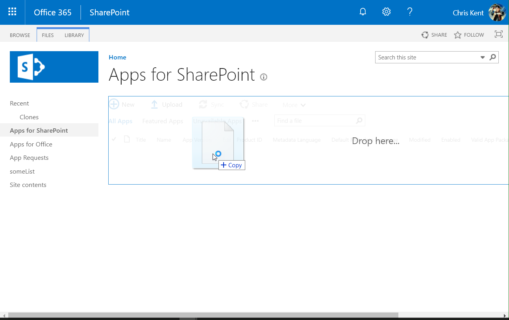
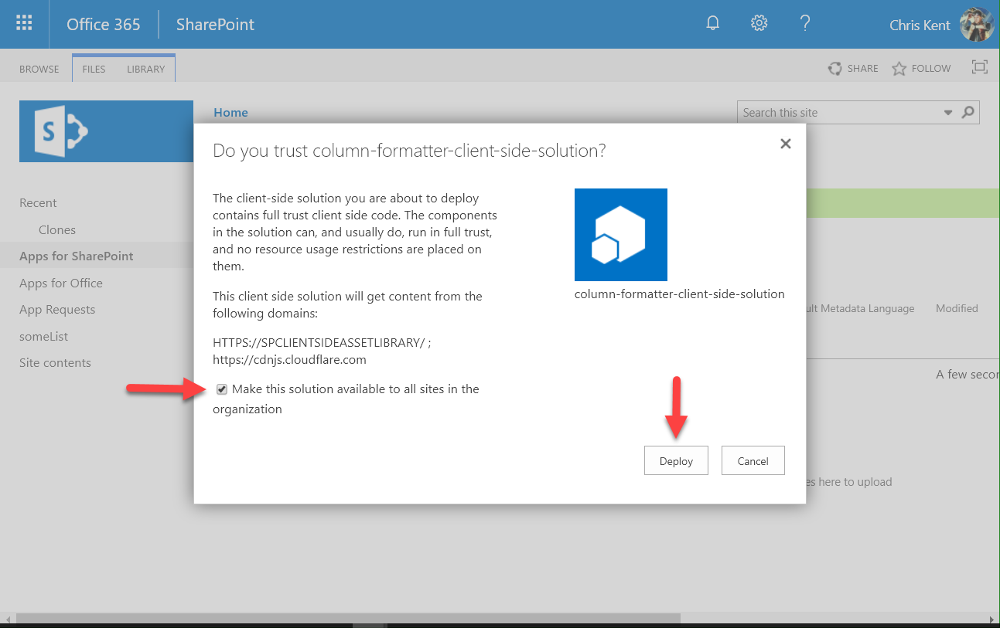
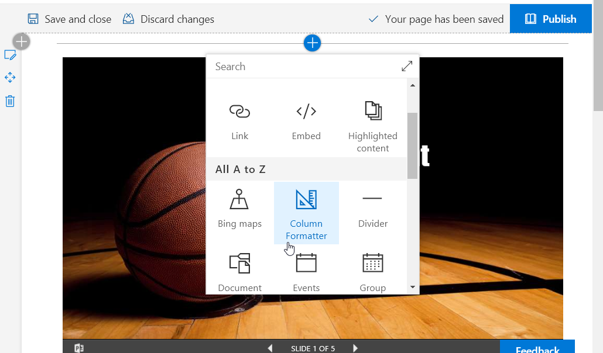
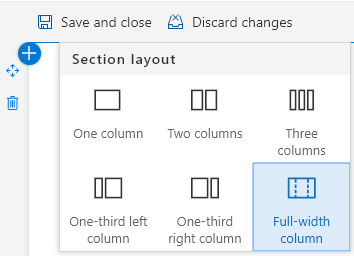
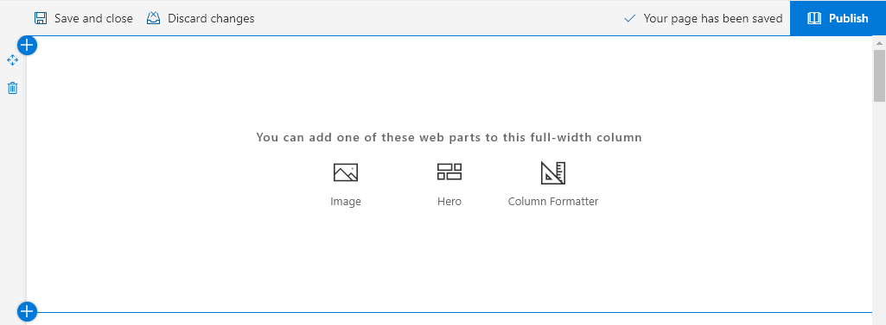
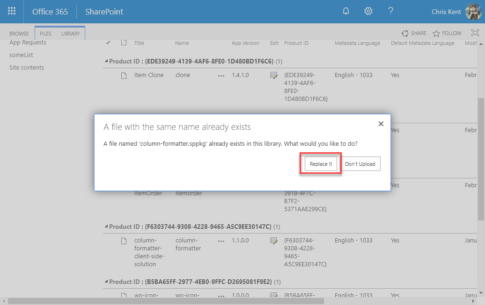
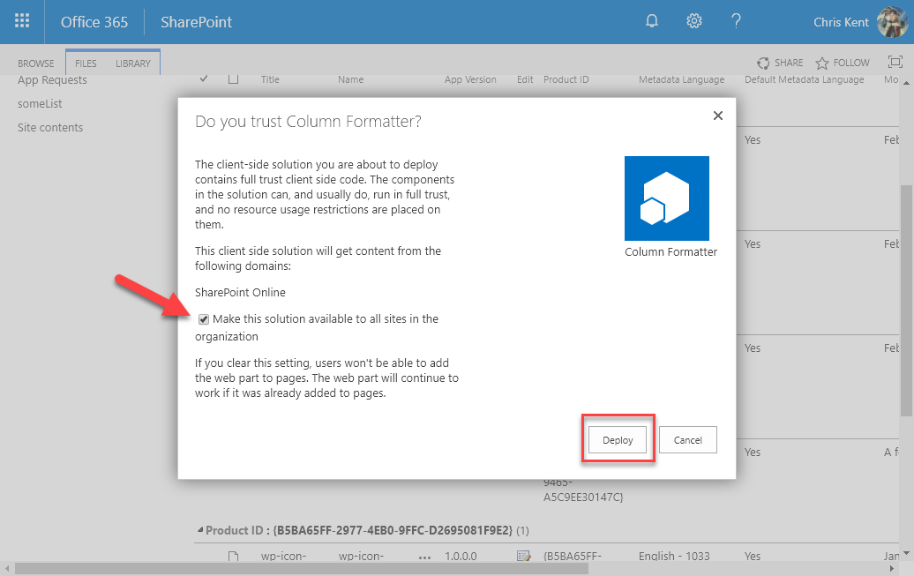

# Setup & Configuration

The deployment & configuration for Column Formatter is no different than most client-side webparts. While you can certainly build it yourself, the app package is also located [here](../../../assets/column-formatter.sppkg).

The whole process takes 2-5 minutes.

## Deployment

To get started, you'll need to upload the web part package to your app (or site) catalog. This will require administrator rights so you may have to hand it off to someone in IT for these steps.

1. Upload or drag and drop the **[package](../../../assets/column-formatter.sppkg)** to the catalog:

2. The Trust Confirmation dialog will appear. Depending on how you've [setup/enabled the Public CDN](https://docs.microsoft.com/en-us/sharepoint/dev/spfx/web-parts/get-started/hosting-webpart-from-office-365-cdn#enable-cdn-in-your-office-365-tenant) in your environment, the listed domains may vary from those shown below.

> All code and assets are included in the app package and nothing is loaded from external domains

3. Check the box to **Make this solution available to all sites in the organization** (this will allow any site to add it to a page - leave this unchecked if you only want to add it to specific sites).
4. Click **Deploy**:

> Additional details and examples of this process can be found [here](https://docs.microsoft.com/en-us/sharepoint/dev/spfx/web-parts/get-started/serve-your-web-part-in-a-sharepoint-page#deploy-the-helloworld-package-to-app-catalog).

## Adding it to a Site

You can add Custom Formatter to a page (classic or modern) just as you would any other webpart.

>Note -If tenant deployment wasn't enabled, then the app will have to be added to the site like any other app from the Site Contents page.

### Full-Width Sections

Column Formatter can be added to any page, but adding it to a full-width section allows you to get the most real estate possible.

You can add a full-width column by editing the section layout and choosing Full-width column.

Next, select Column Formatter from the full-width webpart choices.

## Configuration

There are several [properties available in the property pane](./editor/properties.md) that can be adjusted at any time.

## Updating Column Formatter

If you've previously deployed Column Formatter but want all the new stuff - Good News! Column Formatter is super easy to update.

Just like the initial deployment you'll need to upload the web part package to your app (or site) catalog. This will require administrator rights so you may have to hand it off to someone in IT for these steps.

1. Upload or drag and drop the **[package](../../../assets/column-formatter.sppkg)** to the catalog:
2. You will prompted to replace the existing solution, click **Replace it**:

2. The Trust Confirmation dialog will appear. Depending on how you've [setup/enabled the Public CDN](https://docs.microsoft.com/en-us/sharepoint/dev/spfx/web-parts/get-started/hosting-webpart-from-office-365-cdn#enable-cdn-in-your-office-365-tenant) in your environment, the listed domains may vary from those shown below.

> All code and assets are included in the app package and nothing is loaded from external domains

3. Check the box to **Make this solution available to all sites in the organization** (this will allow any site to add it to a page - leave this unchecked if you only want to add it to specific sites).
4. Click **Deploy**:

## Next Steps

- [Getting Started](./getting-started.md)
- [Properties](./editor/properties.md)

