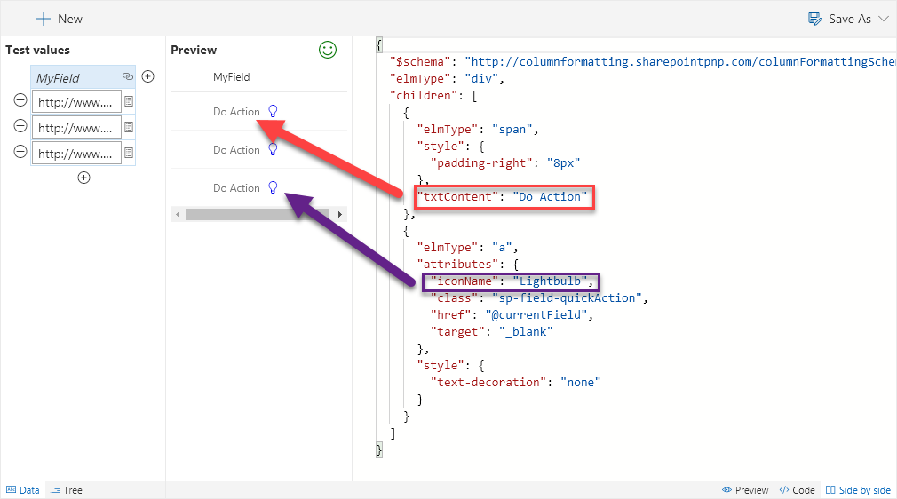

# Action Link

Adds a Quick Action icon to a link.

## How this template works

The Action Link template takes advantage the [sp-field-quickAction class](https://docs.microsoft.com/en-us/sharepoint/dev/declarative-customization/column-formatting#predefined-classes) to display an icon Button to open your link.

You can easily customize the text by changing the value of the `txtContent` field or change the icon shown by changing the `iconName` field. You can use [predefined icons from Office UI Fabric](https://dev.office.com/fabric#/styles/icons).

## Supported column types
- Hyperlink

## Icon

> [Wizards](./index.md)

> Go [Home](../index.md)

