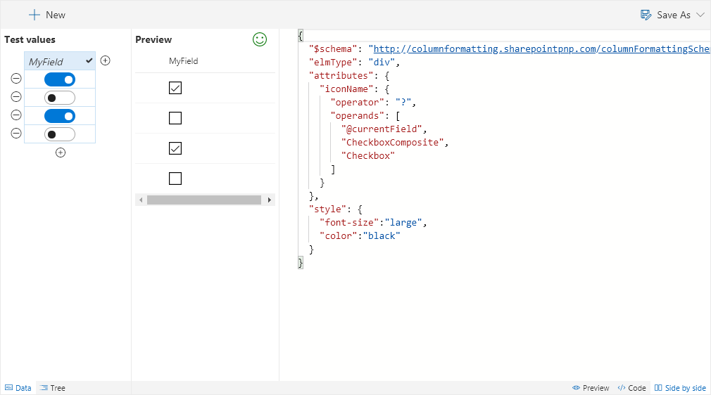

# Checkboxes

Displays Yes/No fields as checkboxes.

## How this template works

This template uses the value of the current field to show the `CheckboxComposite` icon when the value is `Yes` (true) and the `Checkbox` icon when the value is `No` (false). You can easily switch these icons to different [predefined icons from Office UI Fabric](https://dev.office.com/fabric#/styles/icons).

## Supported column types
- Yes/No

## Icon

> [Wizards](./index.md)

> Go [Home](../index.md)

