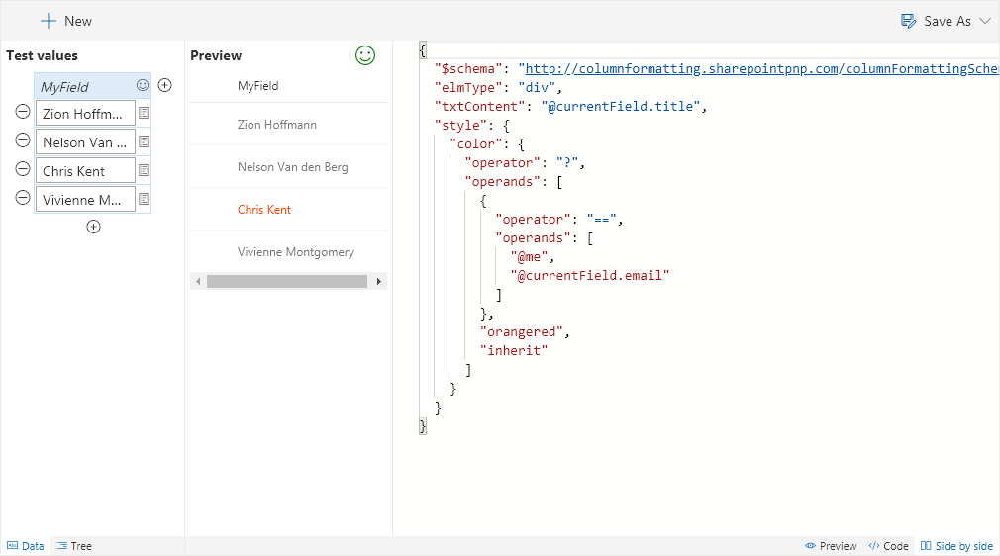

# Current User

Highlights the current user.

## How this template works

This template uses the [`@me`](https://docs.microsoft.com/en-us/sharepoint/dev/declarative-customization/column-formatting#me) keyword to check if the person field is the current user and shows that person using a different color. This is a dynamic check that will always highlight the user using the list (not the creater of the format). This template could easily be extended to apply different/additional styles or icons as desired by simply copying the same operator/operand logic for other fields.

> This template is also available as a standalone sample: [person-currentuser-format](https://github.com/SharePoint/sp-dev-column-formatting/tree/master/samples/person-currentuser-format)

## Supported column types
- Person

## Icon

> [Wizards](./index.md)

> Go [Home](../index.md)

