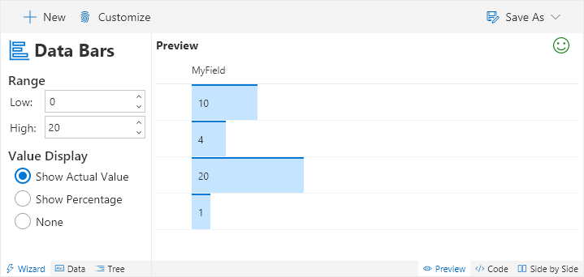
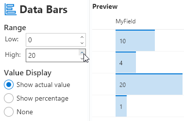
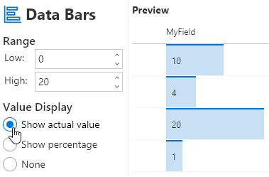

# Data Bars

Adds horizontal bars to the field to visually express the value by length.

## How to use this wizard

This wizard takes advantage of the special column formatting class [`sp-field-dataBars`](https://docs.microsoft.com/en-us/sharepoint/dev/declarative-customization/column-formatting#predefined-classes) to create a data bar visualization of the current value. There are a number of options available to customize this for your column.

### Range

By default the range is setup to show the percentage between 0 and 20 but this can be adjusted as needed. For instance, setting it between 0 and 1 will allow it to work perfectly with percentage fields.

As you adjust the range you'll see the scaling of the bars will adjust automatically. You can switch to the Data tab to select values that more closely match your test cases.

### Value Display

You can customize your visualization further by adjusting how the value is displayed over the data bar:

- **Actual Value**: This is just the value directly from the list item
- **Percentage**: This is the calculated percentage based on the item with your range, it corresponds to the data bar width
- **None**: No value is shown, you let the data bar do the talking

> This wizard is adapted from the [number-data-bar](https://github.com/SharePoint/sp-dev-column-formatting/tree/master/samples/number-data-bar) sample

## Supported column types
- Number

## Icon

> [Wizards](./index.md)

> Go [Home](../index.md)

