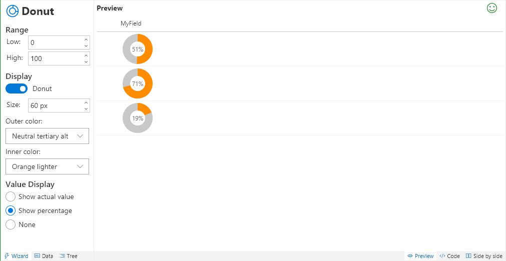
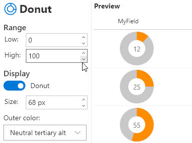
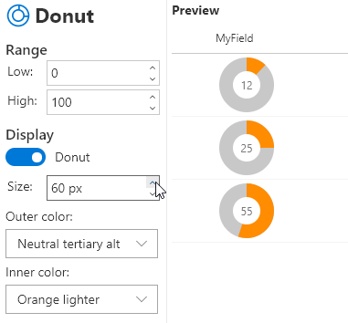
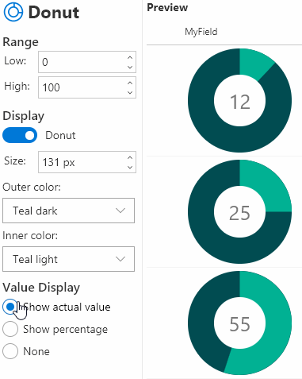

# Donut

Shows values using a donut or pie chart.

## How to use this wizard

This wizard allows easy to customize donut or pie chart visualizations drawn using dynamic SVG images.

### Range

By default the range is setup to show the percentage between 0 and 100 but this can be adjusted as needed. For instance, setting it between 0 and 1 will allow it to work perfectly with percentage fields.

As you adjust the range you'll see the scaling of the chart will adjust automatically. You can switch to the Data tab to select values that more closely match your test cases.

### Display

You adjust size, colors, and toggle between Donut and Pie charts. Pie charts also have the option of changing the text color (when the value is displayed).

### Value Display

You can customize your visualization further by adjusting how the value is displayed over the chart:

- **Actual Value**: This is just the value directly from the list item
- **Percentage**: This is the calculated percentage based on the item with your range
- **None**: No value is shown, you let the chart do the talking

> This wizard is adapted from the [number-piechart](https://github.com/SharePoint/sp-dev-column-formatting/tree/master/samples/number-piechart) sample by Aaron Miao.

## Supported column types
- Number

## Icon

> [Wizards](./index.md)

> Go [Home](../index.md)

