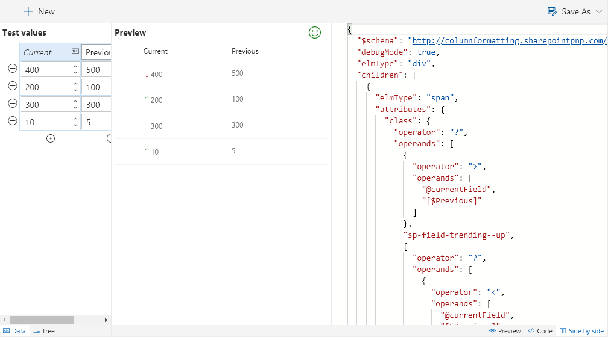

# Wizards & Templates

Both wizards and templates can be choosen when starting a new project. A template provides started code and/or sample data to help give you a head start. Wizards go even further by providing a custom interface to help you create complex logic without having to edit code.

The **# Trending** template:

The **Data Bars** wizard:

When in a wizard, the editor is set to be read only to prevent you from making mistakes. However, once you've got the values configured how you want, you can break out of the wizard by pressing the **Customize** button. This will remove the wizard pane but give you full access to the code.

> Go [Home](../index.md)

