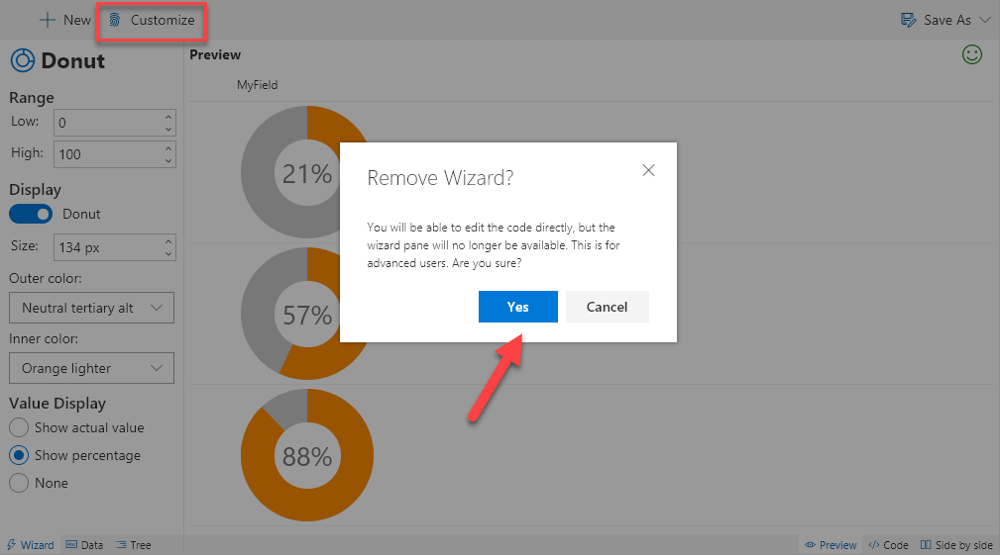

# Wizards & Templates

When creating a new format you can start from scratch or choose a wizard or template.

A template provides starter code and/or sample data to help give you a head start. Wizards go even further by providing a custom interface to help you create complex logic without having to edit code.

## Available wizards/templates and column coverage

|Name|Type|Text|Number|Choice|Person|Yes/No|Link|Picture|Date|Lookup|
|---|:---:|:---:|:---:|:---:|:---:|:---:|:---:|:---:|:---:|:---:|
|**[# Trending](./number-trending.md)**|Template||:heavy_check_mark:|
|**[Action Link](./action-link.md)**|Template||||||:heavy_check_mark:|
|**[Checkboxes](./checkboxes.md)**|Template|||||:heavy_check_mark:|
|**[Current User](./current-user.md)**|Template||||:heavy_check_mark:|
|**[Data Bars](./data-bars.md)**|Wizard||:heavy_check_mark:||||||||
|**[Donut](./donut.md)**|Wizard||:heavy_check_mark:||||||||
|**[Mail To](./mail-to.md)**|Wizard||||:heavy_check_mark:||:heavy_check_mark:|
|**[Overdue](./overdue.md)**|Template||||||||:heavy_check_mark:|
|**[Overdue Task](./overdue-task.md)**|Template||||||||:heavy_check_mark:|
|**[Round Image](./round-image.md)**|Template||||:heavy_check_mark:|||:heavy_check_mark:|
|**[Severity](./severity.md)**|Wizard|:heavy_check_mark:||:heavy_check_mark:||||||:heavy_check_mark:|
|**[Start Flow](./start-flow.md)**|Wizard|:heavy_check_mark:|:heavy_check_mark:|:heavy_check_mark:|:heavy_check_mark:|:heavy_check_mark:|:heavy_check_mark:|:heavy_check_mark:|:heavy_check_mark:|:heavy_check_mark:|
|**[Tiny Map](./tiny-map.md)**|Template|:heavy_check_mark:||:heavy_check_mark:||||||:heavy_check_mark:|
|**[Twitter Pic](./twitter-pic.md)**|Wizard|:heavy_check_mark:||:heavy_check_mark:||||||:heavy_check_mark:|

## Customize

When in a wizard, the editor is set as read-only to prevent mistakes. However, once you've got the values configured how you want, you can break out of the wizard by pressing the **Customize** button. This will remove the wizard pane and give you full access to the code.

> Go [Home](../index.md)

