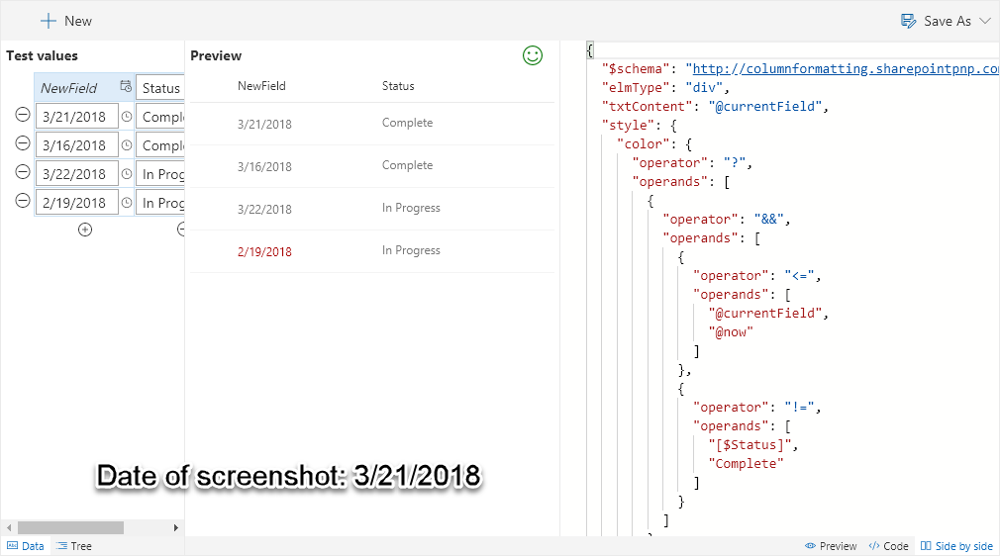

# Overdue Task

Colors the field red once the date is greater than today if the Status is not Complete.

## How this template works

This template uses the [`@now`](https://docs.microsoft.com/en-us/sharepoint/dev/declarative-customization/column-formatting#now) keyword to compare against the current field. If the value is greater than the current date and time AND the Status field is not marked as "Complete" then the color is changed to red.

This template could easily be extended to apply different/additional styles or icons as desired by simply copying the same operator/operand logic for other fields.

A simpler version of this template only uses the date field: [Overdue](./overdue-task.md)

## Supported column types
- DateTime

## Icon

> [Wizards](./index.md)

> Go [Home](../index.md)

