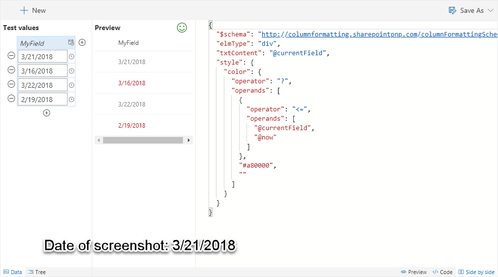

# Overdue

Colors the field red once the date is greater than today.

## How this template works

This template uses the [`@now`](https://docs.microsoft.com/en-us/sharepoint/dev/declarative-customization/column-formatting#now) keyword to compare against the current field. If the value is greater than the current date and time then the color is changed to red.

This template could easily be extended to apply different/additional styles or icons as desired by simply copying the same operator/operand logic for other fields.

A modified version of this template takes into account an additional field to determine if a date should be highlighted: [Overdue Task](./overdue-task.md)

> This template is adapted from the [date-range-format](https://github.com/SharePoint/sp-dev-column-formatting/tree/master/samples/date-range-format) sample

## Supported column types
- DateTime

## Icon

> [Wizards](./index.md)

> Go [Home](../index.md)

