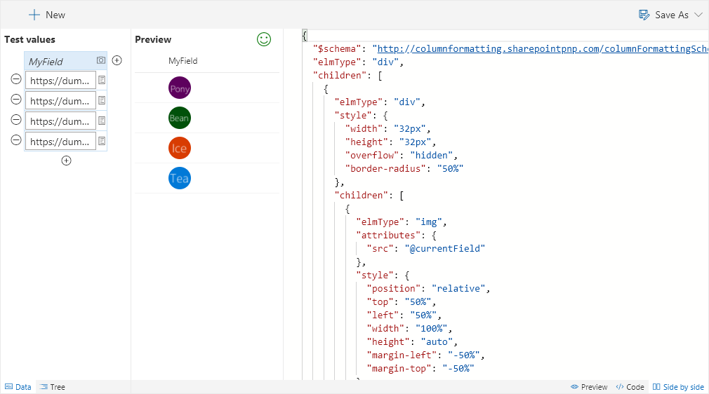

# Round Image

Displays the picture / user picture as a circle.

## How this template works

This template applies styles to a parent `div` element and a child `img` element to show an image in a circle. When a picture column is chosen, the image comes from the value of the field. When a user column is chosen, the image is the user's profile image.

The size can be easily adjusted by changing the default value of `32px` for both the `width` and `height` style attributes on the parent div. To get larger profile pictures you can change the `size=S` portion of the URL to use either `size=M` or `size=L`. See the table below for details on image size.

You can also adjust the `border-radius` value of the parent div to change it from a full circle (_50%_) to a rounded rectangle (_< 50%_).

For best results, images should be square (S & M user profile pictures always are).

### User Profile Picture sizes

|Key|Size|
|:---:|:---:|
|S|48x48|
|M|72x72|
|L|300x?*|

The L size profile pictures maintain the ratio of the original photo which means they are not guaranteed to be square. Neither are they guaranteed to be 300px wide. The maximum width will be 300px but if the original image was smaller than that, then it will be the original size. Even the placeholder image for the L size is only 250x150.

Overall, however, the L size shouldn't be used inside columns not only because the ratio is not guaranteed, but because the default column width won't allow you to take up that much space.

> Note: `@currentField.picture` can be used to retrieve a profile picture directly from a person column. However, size options are not available using that approach.

## Supported column types
- Person
- Picture

## Icon

> [Wizards](./index.md)

> Go [Home](../index.md)

