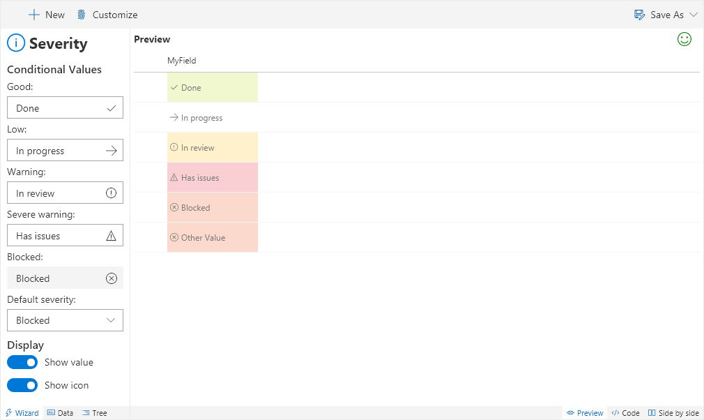

# Severity

Conditionally applies the severity styles based on the field's value.

## How to use this wizard

_Coming Soon_

## Supported column types
- Text
- Choice
- Lookup

## Icon

> [Wizards](./index.md)

> Go [Home](../index.md)

