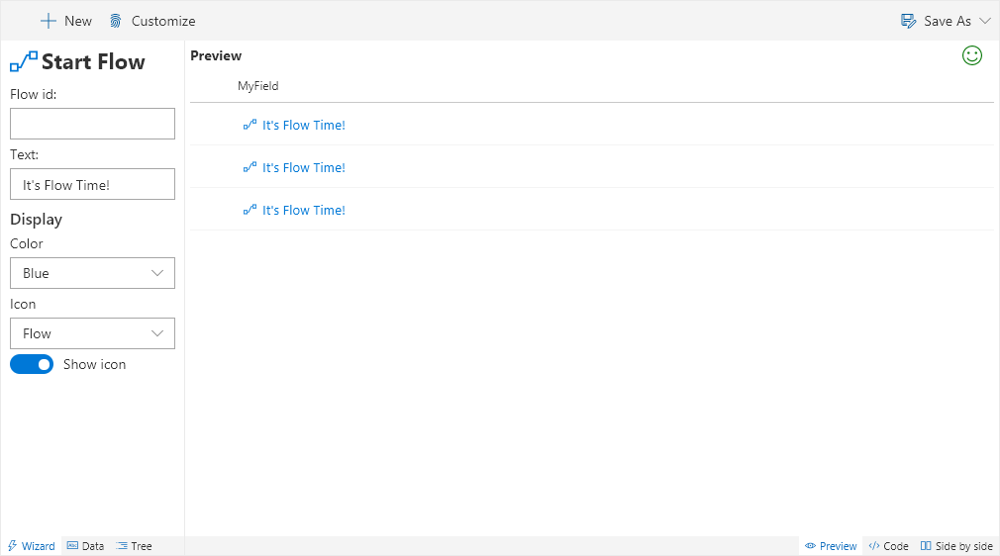
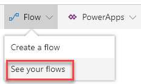
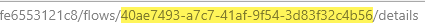
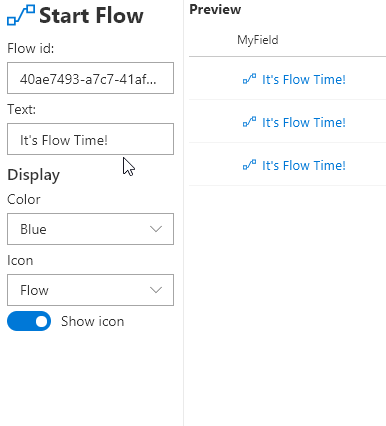

# Start Flow

Creates a button to easily launch a Flow for an item.

## How to use this wizard

_Coming Soon_

### Getting the Flow id

To launch a flow associated with your list, use the Flow dropdown and select _See your flows_:

In the new window, find the flow you are wanting to launch for the item and click it to go to the details page. In the URL, grab the GUID between _flows/_ and _/details_ at the very end:

Now paste that id in the Flow id box for the wizard and you're good to go!

> To launch a flow, it needs to start with the _SharePoint For a selected item_ trigger and be associated to your list/library.

### Customizing the display

You can change the text displayed to anything you like. If you'd like to use the current field's value then you can just type `@currentField` in the box (use `@currentField.title` for person columns and `@currentField.lookupValue` for lookup columns).

The _Color_ dropdown will provide you all the standard Office UI Fabric colors. If you want to provide a custom color, simply edit that property directly in the code.

You can also choose from all of the Office UI Fabric icons using the _Icon_ dropdown. You can even remove the icon altogether by toggling the _Show icon_ option.

> This template is based on the [generic-start-flow](https://github.com/SharePoint/sp-dev-column-formatting/tree/master/samples/generic-start-flow) sample by Yannick Borghmans.

## Supported column types
- All

## Icon

> [Wizards](./index.md)

> Go [Home](../index.md)

