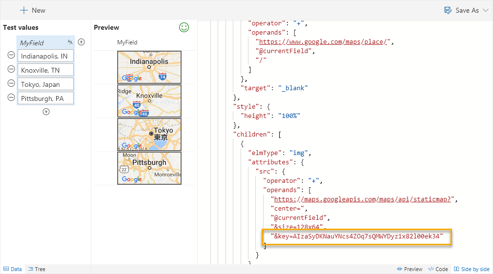

# Tiny Map

Displays a tiny map image for a location.

> Note: This wizard was originally called Mini Map but was renamed to avoid confusion with the [Mini Map feature of the editor](../editor/properties)

## How this template works

This template takes advantage of Google Maps' [staticmap API](https://developers.google.com/maps/documentation/static-maps/) which generates an image using a parameterized URL. The template only uses the most basic features ([location](https://developers.google.com/maps/documentation/static-maps/intro#Locations) & [image size](https://developers.google.com/maps/documentation/static-maps/intro#Imagesizes), but the API offers deep customization including:

- [Zoom Levels](https://developers.google.com/maps/documentation/static-maps/intro#Zoomlevels)
- [Scale Values](https://developers.google.com/maps/documentation/static-maps/intro#scale_values)
- [Map Types](https://developers.google.com/maps/documentation/static-maps/intro#MapTypes)
- [Custom Styling](https://developers.google.com/maps/documentation/static-maps/styling)
- [Pins (Markers)](https://developers.google.com/maps/documentation/static-maps/intro#Markers)
- [Paths](https://developers.google.com/maps/documentation/static-maps/intro#Paths)
- And more!

In this template we are just using the current field's value as the location, but you could easily make very advanced maps by combining multiple column values across your list item.

To add additional parameters, just continue to add operands in the + operation!

### API key

The key provided in the template (the ugly text after `&key`) should be changed to your own FREE API Key. This will ensure you don't receive errors from over usage of a shared key. Getting a key takes 2 minutes and is FREE: [Get API Key](https://developers.google.com/maps/documentation/static-maps/get-api-key)

>Note: Failure to switch the key to your own key leaves you open to future issues as other users use this key or if this key were to be revoked.

## Supported column types
- Text
- Choice
- Lookup

## Icon

> [Wizards](./index.md)

> Go [Home](../index.md)

