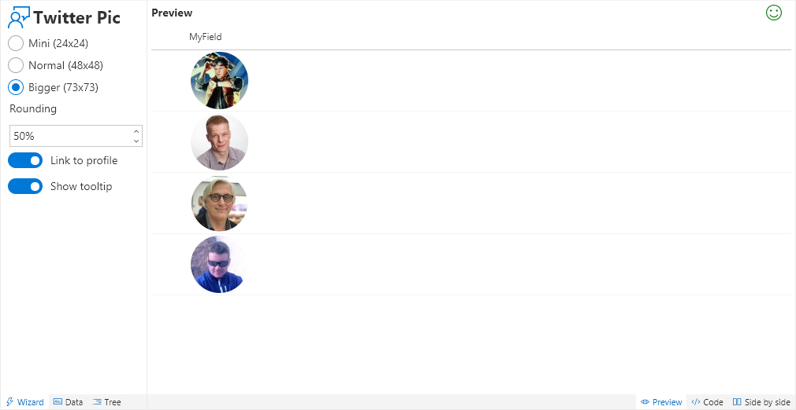
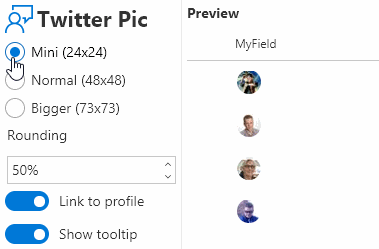

# Twitter Pic

Displays Twitter profile pictures from Twitter handles.

## How to use this wizard

This wizard provides a quick way to show Twitter profile pictures and enables some quick customization.

[Twitter profile pictures](https://developer.twitter.com/en/docs/accounts-and-users/user-profile-images-and-banners) come in 3 standard sizes:

|Name|Size|
|---|:---:|
|mini|24x24|
|normal|48x48|
|bigger|73x73|

> There's actually another "size", `original`, that returns the image using the original proportions as uploaded by the user. This doesn't work well for listviews since there is so much variation, but it is available if you customize the code and change the relevant part of the `src` url to `?size=original`.

By default, clicking the profile image will open a new window for the user's Twitter page. This can be disabled by toggling the _Link to profile_ option.

By default, the user's twitter handle is shown (with the @ added) as a tooltip when you hover over the profile image. This can be disabled by toggling the _Show tooltip_ option.

The field values are case insensitve and should be just the user's twitter handle with no @.

## Supported column types
- Text
- Choice
- Lookup

## Icon

> [Wizards](./index.md)

> Go [Home](../index.md)

