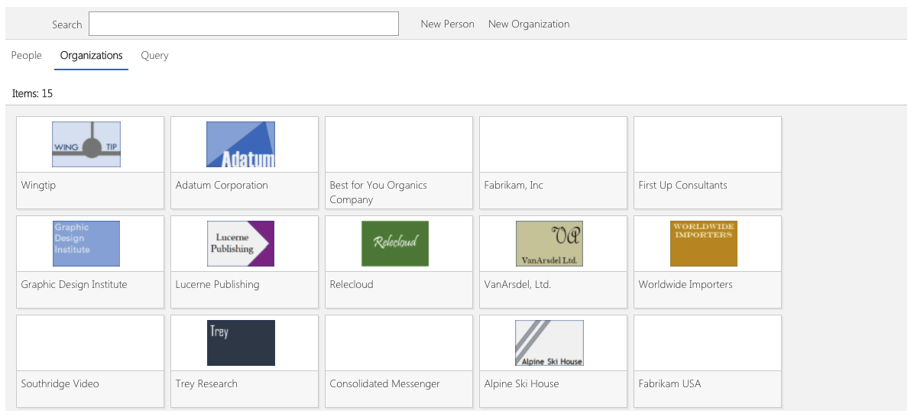

# Contact Management

## Summary
The Contact Management application provides simplified management of contacts and organizations.  It uses a Contacts list to store basic Contacts.  This Contact list is tied to a set of Organizations.  These Organizations become the locus of organizing tracking of the relationship of your organization to the related organization.

## Used SharePoint Framework Version 

## Applies to

* [SharePoint Framework](https://dev.office.com/sharepoint)
* [Office 365 tenant](https://dev.office.com/sharepoint/docs/spfx/set-up-your-development-environment)

## Prerequisites
 
None.

## Solution

Solution                     | Author                                     			|
---------------------------- | ---------------------------------------------------- |
ContactManagement            | Mike Ammerlaan (Microsoft) @mammerla                 |
ContactManagement            | Todd Baginski (Microsoft MVP, Canviz) @tbag          |
ContactManagement            | Alex Chen (Canviz) @alexchx  						|
ContactManagement            | Luis Lu (Canviz) @stluislu   						|
ContactManagement            | Theodore Shi (Canviz) @TheodoreShi                   |
ContactManagement            | Max Liu (Canviz) @maxliu0621 						|
ContactManagement            | Cloris Sun (Canviz) @suheart                         |
ContactManagement            | Benny Zhang (Canviz)                                 |
ContactManagement            | Cindy Yan (Canviz)                                   |

## Version history

Version  | Date               | Comments
-------- | ------------------ | --------
1.0      | September 27, 2017 | Initial release

## Disclaimer
**THIS CODE IS PROVIDED *AS IS* WITHOUT WARRANTY OF ANY KIND, EITHER EXPRESS OR IMPLIED, INCLUDING ANY IMPLIED WARRANTIES OF FITNESS FOR A PARTICULAR PURPOSE, MERCHANTABILITY, OR NON-INFRINGEMENT.**

---

## Minimal Path to Awesome

- Clone this repository
- Move to right folder
- in the command line run:
  - `npm install`
  - `gulp serve`

## Features

### Custom Fields

The Contact Management field supports expandable fields, so that you can track additional fields per contact and per organization.  Use the list settings page to add additional fields into the backing list.  For fields of type Text, Choice, or User, these fields will show up in the Miscellaneous tab for Organizations and Users.

### Tagging

The Content Management application features simple tagging capabilities, along with an ability to search based on tagging.  Create new tags by editing the Tags list, and add new entries within it.  Once that is done, you can associate Tags with Contacts and Organizations via the Tags field.

### Feedback, Issues, and More

We look forward to your feedback. Use Github Issues to provide information about issues as well as your feedback requests.  You can also submit pull requests; see [this link](../../.github/CONTRIBUTING.md) for more information on Contributing.

