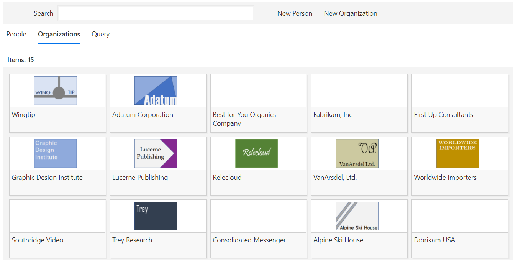

## Contact Management



The Contact Management application provides simplified management of contacts and organizations.  It uses a Contacts list to store basic Contacts.  This Contact list is tied to a set of Organizations.  These Organizations become the locus of organizing tracking of the relationship of your organization to the related organization.

### Custom Fields

The Contact Management field supports expandable fields, so that you can track additional fields per contact and per organization.  Use the list settings page to add additional fields into the backing list.  For fields of type Text, Choice, or User, these fields will show up in the Miscellaneous tab for Organizations and Users.

### Tagging

The Content Management application features simple tagging capabilities, along with an ability to search based on tagging.  Create new tags by editing the Tags list, and add new entries within it.  Once that is done, you can associate Tags with Contacts and Organizations via the Tags field.

### Feedback, Issues, and More

We look forward to your feedback. Use Github Issues to provide information about issues, as well as your feedback requests.  You can also submit pull requests; see [this link](../../.github/CONTRIBUTING.md) for more information on Contributing.

### Building the code

```bash
git clone the repo
npm i
npm i -g gulp
gulp
```

This package produces the following:

* lib/* commonjs components - this allows this package to be reused from other packages.
* dist/* - a single bundle containing the components used for uploading to a cdn pointing a registered Sharepoint webpart library to.
* example/* a test page that hosts all components in this package.
