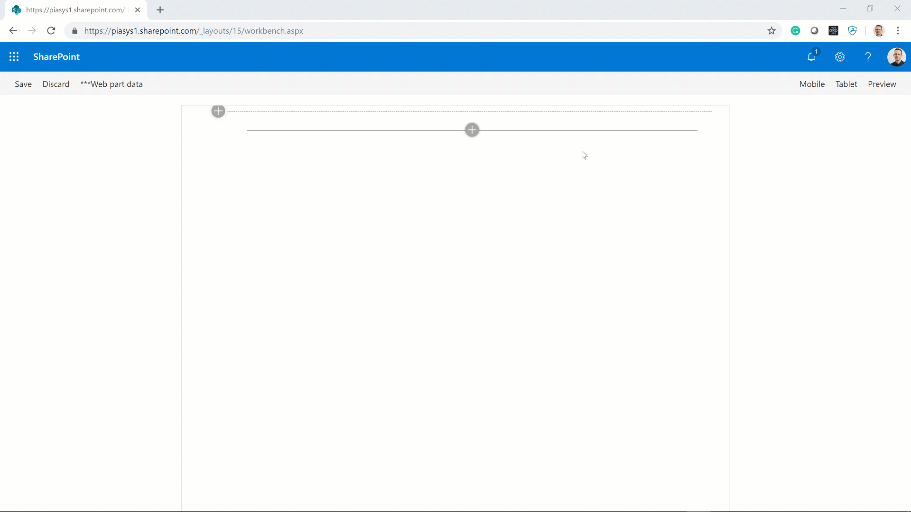

## Instagram Web Part

Demo Web Part demonstrating how to consume an Instagram feed from within a SharePoint Framework solution.



### Building the code

```bash
git clone the repo
npm i
gulp bundle --ship
gulp package-solution --ship
```

This package produces the following:

* sharepoint/solution/insta-webpart.sppkg - the package to install in the App Catalog of your target tenant

## Installation

1. From the **sharepoint/solution** folder, add the **insta-webpart.sppkg** file to the tenant app catalog in your SharePoint tenant.

2. Navigate to the site where you want to install the solution - it's using tenant-scoped deployment, so web part is automatically exposed in the web part picker just by adding it to the app catalog. Search for the Web Part with display name "Instagram".

3. Configure the Web Part and sign-in into Instagram (follow instruction in section [Configuration](#Configuration))

<a name="Configuration"></a>
## Configuration

In order to configure the Instagram Web Part you need to have a valid developer account for Instagram and you need to configure a client app in your Instagram developer's dashboard.

### Signup as an Instagram developer

If you already signed up as an Instagram developer, you can skip this section and go straigth to the [Registering an Instagram client app](#RegisteringClientApp) section.

1. Open your browser and navigate to the [Developer](https://www.instagram.com/developer/) section of Instagram.

2. Login or register into the Instagram web site.

3. Click the **"Register Your Application"** button and fill in the "Developer Signup" page, providing your data.

<a name="RegisteringClientApp"></a>
### Registering an Instagram client app

1. Open your browser and navigate to the [Developer](https://www.instagram.com/developer/) section of Instagram.

2. Login into the Instagram web site.

3. Click the **"Register Your Application"** button and select to **"Register a New Client"**. Provide the basic data for your app (Application Name, Description, Company Name, Website URL, Valid redirect URIs). In the **"Valid redirect URIs"** provide the URL of the pages where you plan to host the Instagram Web Part.

4. Click the **"Register"** button and get back the **"CLIENT ID"** of your new client app. Copy the value and paste it into the **"Client ID"** property of the Instagram Web Part.

5. Back in the Instagram developer page, click the **"Manage"** for the just registered app and select the **"Security"** tab. Clear the **"Disable implicit OAuth"** flag and click the **"Update Client"** button.

6. Now go back to the Instagram Web Part and login with Instagram clicking the **"Sign In"** button in the property pane.

7. The first time you will use the Web Part, you will see a message like "This app is in sandbox mode and can only be authorized by sandbox users." click the **"Authorize"** button to proceed.

Enjoy the Instagram Web Part.