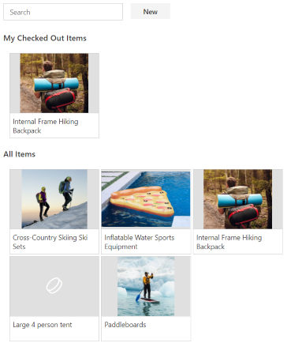

## Inventory Check Out



The Inventory and Checkout management part lets you manage a simple list inventory items, and build a "lending library" style check out infrastructure around them.   

The inventory web part is a single web part you can add to a web part page.  When fully configured, you can add inventory items to a list.  

Optionally, you can configure a list of locations via web part properties that lets users pick an explicit set of locations from a list.

Optionally, you can also choose to upload and link to pictures for items, so that viewers to the site can see pictures of the various items.

Users can individually view the items in the inventory list, and if they'd like, check out items from the list by clicking the checkout item button.  From there, they can input a time by which they expect to return the item.

## Installation and Configuration

When you add the web part for the first time, a user will need to create the backing lists within the site that support storage of Time Away entries.  A user with list creation permissions within the site will need to click the "Create Lists" button that shows up within the web part.

### Building the code

```bash
git clone the repo
npm i
npm i -g gulp
gulp
```

This package produces the following:

* lib/* - intermediate-stage commonjs build artifacts
* dist/* - the bundled script, along with other resources
* deploy/* - all resources which should be uploaded to a CDN.

### Build options

gulp clean
gulp serve
gulp bundle
gulp package-solution

