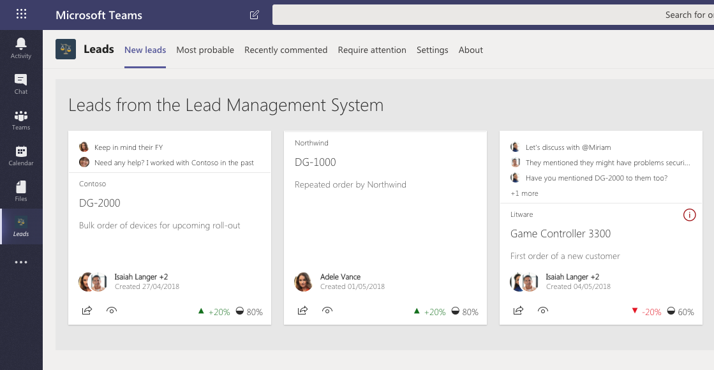

# Leads Management System - LOB solution demo

Demo solution demonstrating how to build a solution using SharePoint Framework and then surface it as a SharePoint web part, a Microsoft Teams tab, a personal app or a Teams messaging extension.

> This solution was originally demonstrated in the SharePoint Conference 2018 keynote and also in the Ignite 2018. As part of the release of SharePoint Framework 1.7, it can be finally shared as a generic demo for the community.

LOB solution exposed as a SharePoint web part:

LOB solution exposed as a Teams tab:

LOB solution exposed as a personal Teams app:

LOB solution exposed as a Teams messaging extension:

## Prerequisites to use the messaging extension

> **Important:** The ability to expose SharePoint Framework web parts as Teams messaging extensions is currently being developed and will be available publicly in the future versions of the SharePoint Framework.

1. Register bot
    1. Follow the instructions at [https://docs.microsoft.com/en-us/microsoftteams/platform/bots/how-to/create-a-bot-for-teams](https://docs.microsoft.com/en-us/microsoftteams/platform/bots/how-to/create-a-bot-for-teams) to register a bot
    1. For the messaging URL enter a mock URL, like `https://contoso.com/api/messaging`. You will update this URL later once you know the temporary URL created by ngrok
    1. Note the Microsoft App ID and password. You will need them later to communicate with Teams
1. Update bot data
    1. In your code editor, navigate to the `bot/.env` file
    1. Set the value of the `MICROSOFT_APP_ID` property to the Microsoft App ID you noted when registering the bot
    1. Set the value of ohe `MICROSOFT_APP_PASSWORD` property to the Microsoft App password you noted when registering the bot
    1. In your code editor, navigate to the `webpart/teams/manifest.json` file
    1. In the `bots` and `composeExtensions` sections, update the value of the `botId` property to the Microsoft App ID you noted when registering the bot
1. Start the web server with the bot locally
    1. Install [ngrok](https://ngrok.com/) which is required to run the bot powering the messaging extension locally
    1. Open terminal
    1. Change the working directory to `bot`
    1. Restore project dependencies by executing `npm install`
    1. Start the local server with the bot by executing `gulp ngrok-serve`
    1. Once ngrok started, note the hostname registered for the tunnel, eg. `b60b1863.ngrok.io`. The hostname is displayed in the terminal. You will need this to register the bot
1. Update bot URL
    1. In the web browser go to your bot registration page
    1. Update the messaging URL to your ngrok domain, eg `https://b60b1863.ngrok.io/api/messaging`

## Installation

1. From the **webpart/sharepoint/solution** folder, add the **leads-lob.sppkg** file to the tenant app catalog in your SharePoint tenant.
1. Navigate to the site where you want to install the solution - it's using tenant-scoped deployment, so web part is automatically exposed in the web part picker just by adding it to the app catalog.
1. Move to Microsoft Teams and either upload the LeadsManagement.zip file from the Teams folder to app catalog of a specific Team or to the tenant level app catalog for Microsoft Teams.

> Notice that you will need to enable side loading if you want to upload solution specifically to one team or to the Microsoft Team tenant app catalog. See following tutorial for additional details: [Building Microsoft Teams tab using SharePoint Framework - Tutorial](https://docs.microsoft.com/en-us/sharepoint/dev/spfx/web-parts/get-started/using-web-part-as-ms-teams-tab).

## Configuration

By default web part is using "demo mode", which does not require any additional configurations. More details on the optional Azure Function integration will be added on this readme file later.

## Solution information

### Compatibility

This solution is compatible with SharePoint Online. Teams capability only works currently in Targeted Release tenants (until it's moved from Preview status to GA).

### Author(s)

- [Waldek Mastykarz](https://github.com/waldekmastykarz) (MVP, [Rencore](https://rencore.com))

### Version history

Version|Date|Comments
-------|----|--------
1.4.2|Jun 15, 2020|Extended with storing user's configuration in application's personal folder
1.4.1|May 25, 2020|Switched to using preview Microsoft To Do APIs for creating lead reminders
1.4.0|May 19, 2020|Extended with the ability to create a reminder in Planner for the specific lead
1.3.0|May 18, 2020|Extended with Teams messaging extension
1.2.0|May 11, 2020|Extended with a Teams task module
1.1.0|May 1, 2020|Extended with a multi-tab personal Teams app configuration
1.0.0|November 21, 2018|Updated to match v1.7 experience and tested in RTM

## Disclaimer

**THIS CODE IS PROVIDED *AS IS* WITHOUT WARRANTY OF ANY KIND, EITHER EXPRESS OR IMPLIED, INCLUDING ANY IMPLIED WARRANTIES OF FITNESS FOR A PARTICULAR PURPOSE, MERCHANTABILITY, OR NON-INFRINGEMENT.**

