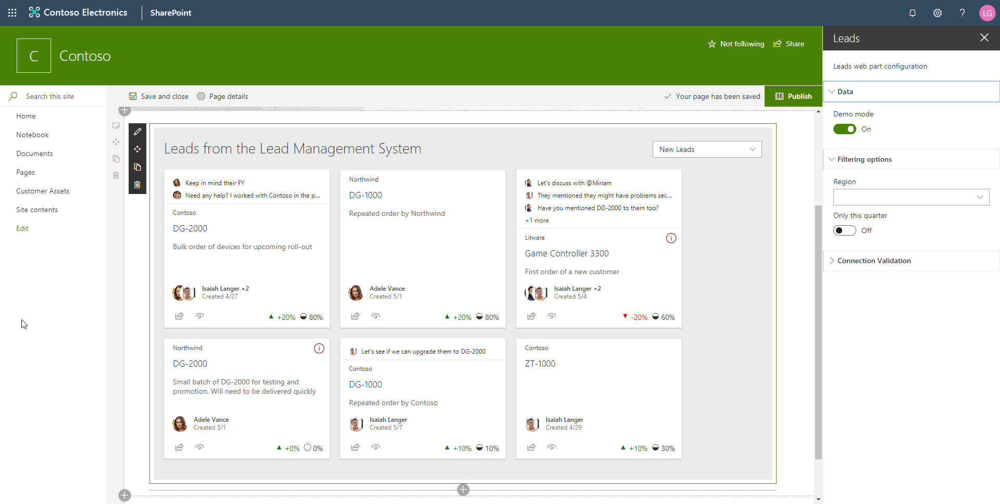
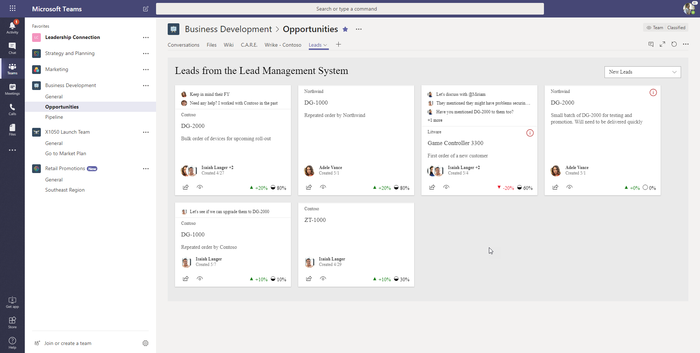

# Leads Management System - LOB solution demo

Demo solution demonstrating how to build a solution using SharePoint Framework and then surface it either as a SharePoint web part or as a Microsoft Teams tab:

> This solution was originally demonstrated in the SharePoint Conference 2018 keynote and also in the Ignite 2018. As part of the release of SharePoint Framework 1.7, it can be finally shared as a generic demo for the community.

## Installation

1. From the **sharepoint/solution** folder, add the **leads.sppkg** file to the tenant app catalog in your SharePoint tenant.

2. Navigate to the site where you want to install the solution - it's using tenant-scoped deployment, so web part is automatically exposed in the web part picker just by adding it to the app catalog.

3. Move to Microsoft Teams and either upload the LeadsManagement.zip file from the Teams folder to app catalog of a specific Team or to the tenant level app catalog for Microsoft Teams.

> Notice that you will need to enable side loading if you want to upload solution specifically to one team or to the Microsoft Team tenant app catalog. See following tutorial for additional details: [Building Microsoft Teams tab using SharePoint Framework - Tutorial](https://docs.microsoft.com/en-us/sharepoint/dev/spfx/web-parts/get-started/using-web-part-as-ms-teams-tab).

## Configuration

By default web part is using "demo mode", which does not require any additional configurations. More details on the optional Azure Function integration will be added on this readme file later.

## Solution information

### Compatibility

This solution is compatible with SharePoint Online. Teams capability only works currently in Targeted Release tenants (until it's moved from Preview status to GA).

### Author(s)

- [Waldek Mastykarz](https://github.com/waldekmastykarz) (MVP, [Rencore](https://rencore.com))

### Version history

Version|Date|Comments
-------|----|--------
1.0.0|November 21, 2018|Updated to match v1.7 experience and tested in RTM

## Disclaimer

**THIS CODE IS PROVIDED *AS IS* WITHOUT WARRANTY OF ANY KIND, EITHER EXPRESS OR IMPLIED, INCLUDING ANY IMPLIED WARRANTIES OF FITNESS FOR A PARTICULAR PURPOSE, MERCHANTABILITY, OR NON-INFRINGEMENT.**

