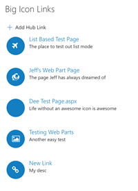
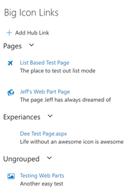
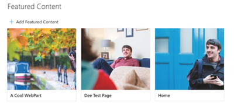
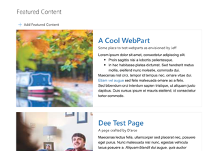
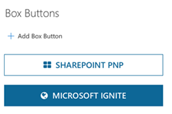
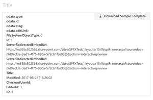

# Hub and Link Web Parts

## Summary

This solution contains the following web parts:

### Hub Links

A list of links that can either be set within the properties of the web part or in a SharePoint List

Icon Layout:

List Layout:

Grouped Layout:

### Featured Content

Tile links that enable users to show links with images stored within the web part or in a SharePoint list

Default Layout:

Default Layout Small Column:

Stacked Layout:

### Box Button

Button links that can be stored within the web part or in a SharePoint list

### Hub Template

A handlebars template web part that enables highly customized UI code to be applied to SharePoint list items. 

> The Hub Template web part allow users to add JavaScript into the page.  Carefully consider the implications of this capability, and restrict creation and updating of this part to specific site collections and audiences. The Hub Template is the only web part in the group that allows script injection

## Used SharePoint Framework Version 

## Applies to

* [SharePoint Framework](https://dev.office.com/sharepoint)
* [Office 365 tenant](https://dev.office.com/sharepoint/docs/spfx/set-up-your-development-environment)

## Prerequisites
 
Note that you will need to download and host a CAMLJS javascript library (https://github.com/andrei-markeev/camljs/blob/master/CamlJs/camljs.js).

## Version history

Version  | Date               | Comments
-------- | ------------------ | --------
1.0      | September 27, 2017 | Initial release

## Disclaimer
**THIS CODE IS PROVIDED *AS IS* WITHOUT WARRANTY OF ANY KIND, EITHER EXPRESS OR IMPLIED, INCLUDING ANY IMPLIED WARRANTIES OF FITNESS FOR A PARTICULAR PURPOSE, MERCHANTABILITY, OR NON-INFRINGEMENT.**

---

## Minimal Path to Awesome

- Clone this repository
- Download the [caml.js](https://github.com/andrei-markeev/camljs/blob/master/CamlJs/camljs.js) library and host it in an accessible location.
- Change the config/config.json file to point to the above location.
- Set the cdnBasePath in the config/write-manifests.json file
- (_Optional_) Set the Azure storage account information for where the files should be deployed
- in the command line run:
  - `npm install`
  - `gulp serve`

