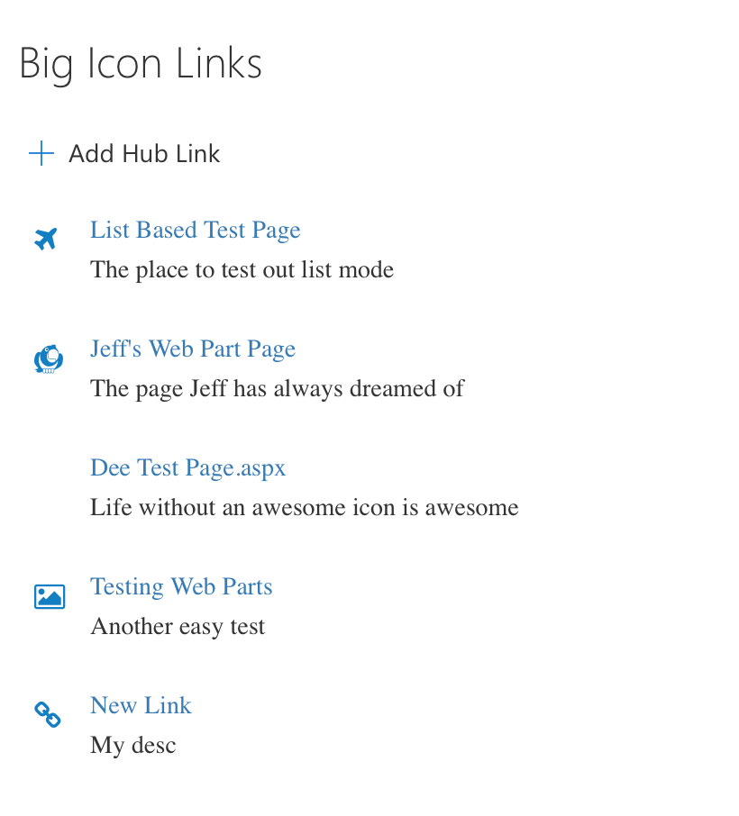
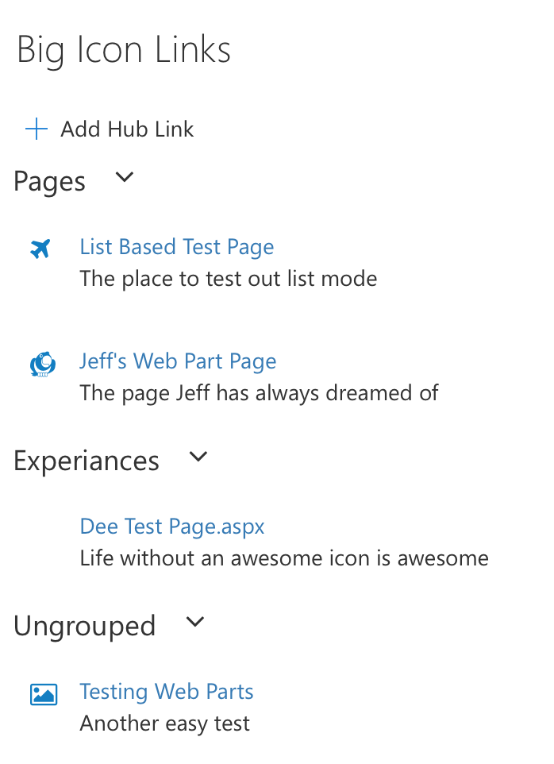
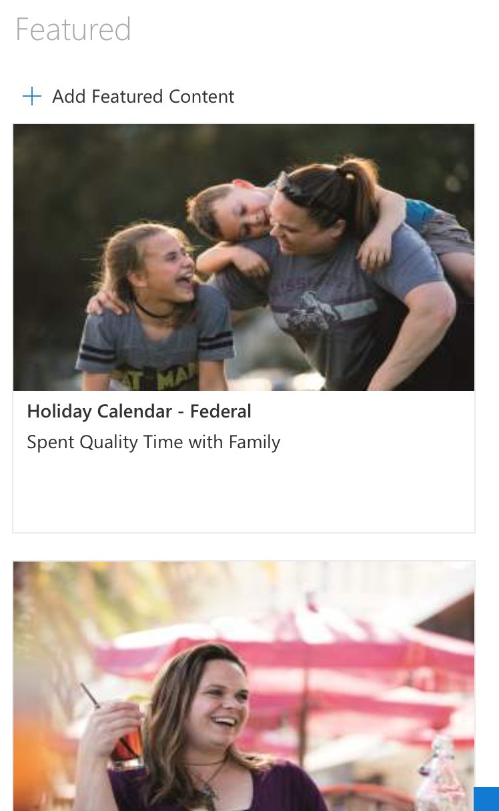
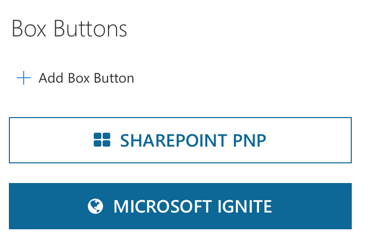
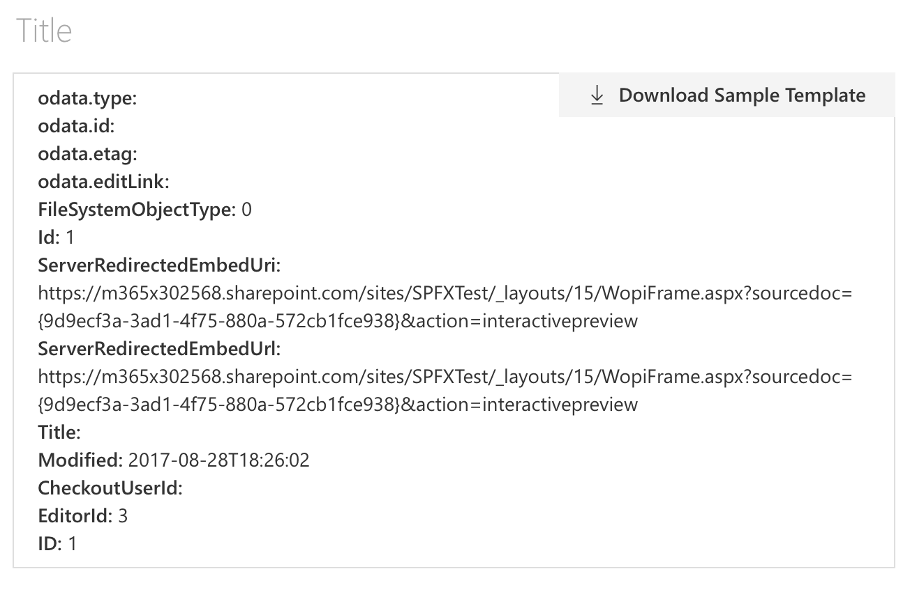

## hub-web-parts

__This solution contains the following web parts.__
* Hub Links: A list of links that can either be set within the properties of the web part or in a SharePoint List

Icon Layout:


List Layout:


Grouped Layout:


* Featured Content: Tile links that enable users to show links with images stored within the web part or in a SharePoint list

Default Layout:


Default Layout Small Column:


Stacked Layout:


* Box Button: Button links that can be stored within the web part or in a SharePoint list


* Hub Template: A handlebars template web part that enables highly customized UI code to be applied to SharePoint list items (__The Hub Template web part allow users to add JavaScript into the page.  Carefully consider the implications of this capability, and restrict creation and updating of this part to specific site collections and audiences. The Hub Template is the only web part in the group that allows script injection__)


__Steps needed to prepare the solution for deployment:__
1) Download the [caml.js](https://github.com/andrei-markeev/camljs/blob/master/CamlJs/camljs.js) library and host it in an accessible location.
2) Change the config/config.json file to point to the above location.
3) Set the cdnBasePath in the config/write-manifests.json file
4) (_Optional_) Set the Azure storage account information for where the files should be deployed


### Building the code

```bash
git clone the repo
npm i
npm i -g gulp
gulp
```

This package produces the following:

* lib/* - intermediate-stage commonjs build artifacts
* dist/* - the bundled script, along with other resources
* deploy/* - all resources which should be uploaded to a CDN.

### Build options

gulp clean - TODO
gulp test - TODO
gulp serve - TODO
gulp bundle - TODO
gulp package-solution - TODO
