# SharePoint Framework modern search Web Parts

## This repo has moved to https://github.com/microsoft-search/pnp-modern-search

## Download
**Get the latest release at our [releases page](https://github.com/SharePoint/sp-dev-solutions/releases/latest).**

## Summary
This solution allows you to build user friendly SharePoint search experiences using SPFx in the modern interface. The main features include:

- Fully customizable SharePoint search query like the good old Content Search Web Part.
- Can either use a static query or be connected to a search box component using SPFx dynamic data.
- Live templating system with Handlebar to meet your requirements in terms of UI + built-in layouts. Can also use template from an external file.
- Search results including previews for Office documents and Office 365 videos.
- Customizable refiners supporting multilingual values for taxonomy based filters.
- Sortable results (unique field).
- Refiners Web Part.
- Pagination Web Part.
- SharePoint best bets support.
- Search query enhancement with NLP tools (like Microsoft LUIS).

A complete 1 hour tutorial video is available on the [official SharePoint Developer blog](https://developer.microsoft.com/en-us/sharepoint/blogs/pnp-webcast-sharepoint-framework-modern-search-web-part/):

  

This sample includes the following components and service(s):

**Web Part(s)**

Component | Description
----- | -----
Search Box Web Part | Allows users to enter free text/KQL search queries connected to a search results Web Part.
Search Results Web Part | Performs static or dynamic search query with customizable parameters sorting and templating. An associated [blog post](http://thecollaborationcorner.com/2017/10/16/build-dynamic-sharepoint-search-experiences-with-refiners-and-paging-with-spfx-office-ui-fabric-and-pnp-js-library/) is available to give you more details about this Web Part implementation.
Search Refiners | Allows users to configure refiners for a search results Web Part.
Search Pagination | Allows users to configure pagination for a search results Web Part.
Search Navigation | Allows users to configure navigation for a search results Web Part.
Search Verticals | Allows users to search in predefined scopes.

**Back-end service(s)**

Service | Description
----- | -----
Search Query Enhancer | Sample Azure function to demonstrate the use of Microsoft LUIS and other cognitive services to interpret user intents and enhance the search box query accordingly.

## Used SharePoint Framework Version

## Applies to

* [SharePoint Framework](https:/dev.office.com/sharepoint)
* [Office 365 tenant](https://dev.office.com/sharepoint/docs/spfx/set-up-your-development-environment)

## Solution

Solution| Contributors(s)
--------|---------
ModernSearch | Franck Cornu - [@FranckCornu](http://www.twitter.com/FranckCornu) Tarald Gåsbakk - [@taraldgasbakk](https://twitter.com/Taraldgasbakk) Yannick Reekmans - [@yannickreekmans](https://twitter.com/yannickreekmans) Mikael Svenson - [@mikaelsvenson](http://www.twitter.com/mikaelsvenson) Albert-Jan Schot - [@appieschot](https://twitter.com/appieschot) Brad Schlintz - [@bschlintz](https://twitter.com/bschlintz)

## Web Parts Configuration

### Search Box Web Part

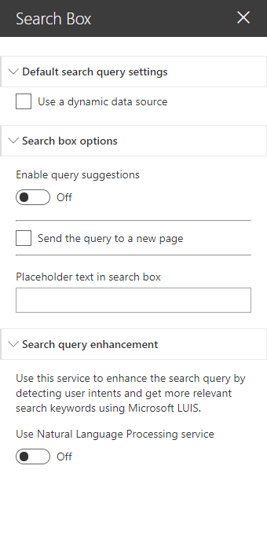

#### Default Search Query Settings

Setting | Description
-------|----
Use a dynamic data source | You can set a default query text coming from am other data source. This case is particularly useful when you want to put a search box Web Part on the front page redirecting to an other page with the same query. Use the query string parameter 'q' from the built-in 'Page Environment' data source.

#### Search box options

Setting | Description
-------|----
Enable query suggestions | The search box supports query suggestions from SharePoint. Refer to the following [article](https://docs.microsoft.com/en-us/sharepoint/search/manage-query-suggestions) to know how to add query suggestions in your SharePoint tenant (caution: it can take up to 24h for changes to take effect).
Send the query to a new page | Sends the search query text to a new page. On that page, use an other search box Web Part configured with a dynamic data source as the default query. This Web Part uses the URL fragment '#' to pass the entered keywords. Make sure you use this data source property in your targeted components to retrieve the query.
Placeholder text | The placeholder text to display in the search box.

#### Search query enhancement

Setting | Description
-------|----
Use Natural Language Processing service | Turn this option 'on' if you want to enhance the query text with NLP services like LUIS. In the _'Service Url'_ field, enter the URL of the Azure Function endpoint. Refer the instructions in the `'/functions/README.md'` file to set up the service. In this sample, only relevant detected keywords are returned as q new query using LUIS. Enabling debug mode will show you relevant information about the entered query.

---

### Search Results Web Part

<table>
  <tr>
    <td>
      
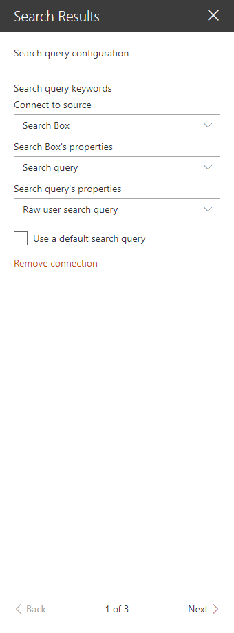

    </td>
    <td>
      
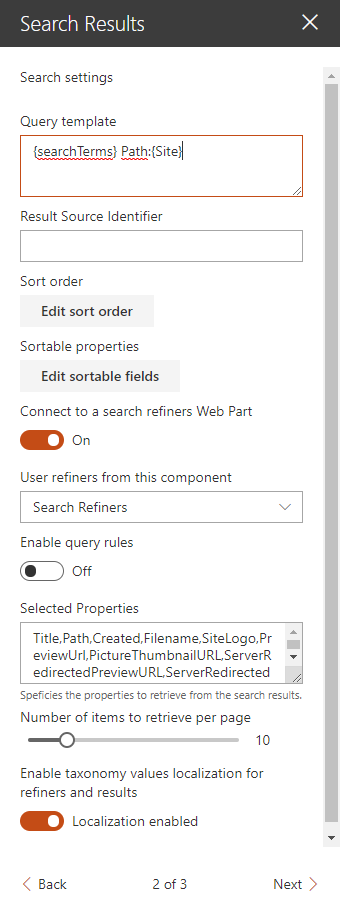

    </td>
    <td>
      
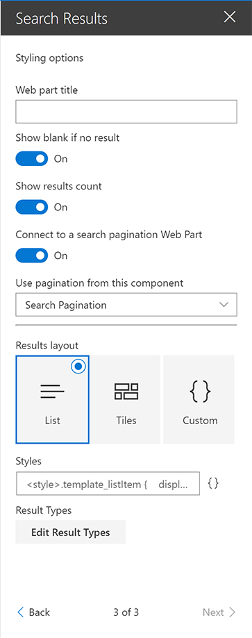

    </td>
  </tr>
<table>

#### Search Query Configuration

Setting | Description
-------|----
Search query keywords | Here you choose to use a static search query or a query coming from a data source. It is recommended to use the associated Web Part coming with this sample. The search query is in KQL format so you can use search query variables (See this [post](http://www.techmikael.com/2015/07/sharepoint-rest-do-support-query.html) to know which ones are allowed). You can only plug one source to this Web Part.

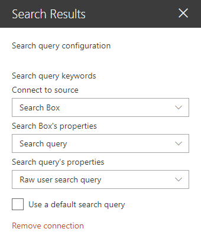

#### Search Settings

Setting | Description
-------|----
Query template | The search query template in KQL format. You can use search variables here (like Path:{Site}).
Result Source Identifier | The GUID of a SharePoint result source.
Sort order | The initial search results sort order, where you can use one or multiple properties to sort by. **By default, results are sorted by created date (ascending) and size (descending). Remove these values to reset default sorting**
Sortable fields | The search managed properties to use for sorting. With SharePoint Online, you have to reuse the default ones to do so (RefinableStringXX etc.). The order is the same as they will appear in the sort panel. You can also provide your own custom labels using the following format RefinableString01:"You custom filter label",RefinableString02:"You custom filter label",... If no sortable fields are provided, the 'Sort' button will not be visible.
Connect to a search refiners Web Part | If enable, select the search refiners Web Part to use on the current page to get selected filters. It is a 2 ways connection so don't forget to connect the targeted search refiners to the search results Web Part as well.
Connect to a search verticals Web Part | If enable, select the search verticals Web Part to connect to.
Enable Query Rules | Enable the query rules if applies. Turn this options  'on' to display your SharePoint Promoted results (links only) and make result blocks available to custom renderers.
Include OneDrive results | Include OneDrive results if applicable. Turn this option 'on' to make users' personal OneDrive results available to custom renderers. Read more [here](https://docs.microsoft.com/en-us/sharepoint/support/search/private-onedrive-results-not-included).
Selected properties | The search managed properties to retrieve. You can select them from a predefined list or add them as free text if not listed. Then, these properties are available in your Handlebars template with the syntax (`item.property_name` or `property_name` inside the `{{#each}}` loop).
Number of items to retrieve per page | Quite explicit. The paging behavior is done directly by the search API (See the *SearchDataProvider.ts* file), not by the code on post-render.

#### Styling Options

Setting | Description
-------|----
Web Part Title | Shows a title for this Web Part. Set blank if you don't want a title.
Show blank if no result | Shows nothing if there is no result
Show result count | Shows the result count and entered keywords
Connect to a search pagination Web Part	 | If enable, select the search pagination Web Part to use on the current page to get selected page. It is a 2 ways connection so don't forget to connect the targeted search pagination to the search results Web Part as well.
Result Layouts options | Choose the template to use to display search results. Some layouts are defined by default but you can create your own either by clicking on the **"Custom"** tile, or **"Edit template"** from an existing chosen template. In custom mode, you can set an external template. It has to be in the same SharePoint tenant. Behind the scenes, the Office UI React controls are used. Custom code templates will also automatically be displayed here upon registration. See the [TEMPLATING.md documentation](./docs/TEMPLATING.md) for more information about templating.
Result types | Allows you to set a custom template at item level according to a specific condition (ex: FileType equals 'pdf').

##### Miscellaneous: Taxonomy values dynamic translation

The search results Web Part supports automatic translation for taxonomy based filters and result metadata according to current site language. To get it work, you must map a new refinable managed property associated with *ows_taxId_<your_column_name>* crawled property and turn on the *'Localization Enabled'* toggle in the search results property pane:

  

  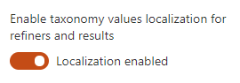

---

#### Out of the box query variables

The following out of the box [query variables](https://docs.microsoft.com/en-us/sharepoint/technical-reference/query-variables) are supported/tested:

##### Site and site collection properties
|**Query variable**|**Definition**|
|:-----|:-----|
|{Site} or {Site.URL}    |URL of the site from where the query was issued. For example, this value can be used to query content of the managed property Path.    |
|{Site.ID}    |GUID of site from where the query was issued. This value corresponds to the value of the managed property SiteID.    |
|{Site.LCID}    |Numeric value of the locale as specified by the Regional Settings in the Site Settings on the Site from where the query was issued.    |
|{Site.Locale}    |Language of the Site from where the query was issued in ll-cc format — for example, en-us.    |
|{Site.\<property\>}    |Any property from the property bag of the site (SPWeb) from where the query was issued, including custom properties.    |
|{SiteCollection} or {SiteCollection.URL}    |URL of site collection from where the query was issued. For example, this value can be used to query content of the managed property Path.    |
|{SiteCollection.ID}    |GUID of site collection from where the query was issued.    |
|{SiteCollection.LCID}    |Numeric value of the locale as specified by the Regional Settings in the Site Settings on the Site Collection from where the query was issued.    |
|{SiteCollection.Locale}    |Language of the Site Collection from where the query was issued in ll-cc format — for example, en-us.    |
|{SiteCollection.\<property\>}    |Any property from the property bag of the root site (SPWeb) in the site collection (SPSite) from where the query was issued, including custom properties.    |

##### URL token and request properties
|**Query variable**|**Definition**|
|:-----|:-----|
|{URLToken.\<integer\>}    |A value from the URL of a page. The integer represents the position of the value in the URL as counted from right to left. For example, for the page http://www.contoso/audio/mp3/1010101, the query variable {URLToken.1} will query for the last value in the URL, 1010101. The query variable {URLToken.3} will query for the third last property in the URL, audio. You can query for values up to the ninth last position in a URL.    |
|{Request.\<PropertyName\>}    |A value from the current http request - for example, {Request.Url}.    |

##### User properties
|**Query variable**|**Definition**|
|:-----|:-----|
|{User} or {User.Name}    |Display name of the user who issued the query. For example, this value can be used to query content of the managed property Author.    |
|{User.Email}    |Email address of the user who issued the query. For example, this value can be used to query content of the managed property WorkEmail.    |
|{User.PreferredContentLanguage}    |Language as specified as Preferred Content Language in the profile of the user who issued the query.    |
|{User.PreferredDisplayLanguage}    |Language as specified as Preferred Display Language in the profile of the user who issued the query.    |
|{User.\<property\>}    |Any property from the user profile of the user who issued the query — for example, SPS-Interests, including custom properties.    |

##### Other properties
|**Query variable**|**Definition**|
|:-----|:-----|
|{Today+/- \<integer value for number of days\>}    |A date calculated by adding/subtracting the specified number of days to/from the date when the query is issued. Date format is YYYY-MM-DD. For example, this value can be used to query content of the managed property LastModifiedTime.    |
|{SearchBoxQuery} or {searchTerms}   |The query value entered into a search box on a page.    |
|{CurrentDisplayLanguage}    |The current display language based on MUI in ll-cc format.    |
|{CurrentDisplayLCID}    |Numeric value of the current display language based on MUI in ll-cc format.    |

#### Custom query variables

The following custom query variables are supported:

|**Query variable**|**Definition**|
|:-----|:-----|
|{Page.&lt;FieldName&gt;}    | The value of a field on the page from where the query was issued. For example, if the page from where the query was issued contained a site column named "ContentOwner," specifying {Page.ContentOwner} would allow you to query for the value of "ContentOwner." FieldName is the internal name of the field. When used with taxonomy columns, use `{Page.<FieldName>.Label}` or `{Page.<FieldName>.TermID}`   |
|{CurrentYear}    | Todays's date four digits, 2018   |
|{CurrentMonth}    | Today's month, 1-12   |
|{CurrentDate}    | Today's date, 1-31   |
|{QueryString.&lt;ParameterName&gt;}   | A value from a query string in the URL of the current page. For example, if the URL of the current page contains a query string such as ItemNumber=567, you could obtain the value 567 by specifying {QueryString.ItemNumber}.   |
|{PageContext.&lt;ParameterName&gt;}   | A value from the legacyPageContext object on the page. For example, if the legacyPageContext object of the current page contains a property "hubSiteId": "166aa115-7ae7-4c21-9e02-9e0c8872be28", you could obtain the value 166aa115-7ae7-4c21-9e02-9e0c8872be28 by specifying {PageContext.hubSiteId}. The property name is case sensitive!  |
|{TenantUrl}    |URL of the tenant (root site)  |

#### Best bets

This WP supports SharePoint best bets via SharePoint query rules:

  

  

### Search Refiners

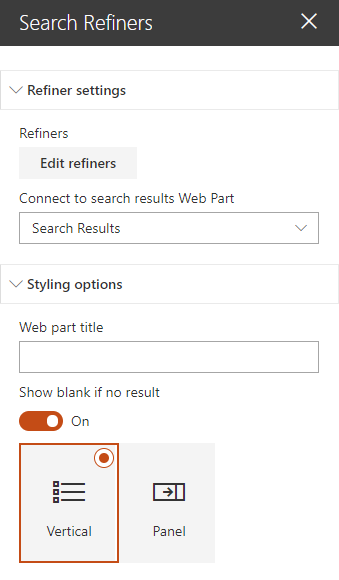

#### Refiner Options

Setting | Description
-------|----
Refiners | The search managed properties to use as refiners. Make sure these are refinable. With SharePoint Online, you have to reuse the default ones to do so (RefinableStringXX etc.). The order is the same as they will appear in the refinement panel. You can also provide your own custom labels using the following format RefinableString01:"You custom filter label",RefinableString02:"You custom filter label",... This Web Part supports dynamic translation of taxonomy based refiners with few additional configurations in the connected search results Web Part (see above).
Connect to search results Web Part | The search results Web Part to use on the current page to get filters.

#### Styling Options

Setting | Description
-------|----
Web Part Title | Shows a title for this Web Part. Set blank if you don't want a title.
Show blank if no result | Shows nothing if there is no filter
Filters layout | Choose the template to use to display filters results.

### Search Pagination

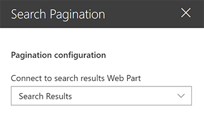

#### Pagination Options

Setting | Description
-------|----
Connect to search results Web Part | The search results Web Part to use on the current page to get page.

### Search Navigation Webpart
This addition is a pivot-navigation link list that may be used to emulate the navigation in the out-of-the-box search center. You can use this webpart on several different pages and set up a searchbox and refiners webpart to handle different types of result. The webpart will automatically detect if it is on the right page from the set of navigation nodes, and display it in the preferred color.
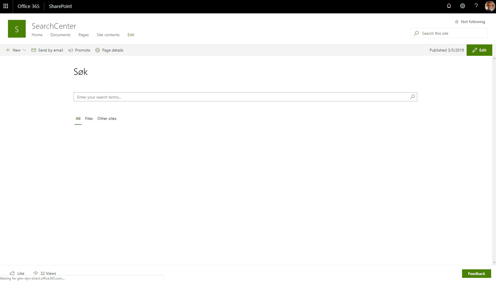

#### Connect to a source
In order to make the search go between the pages where you have set up searches, use this functionality to connect to a search box on the current site. The query from this searchbox will be passed as a url parameter 'q' when navigating to the next page. This is done in the same manner as when you are connecting the search box webpart to the search refiners webpart.

#### Setup Navigation nodes
This step is used to set up the navigation nodes, and needs to be done on all pages it should be displayed on to work correctly.
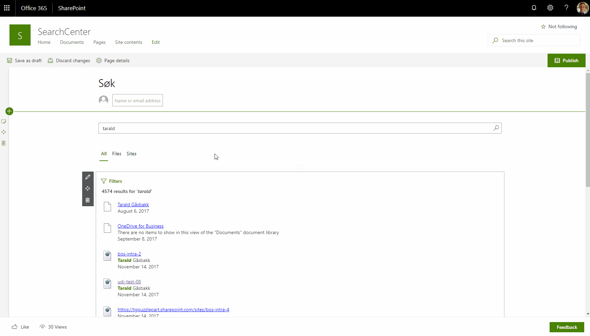

#### Setup colors
The you may either use the site collection theme colors, or use a custom color you choose in the settings pane.
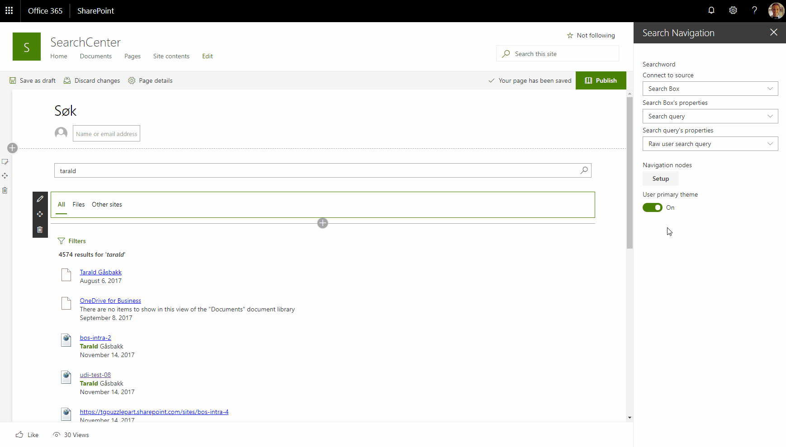

### Search Verticals Web Part

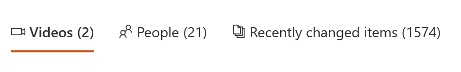

The search verticals Web Part allow users to search through predefined scopes (i.e videos, people, etc.). The behavior is different from the search navigation Web Part because here, we simply replace the query template and result source dynamically for a chosen vertical. To get it work, you simply need to connect the search verticals Web Part to a search results Web Part using the associated option. Also, if you want to display counts for each verticals **when a new query is performed** (for instance a search box query or an URL fragment update), connect the search results Web Part to the search verticals one (two ways connection in this case).

#### Verticals Options

<table>
  <tr>
    <td>

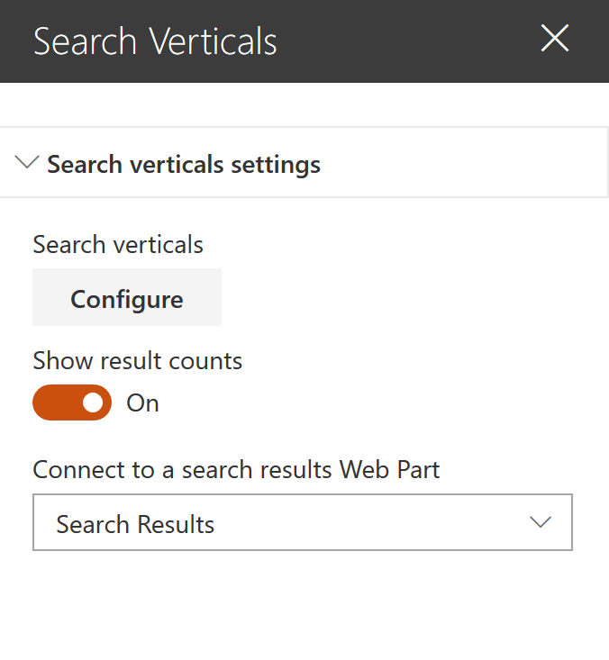

    </td>
    <td>

    </td>
  </tr>
  <tr>
    <td colspan=2>

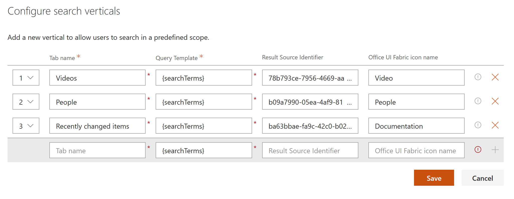

    </td>
  </tr>
<table>

Setting | Description
-------|----
Search verticals | Configure the search verticals to display. When you set a query template or a result source id for a vertical, these override the ones in the connected search results. You can also set an icon for a vertical using [Office UI Fabric icons names](https://developer.microsoft.com/en-us/fabric#/styles/icons). The query keywords are shared across all verticals. For instance, if you need default results for tabs, just specify a default query in the connected search results Web Part (like `*`) and the `{searchTerms}` expression in your vertical query template. Also, selected refinement filters are reset, if present, when a new vertical is selected.
Show results count | Indicates if the results count should be displayed for each vertical. In this case, you need to connect the Web Part to an existing search results Web Part on the page.

## Features
This Web Part illustrates the following concepts on top of the SharePoint Framework:

- Build an user friendly search experience on the top of the SharePoint search REST API with paging, refiners and query suggestions using the *@pnp* JavaScript library.
- Use [Handlebars](https://handlebarsjs.com/) to create templates for search results according to your requirements like the good old display templates.
- Using the SPFx [dynamic data feature](https://docs.microsoft.com/en-us/sharepoint/dev/spfx/dynamic-data) to connect Web Parts.
- Using SharePoint taxonomy using JSOM in SPFx (filter translations)
- Integrate the [@pnp/spfx-property-controls](https://github.com/SharePoint/sp-dev-fx-property-controls) in your solution (*PlaceHolder* control).
- Integrate multiple Office UI Fabric components (DocumentCard, Panel, GroupedList, ...) to fit with the native Office 365 theme.
- Use the React container component approach inspiring by the [react-todo-basic sample](https://github.com/SharePoint/sp-dev-fx-webparts/tree/master/samples/react-todo-basic)

## Version history

Version|Date|Comments
-------|----|--------
1.0 | Oct 17, 2017 | Initial release
1.1 | Jan 03, 2018 | Improvements and updating to SPFx drop 1.4
1.2 | Feb 12, 2018 | Added a search box Web Part + Added a "Result Source Id" and "Enable Query Rules" parameters.
1.3 | Apr1, 2018 | Added the result count + entered keywords option
1.4 | May 10, 2018 | <ul><li>Added the query suggestions feature to the search box Web Part</li><li>Added the automatic translation for taxonomy filter values according to the current site locale.</li> <li>Added the option in the search box Web Part to send the query to an other page</ul>
1.5 | Jul 2, 2018 | <ul><li>Added a templating feature for search results with Handlebars inspired by the [react-content-query-webpart](https://github.com/SharePoint/sp-dev-fx-webparts/tree/master/samples/react-content-query-webpart) sample.</li><li>Upgraded to 1.5.1-plusbeta to use the new SPFx dynamic data feature instead of event aggregator for Web Parts communication.</li> <li>Code refactoring and reorganization.</ul>
2.0.0.5 | Sept 18, 2018 | <ul><li>Upgraded to 1.6.0-plusbeta.</li><li>Added dynamic loading of parts needed in edit mode to reduce web part footprint.</li><li>Added configuration to sort.</li><li>Added option to set web part title.</li><li>Added result count tokens.</li><li>Added toggle to load/use handlebars helpers/moment.</li></ul>
2.1.0.0 | Oct 14, 2018 | <ul><li>Bug fixes ([#641](https://github.com/SharePoint/sp-dev-fx-webparts/issues/641),[#642](https://github.com/SharePoint/sp-dev-fx-webparts/issues/642))</li><li>Added document and Office 365 videos previews for the list template.</li><li>Added SharePoint best bets support.</li></ul>
2.1.1.0 | Oct 30, 2018 | <ul><li>Bug fix for editing custom template.</li><li>Bug fix for dynamic loading of video helper library.</li><li>Added support for Page context query variables.</li><li>Added `getUniqueCount` helper function.</li></ul>
2.1.2.0 | Nov 9, 2018 | <ul><li>Bug fix for IE11.</li><li>Added date query variables.</li><li>Added support for both result source id and query template.</li><li>Added `getUniqueCount` helper function.</li></ul>
2.2.0.0 | Nov 11, 2018 | <ul><li>Upgraded to SPFx 1.7.0</li><li>Added a TypeScript Azure Function to demonstrate NLP processing on search query</li><li>Removed extension data source. Now we use the default SPFx 'Page Environment' data source.</li></ul>
2.2.0.1 | Dec 3, 2018 | <ul><li>Remove switch for handlebar helpers, and instead load helpers if used in the template.</li></ul>
2.3.0.0 | Dec 13, 2018 | <ul><li>Upgraded to @pnp/controls 1.13.0</li><li>Added a result types features</li><li>Fix bug regarding dynamic data source connection</li></ul>
2.4.0.0 | Jan 03, 2019 | Added custom code renderer support.
2.4.0.1 | Jan 07, 2019 | Added backwards compatibility for older sort configurations, and old empty refiner configurations
2.5.0.1 | Feb 11, 2019 | Downgrade @microsoft/sp-office-ui-fabric-core to v1.6.0 to fix theming
2.5.1.0 | Mar 05, 2019 | Added Search Navigation webpart to the package.
3.0.0.0 | Mar 10, 2019 | Created a dedicated refiners Web Part to connect with a search results like to the classic SharePoint search experience.
3.0.1.0 | Mar 14, 2019 | Created a dedicated pagination Web Part to connect with a search results like to the classic SharePoint search experience. Improved Refiners WP CSS.
3.0.2.0 | Mar 14, 2019 | Fixed regressions with the paging experience
3.0.3.0 | Mar 16, 2019 | Fixed display of custom renderers, in edit mode
3.0.4.0 | Mar 21, 2019 | Fixed loading of Handlebars helpers when having multiple search parts on a page
3.0.5.0 | Mar 26, 2019 | Fixed recreating SearchService on each render
3.1.0.0 | Mar 30, 2019 | Added date range and multi value refiner templates
3.2.0.0 | Apr 08, 2019 | Added support for QueryString token
3.3.0.0 | Apr 20, 2019 | Added search verticals Web Part allowing to search within predefined scopes using query template and result source.
3.4.0.0 | May 23, 2019 | Added placeholders HTML markup by template instead of global.
3.5.0.0 | July 8th, 2019 | Fixes: Taxonomy tags, web part header, theme colors, search box clearing, loading of handlebars helpers. Added Spanish locale. Optimized CSS references (may break in custom templates if you used some of the OUIF styles). Optimized bundle size for run-time. Added more options for time zone handling with `getDate`.
3.6.2.0 | Aug 13th, 2019 | <ul><li>Does not work with IE11 (looking into it)</li><li>Removed the deprecated 'office-ui-fabric' module and updated layouts with the Office UI React components by wrapping them with web components.</li><li>Added a DetailsList and Debug layouts + template options for 'Tiles' (placeholders fileds, etc.) and 'Details List' (column builder, etc.).</li><li>Updated property pane fields (Search Results and Refiners WP) to use a dynamic search managed properties list instead of text values.</li><li>Added `regEx` and `getUnique` helpers.</li><li>Added Dutch translation.</li></ul>
3.6.3.0 | Aug 14th, 2019 | Now works in IE11, just ignore the errors :)
3.7.0.0 | Oct 30th, 2019 | <ul><li>Allow selecting between URL Fragment or QueryString parameter.</li><li>Refiner flashing fix.</li><li>Fixed Page token handling.</li><li>Added more handlebar helper methods.</li><li>Removed default path filter on the webpart.</li><li>Added sorting option for refiners.</li><li>Better default icon handling and support for using [OUIFR icons](https://developer.microsoft.com/en-us/fabric#/styles/web/icons) in your templates. See [TEMPLATING.md documentation](./docs/TEMPLATING.md#Web-components) for more information.</li><li>Added support for rendering secondary result blocks in custom renderers.</li><li>Added toggle to include OneDrive results as a secondary result block (not currently visible without custom renderer).</li><li>Allow custom renderers to render even if there are zero search results to display.</li><li>Added fixed date refiner template.</li><li>Fix for using custom code renderer.</li><li>Upgraded to SPFx v1.9.1.</li><li>Added preview support for 'spellingSuggestion' token.</li></ul>

## Important notice on upgrading the solution from pre v2.2.0.0
**Due to code restructuring we have hit an edge case which impacts upgrades from previous versions. To solve the issue go to `https://<tenant>.sharepoint.com/sites/<appcatalog>/Lists/ComponentManifests` and remove the entries for SearchBox and Search Results, and then upload the .sppkg for the new release.**

**Next you need to loop over all sites which have the web parts installed, and upgrade the App on those sites. Now the web parts should work on new and existing sites. You may use the PnP command `Update-PnPApp` to update the application.**

**If you have deployed the solution as a tenant wide extension, this should not impact you.**

## Important notice on upgrading the solution from pre v3.0.0.0

**Because this version introduces a new standalone search refiners Web Part, you will have to reconfigure all previous refiners from the search results Web Part to this new Web Part. You can get the previous layout for filters by selecting the 'Panel' layout in the new Web Part property pane.**

## Disclaimer
**THIS CODE IS PROVIDED *AS IS* WITHOUT WARRANTY OF ANY KIND, EITHER EXPRESS OR IMPLIED, INCLUDING ANY IMPLIED WARRANTIES OF FITNESS FOR A PARTICULAR PURPOSE, MERCHANTABILITY, OR NON-INFRINGEMENT.**

---

## Minimal Path to Awesome

- Clone this repository

### SPFx
- Go to the [spfx](./spfx) directory
- In the command line run:
  - `npm install`
  - `gulp serve`

### Azure Function (Not mandatory)

- Go to the [functions](./functions) directory
- Follow the README.md file instructions
- Set the correct service URL in the Search Box Web Part
