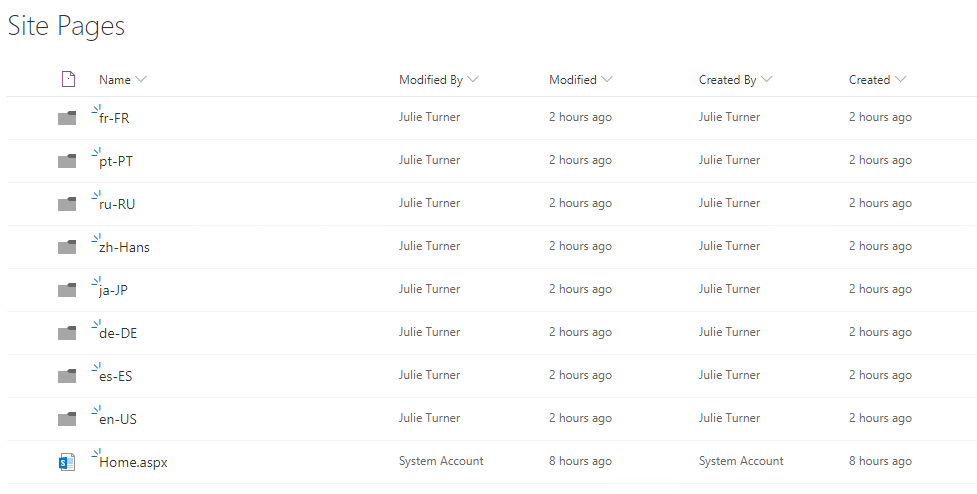
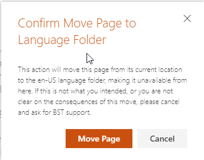
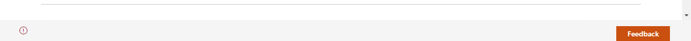
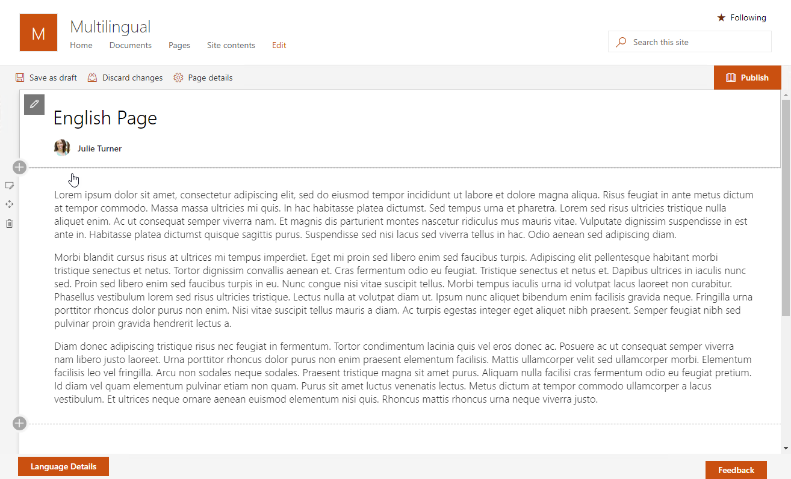
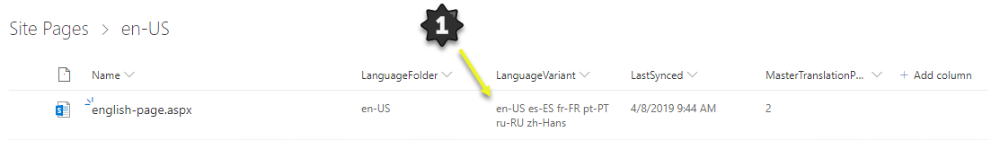
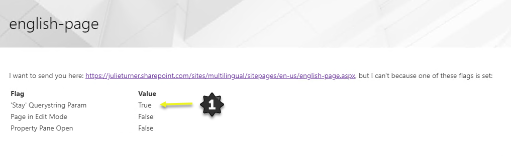

# Multilingual Pages

## Summary

To see a live demo of the soultion check out the [video posted on the PnP YouTube channel](https://www.youtube.com/watch?v=i2rDqK6br5M).

### Multilingual Application Customizer

This solution contains a application customizer and a web part that when used together provide a client side solution to managing multilingual pages in a SharePoint site collection.

The application customizer includes a custom footer extension that will add a the multilingual functionality for viewers and additional functionality for editors (those with edit item rights to the Site Pages library).

After addition the app to your site collection, navigate to the site pages library. Assuming you've set up your languages properly, see [Languages Configuration](#languages_configuration), then after the multilingual extension loads on the page it will configure the folders for you.

1. When an "editor" creates a new page in the site pages library it will then have an indicator that the page is not in a language folder and will ask the user if they would like to move it to one. The user can select the language they want to start from and then click `Move Page`.

1. The user will receive a message asking them to confirm. This option is only available to users with editing rights.

If the page is in a language folder but not configured for multilingual a notification icon `i` will show for users who have edit rights. Clicking that icon will put the page in edit mode.

Once the page is moved, or created specifically in a language folder, the"Language Details" button will be shown in the footer when the page is in edit mode. Clicking it will reveal the language configuration panel.

The language folder you start the translation in becomes the master language. You can change your master language on a page by page basis.

1. Select the languages you would like to translate this page to.
1. If desired, turn on the redirector page setting to have the system create a page in the root of the site pages library with the same name but the redirector web part added, and configured, based on the languages you selected.
1. Click `Apply Language Changes` to save this configuration.

Publish the page to make it visible to viewers.

When a translated page is not in edit mode the users see a navigation selector in the footer of the page. It will show the currently selected language and when the user hovers over the area a selector of the languages the page has been translated to.

1. Note a redirector page has been created in the root of the site pages library with the same name. Opening that page in edit mode with the query string ?Stay=True will halt the redirector from firing so that it can be manually modified. The redirector web part is also available in the gallery so it can be manually deployed independent of the multilingual solution.

When multilingual application customizer first ran it not only created the language folders but also 4 additional site columns that were then added to the Site Page content type. You can configure the view to see them.

1. Note that the `Language Variant` site column is set to a list of the languages that the page represent. This field can be the News web part to filter local news by language or in a search based solution such as the highlighted content or pnp search web part. News rollup do not yet support filtering so duplicate articles would be displayed.

Copies of the original page are now in each of the folders for the languages selected.

1. Here we can see the Japanese version of the page. An editor can modify this page and publish it for viewers to see.

1. The editor can view the page page details. Because this is not the master language, modifying the properties is disabled.
1. The user can see metadata about each of the pages by clicking on the `i` icon.

The editor should make all required changed and then `Publish` the page when it's ready for the users to view that translation.

1. We can now see, if we navigate back to the master language page and view the language details, that the Japanese version of the page has been modified since the last synchronization occurred.
1. Because the Japanese version has changed the solution will not overwrite it and allows the editor to send a comment to the person who last modified the page informing them that the master page has changed.
1. In the instance where all the translations should be abandoned a `Replace Existing Pages` toggle exists which will reset all the translations back to the master language page.

### Multilingual Redirector

The Multilingual Redirector web parts job is to redirect the user to the page appropriate to the users current language as configured in SharePoint. The web part is either automatically added to a page by `Apply Language Changes` from the language detail screen or by manually adding the web part to a page and configuring it.

1. To modify or create a redirector page add the `?Stay=True` query string parameter to the page url where you have the redirector web part. This will keep the page from automatically redirecting to another page based on your current language.

1. Each language supported can point to a different version of the page.

## Used SharePoint Framework Version

## Applies to

* [SharePoint Framework](https://dev.office.com/sharepoint)
* [Office 365 tenant](https://dev.office.com/sharepoint/docs/spfx/set-up-your-development-environment)

## Prerequisites

### Required Permissions

The first installation in a tenant will require tenant admin permissions; see Language Configuration for details.

### Languages Configuration

Languages that the solution supports will be defined in a [SharePoint Online Tenant Property](https://docs.microsoft.com/en-us/sharepoint/dev/spfx/tenant-properties). The powershell that creates the property is included in the `deployment` folder in the `LanguageConfigTenantProperty.ps1` file. You will need tenant admin privileges to create this property but everyone has rights to read the property.

The value of the custom property is a stringified JSON object that represents the languages that the tenant will support:

* Language code (ISO 639-1) - this is a two part code, e.g. en-US
* Description

Please see an example file in the [languages.json](./deployment/languages.json) file.

### Tooling

Node.js version >=8.9.4 <9.0.0 is required to build this project.

## Known Issues

### Initialization takes time

After adding the app to a site scripts start running to create assets needed by the solution (fields, folders, ...). It might take a couple of minutes for this initialization to finish. No progress indicator will be shown. As soon as you see new language folders appearing in the Pages library this initialization should be completed.

Also, during initialization, make sure to open the site only in one browser window or tab. If your colleagues have the site open as well initialization might fail because scripts start running there as well. As soon as the language folders appear you are good to go and everyone can start using the solution.

## Solution

Solution|Author(s)
--------|---------
MultilingualPages | Dave Feldman (Takeda) - [@bostonmusicdave](https://twitter.com/bostonmusicdave)  Scot Hillier (Scot Hillier Technical Solutions) - [@scothillier](https://twitter.com/ScotHillier)   Julie Turner (Sympraxis Consulting) - [@jfj1997](https://twitter.com/jfj1997)

## Version history

Version|Date|Comments
-------|----|--------
2.0.1|Jan 7, 2020|Bug fix for button color issue created by Office Fabric React, Performance improvement to provisioning step.
2.0.0|Jan 2, 2020|Update to SPFx 1.9.1, Fix edit permission bug, Fix for 'Site Pages' reference for non-english sites #207 and part/all of #175
1.6.7|Sept 9, 2019|Further refinement of App Customizer bootstrap code.
1.6.6|Aug 29, 2019|Handle 403 for getUserEffectivePermissions.
1.6.5|Aug 20, 2019|Fix bug with multiple customizers in page.
1.6.4|Aug 19, 2019|Stabilize loading customizer during page transitions across sites.
1.6.3|May 14, 2019|Fix issue with redirectorPageUrl being undefined.
1.6.2|April 9, 2019|Generalize move page message.
1.6.1|April 8, 2019|Initial release

## Disclaimer

**THIS CODE IS PROVIDED *AS IS* WITHOUT WARRANTY OF ANY KIND, EITHER EXPRESS OR IMPLIED, INCLUDING ANY IMPLIED WARRANTIES OF FITNESS FOR A PARTICULAR PURPOSE, MERCHANTABILITY, OR NON-INFRINGEMENT.**

---

## Minimal Path to Awesome

* Clone this repository
* Move to right solution folder
* Run PowerShell script to set up supported languages, details in [Prerequisites](#Prerequisites)
* in the command line run:
  * `npm install`
  * `gulp serve`

## Features

This solution contains a application customizer and a web part that when used together provide a client side solution to managing multilingual pages in a SharePoint site collection.

This extension and web part illustrates the following concepts:

* create folder structure and site columns to support multilingual pages
* provide viewers a way to switch to language variants of a page
* provide editors a management solution for creating and updating language variations of a page
* provide properties that can be leveraged in various out of the box and custom web parts to provide content surfacing filtered by language.
* provide a web part that can be configured to automatically redirect to the appropriate language variant based on the users/sites current UI language setting in SharePoint. This URL then can be used in links shared with the entire organization.

