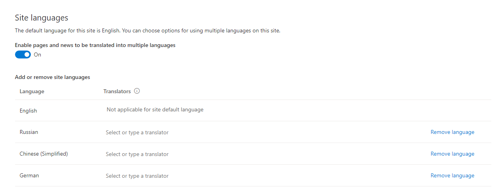

# Multilingual Pages Converter

## Summary

Multilingual Pages Converter is a .NET console application that allows you to convert a site previously using the PnP Multilingual Pages Application Extension to using the OOB SharePoint Online Multilingual Pages solution.

### Using the Multilingual Pages Converter

***PLEASE DO NOT ATTEMP TO USE THE CONVERTER UNTIL YOU HAVE VERIFIED THAT MODERN SHAREPOINT MULTILIGUAL PAGES IS ENABLED IN YOUR TENANT***

Before you start you should enable the OOB Languages settings in the site administration. Once configured, required site columns will be enabled on pages library.

The solution is designed to run on a site by site bases. It requires that you provide the Site Url, requests if you would like to run in cleanup* mode only, and then asks for a username and password.

>Make sure the user account you use is a site collection administrator.

When the solution starts it will validate that the Multilingual Pages extension is enabled (so don't disable it in advance) and will validate the OOB languages settings have been enabled. Then it will run through all pages that have been translated and will modify the metadata on those pages to be in compliance with settings required by the OOB feature. Once complete the Multilingual Pages application customizer will be disabled and the site columns and corresponding metadata will be removed from the site.

*If during the process there are any errors converting the metadata the log will reflect this and the cleanup step will be skipped.  The solution can be rerun as many times as is needed and also can be run only to provide cleanup if needed.

## Solution

Solution|Author(s)
--------|---------
MultilingualPagesConverter | Julie Turner (Sympraxis Consulting) - [@jfj1997](https://twitter.com/jfj1997)

## Version history

Version|Date|Comments
-------|----|--------
1.0.0|April 13, 2020|Initial release

## Disclaimer

**THIS CODE IS PROVIDED *AS IS* WITHOUT WARRANTY OF ANY KIND, EITHER EXPRESS OR IMPLIED, INCLUDING ANY IMPLIED WARRANTIES OF FITNESS FOR A PARTICULAR PURPOSE, MERCHANTABILITY, OR NON-INFRINGEMENT.**

---

## Minimal Path to Awesome

* Clone this repository
* Move to right solution folder
* Build the Visual Studio solution
* Enable and configure OOB languages settings in site administration
* Execute MultilingualPagesConverter.exe

## Features

This solution contains a solution that will migrate the metadata on SharePoint pages created with the Multilingual Pages Application Customizer to appropriate metadata values for the out of the box, SharePoint Multilingual Pages solution.

