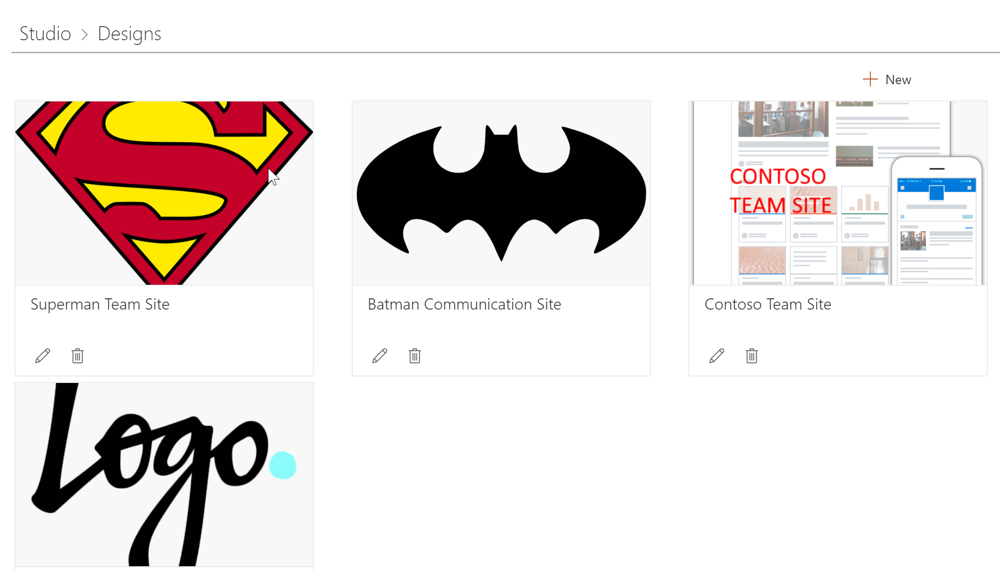
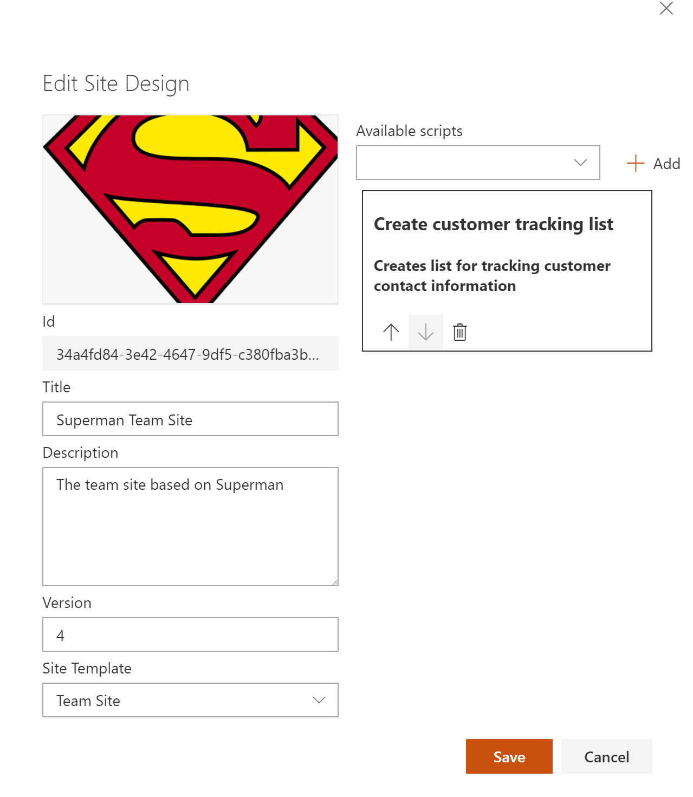
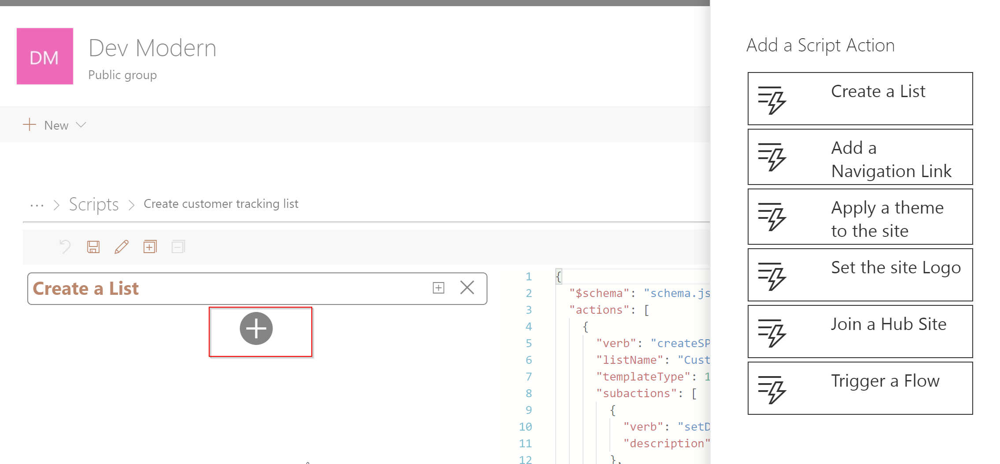

# Site Designs Studio

## NOTICE
This version has been superceeded by Version 2. 
Please visit: https://github.com/pnp/sp-site-designs-studio

## Summary
A SharePoint Framework WebPart allowing end-users to manage Site Designs and Site Scripts without the need to deal with JSON , PowerShell or REST

## Used SharePoint Framework Version 

## Applies to

* [SharePoint Framework](https://dev.office.com/sharepoint)
* [Office 365 tenant](https://dev.office.com/sharepoint/docs/spfx/set-up-your-development-environment)

## Solution

Solution|Author(s)
--------|---------
SiteDesignsStudio | Yannick Plenevaux (GitHub: @ypcode) (Twitter: @yp_code)

## Version history

Version|Date|Comments
-------|----|--------
1.1|March 29, 2018|Update comment
1.0|March 22, 2018|Initial release

## Disclaimer
**THIS CODE IS PROVIDED *AS IS* WITHOUT WARRANTY OF ANY KIND, EITHER EXPRESS OR IMPLIED, INCLUDING ANY IMPLIED WARRANTIES OF FITNESS FOR A PARTICULAR PURPOSE, MERCHANTABILITY, OR NON-INFRINGEMENT.**

---

## Minimal Path to Awesome

- Clone this repository
- Move to right solution folder 
- in the command line run:
  - `npm install`
  - `gulp serve`

## Features
Description of the extension with possible additional details than in short summary.
This extension illustrates the following concepts:

- Create, Edit and Delete Site Designs in the current Tenant
- Create, Edit and Delete Site Scripts in the current Tenant
- Edit Site Scripts with a user friendly GUI and save them directly in the current Tenant

