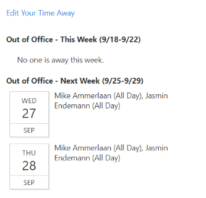

## Time Away web parts



The Time Away web part package provides a simple mechanism to track major away-times for team members.  

The Time Away web part contains two web parts:

	* A "Your Time Away" web part lets team members manage their time away from the office.
	* A "Time Away Summary" web part shows the overall set of time ways for the next two weeks in an organization.

When you add the web part for the first time, a user will need to create the backing lists within the site that support storage of Time Away entries.  A user with list creation permissions within the site will need to click the "Create Lists" button that shows up within the web part.

## Options and Configuration

You can choose to use the web parts separately -- for example, place the "Your Time Away" web part on a page for users to manage their personal information, and the Time Away Summary part on your home page.   Alternatively, you can just use the Time Away Summary web part by itself.  It optionally will show a "Edit your Time Away" summary link that users can use to adjust their time away.

You can also toggle whether the web part willl show a full week, or only show Monday/Tuesday/Wednesday/Thursday/Friday. 

Finally, you can also choose to use content approval features in SharePoint to set up simple notifications or approvals. Via a setting in the Time Away Summary web part, you can choose to hide Time Away out-of-office entries unless the Approval field is set to Approved. This gives administrators the ability to connect SharePoint approval features, or a workflow product like Microsoft Flow, tied to the Approval field in the Time Away list, to let managers choose to approve or hide fields.

### Building the code

```bash
git clone the repo
npm i
npm i -g gulp
gulp
```

This package produces the following:

* lib/* - intermediate-stage commonjs build artifacts
* dist/* - the bundled script, along with other resources
* deploy/* - all resources which should be uploaded to a CDN.

### Build options

gulp clean
gulp serve
gulp bundle
gulp package-solution
