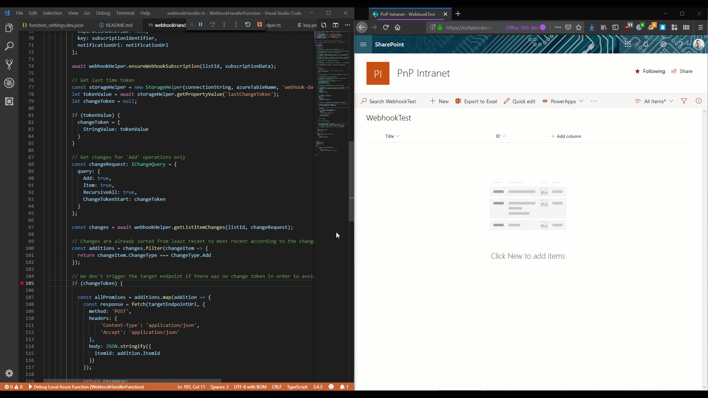
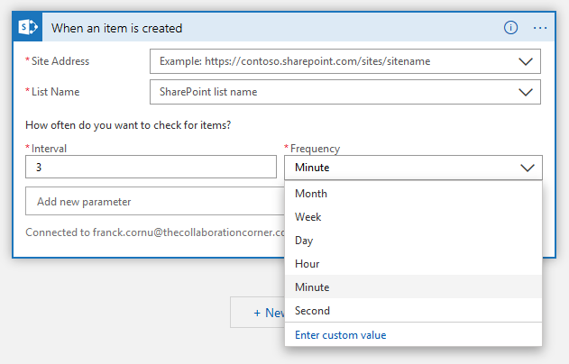
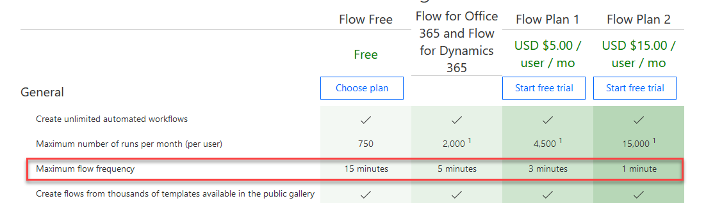
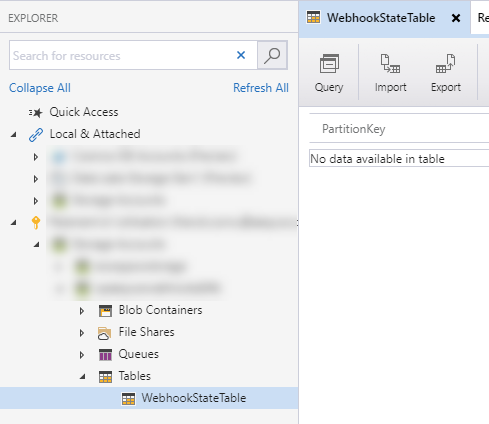
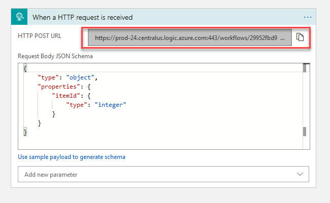
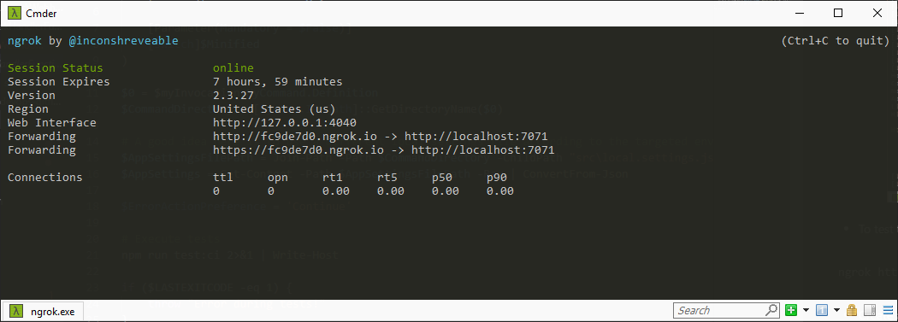
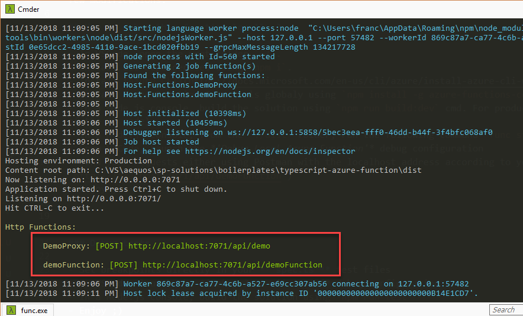
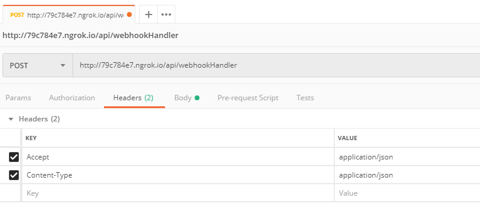

# SharePoint List Webhook Handler 


## Description

This function allows you to handle updates on a **list** by using a SharePoint webhook and a TypeScript Azure function. It has been implemented using the following [boilerplate](https://github.com/aequos-solutions/sp-solutions/tree/master/boilerplates/typescript-azure-function).

<p align="center"><p>

### Why an azure function instead of a Microsoft Flow or Logic App trigger?

Altough they are a quick and convenient way to catch numerous events from SharePoint (lists, etc.), [Logic App polling triggers](https://docs.microsoft.com/en-us/azure/logic-apps/logic-apps-workflow-actions-triggers#apiconnection-trigger) can be costly and unadapted especially when your solution requires to check for updates very often, for instance, in a site provisioning solution. 

<p align="center"><p>

With Microsoft Flow, the issue is slighty different because here, the polling frequency is limited, according to the official documentation, by your subscription plan.

<p align="center"><p>

Instead of relying on a polling strategy, this function leverages SharePoint webhooks to get notified when a new event occurs. This way, you don't have to worry of the trigger frequency anymore. The webhook subscription logic and updates retrieval are generic so you can reuse them easily in your solution. The function ensures the webhook subscription by creating one if doesn't exist or renew if expired.

## Applies to

* [Office 365 tenant](https://dev.office.com/sharepoint/docs/spfx/set-up-your-development-environment)

## Solution

Solution| Contributors(s)
--------|---------
WebhookHandlerFunction | Franck Cornu (aequos) - [@FranckCornu](http://www.twitter.com/FranckCornu)

## Prerequisites

### Azure AD app and certificate setup

This solution uses an Azure AD application with a certificate to communicate with SharePoint. It means you need to:

1.  Create an Azure AD app with the correct application permissions (ex: '_Sites.FullControl.All_') and associate it a certificate. You can refer to the following [procedure](https://docs.microsoft.com/en-us/sharepoint/dev/solution-guidance/security-apponly-azuread).


2.  Generate the certificate private key in _*.pem_ format and copy it to the _'./config'_ folder of your function. Use the [OpenSSL](https://wiki.openssl.org/index.php/Binaries) tool and the following command to generate the _.pem_ key from the _.pfx_ certificate:

```
openssl pkcs12 -in C:\<your_certificate>.pfx -nocerts -out C:\<your_certificate>.pem -nodes
```

You can also use the [`Get-PnPAzureCertificate`](https://docs.microsoft.com/en-us/powershell/module/sharepoint-pnp/get-pnpazurecertificate?view=sharepoint-ps) cmdlet to do the same:

```
Get-PnPAzureCertificate -CertificatePath "C:\<your_certificate>.pfx -" -CertificatePassword (ConvertTo-SecureString -String '<your_password>' -AsPlainText -Force)
```

### Create an Azure Table

This solution uses an Azure storage table to save the change token in order to track updates timeline from the list. The default table name is '_WebhookStateTable_':

<p align="center">

### Create an HTTP triggered Logic App

This function is first intended as a replacement for a [Logic App SharePoint polling trigger](https://docs.microsoft.com/en-us/azure/logic-apps/logic-apps-workflow-actions-triggers). To test it with this solution, create a new Logic App with an HTTP trigger with the following body playload schema:

```
{
    "itemId": 0
}
```

<p align="center"><p>

Then, set the logic app URL in the `function_settings.dev.json` settings file:

```
...
"webhookSettings": {
    ...
    "targetEndpointUrl": "https://prod-24.centralus.logic.azure.com:443/workflows/..."
},
...
```

Notice only the item ID is the sent by the function. To get item properties, use the appropriate Logic App SharePoint action.

### Configure settings

Configure other settings in the `function_settings.dev.json` settings file:

| Setting       | Description |
| -------       | ----------- |
| *appId*         | The Azure AD app id
| *tenant*        | The Office 365 tenant URL
| *resource*      | The SharePoint resource URL for you tenant
| *certificateThumbPrint*              | The Azure AD app certificate thumbprint
| *certificatePath*   | The certificate private key file path
| *listId*    | The SharePoint list ID to get updates from
| *webUrl*    | The web URL of the SharePoint list
| *subscriptionIdentifier* | An unique identifier for the SharePoint webhook subscription. Optional
| *notificationUrl* | The webhook notification URL. Should be the `ngrok` generated URL or the function URL in Azure
| *targetEndpointUrl* | The Logic App URL to call when a event is received from the list  
| *connectionString* | The Azure storage connection string to get/set the change token
| *azureTableName*    | The Azure storage table name

## Usage 

### Create the Webhook subscription

To first create the webhook subscription from the SharePoint list, you can either:

- Run the function for a first time, without any parameter. The subscription will be created wautomatically according to your parameters in the `function_settings.dev.json` settings file (list ID and notification URL).
- Use the `Add-PnPWebhookSubscription` PnP PowerShell cmdlet with the list id and notification URL (i.e. the function URL) to create the subscription manually.

### Configure list item changes request

In the `webhookHandler.ts` file, set the event(s) you want to retrieve in a list by setting the change request as follow:

```
// Get changes for 'Add' operations only
const changeRequest: IChangeQuery = {
    query: {
        Add: true,
        Item: true,
        RecursiveAll: true,
        ChangeTokenStart: changeToken
    }
};
```

### Set the subscription renewal period

By default, this value is set to 180 days for the webhook subscription. You can change it by setting the value in the `expirationRenewalDays` property in the `SharePointWebHookhandler` instance:

```
const webhookHelper = new SharePointWebHookHelper(webUrl, token.accessToken); 
webhookHelper.expirationRenewalDays = 30;
```

### How to debug this function locally ?

- In VSCode, open the root folder `./`.
- Install all dependencies using `npm i`.
- Install [Azure CLI](https://docs.microsoft.com/en-us/cli/azure/install-azure-cli-windows?view=azure-cli-latest) on youre machine.
- Install Azure Function Core tools globaly using `npm install -g azure-functions-core-tools@2` (version 2).
- Install [Azure Storage Explorer](https://azure.microsoft.com/en-us/features/storage-explorer/) to view or edit the change token
- Install ngork using `npm i -g ngrok`
- To test the webhook from SharePoint, in a Node.js console, use `ngrok` to redirect to your localhost function and set the generated URL as the webhook notification URL in the `function_settings.dev.json` file (i.e. _http://fc9de7d0.ngrok.io/api/webhookHandler_)

```
ngrok http 7071
```
<p align="center"><p>

- In a Node.js console, build the solution using `npm run build:dev` cmd. For production use, execute `npm run build` (minified version of the JS code).
- In a Node.js console, from the `./dist` folder, run the following command `func start`.

<p align="center"><p>

- From VSCode, Launch the *'Debug Local Azure Function'* debug configuration 
- Register the webhook either sending an empty POST request using Postman or use the PnP PowerSell cmdlet `Add-PnPWebhookSubscription`. Your function should be triggered at this step.

<p align="center"><p>

- Create a new item in the targeted SharePoint list to see the function trigerred as well.

#### Debug tests

- Set breakpoints directly in your **'spec.ts'** test files
- In VSCode, launch the *'Debug Jest all tests'* debug configuration
- In a Node.js console, build the solution using `npm run test`

#### Azure Function Proxy configuration ###

This solution uses an Azure function proxy to get an only single endpoint URL for multiple functions. See the **proxies.json** file to see defined routes. You can use proxy instead of original URL as the webhook notification URL.

### How to deploy the solution to Azure ? ##

#### Development scenario

We recommend to use Visual Studio Code to work with this solution.

- In VSCode, download the [Azure Function](https://code.visualstudio.com/tutorials/functions-extension/getting-started) extension
- Sign-in to to Azure account into the extension
- In a Node.js console, build the application using the command `npm run build` (minified version)
- Use the **"Deploy to Function App"** feature (in the extension top bar) using the *'dist'* folder. Make sure you've run the `npm run build` cmd before.
- Upload the application settings file according to your environment (`local.settings.json`)

#### Production scenario with CI

A `deploy.ps1` script is available to also deploy this function into your Azure environment.

- From you Azure portal, create a new empty function
- Set the `Azure_Function_Name` value in the `local.settings.json` accordingly.
- Login to Azure using `az login` then run `deploy.ps1` script with your parameters.
- Don't hesitate to refactor this to adapt to your situation.

***In both scenarios, you can test your function using Postman. If you test it using a SPFx component, don't forget to add the SharePoint domain to the CORS settings to allow this origin:***

<p align="center"><p>


