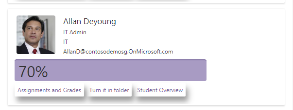
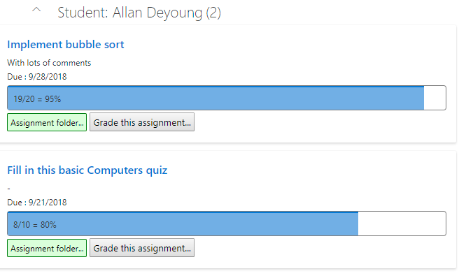
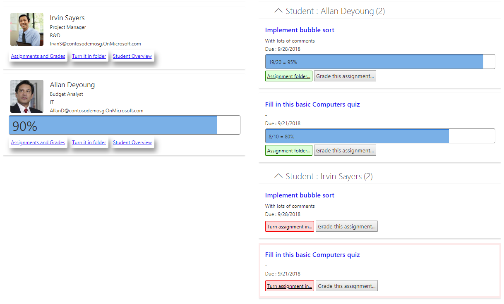
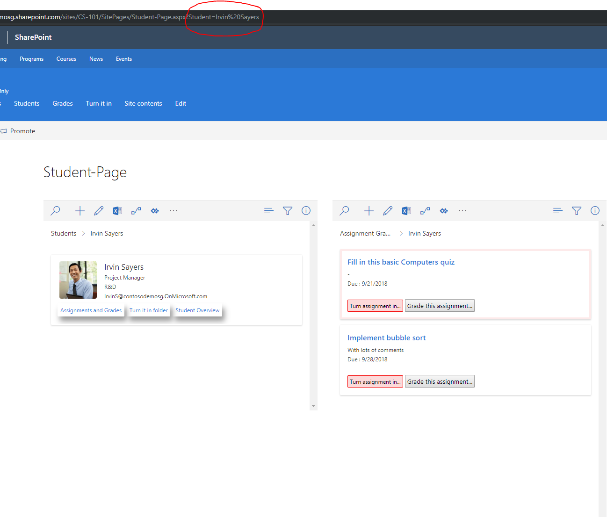
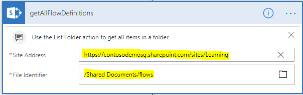
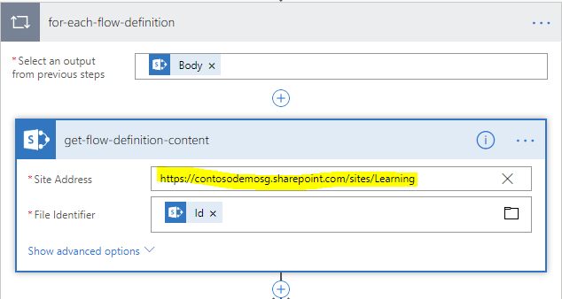
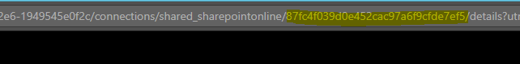
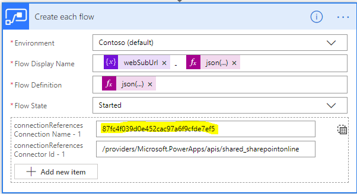
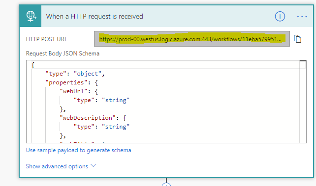

# Session: BRK3080 - Create 'No code' solutions with SharePoint and Flow.

## What is this session about?

This Ignite session is for SharePoint 'makers'. We will show you all the steps we took to create a full-fledged application. We picked an easy to understand scenario that covers multiple low-code extensibility mechanisms. The scenario incorporates business logic (using Flows) and no-code-custom-UI to make your application look great and responsive on all screen sizes. We will also walk you through a number of insider tips and tricks to get the most out of this session.

## So, what are we going to make?
We are going to make a typical classroom/corporate-learning application.

1. [We'll use SharePoint lists and libraries to store data.](#Lists)
2. [We'll take advantage of Microsoft Flows to apply the necessary business logic.](#Flows)
3. [We'll use the newly released view formatters on lists to completely customize the UX of the application so that it looks delightful and responsive on all screen sizes.](#ViewFormatters)
4. [We'll use modern pages, web-parts and dynamic web-part connections to create the home page and other tailor-made experiences for drill-in pages.](#Pages)
5. [And finally, we'll show you how to package up the application (Lists, Libraries, Flows, custom-ux etc.) using site scripts.](#SiteScripts)
6. [So that you can stamp out a new "classroom application" every time a site is created using the new hub-site join site script action.](#Packaging)

## How are we going to make this application?

### <a name="Lists"></a>We are going to start off with 4 lists.
1. Students: A list containing the students in the class. It will also capture the final grade for the student in this class
2. Turn-it-in: A document library that students will use to turn their assignments in
3. Assignments: A list that a teacher will use to create new assignments for students.
4. Grades: A list that will capture the grade of each student for each assignment

We will take advantage of SharePoint's ability to assign unique permissions to items in a list to create the application. We break inheritance (from the parent site) on each of these lists. At the beginning, nobody except the admin has access to these lists. We'll use logic (Flows) to grant selective access.

### <a name="Flows"></a>We will use [Microsoft Flows](https://flow.microsoft.com/en-us/) to handle the core business logic for the application. The following logic covers the gist of the classroom application.

1. **When a teacher creates a new student item in the Student list**, we will automatically create a folder in the Turn-it-in library specifically for that student. We will also set unique permissions on this item to ensure that only that student (and the teacher) have access to this student folder. In addition, we'll ensure that this new student list item is permissioned so that only this student has read-access to the item. This is to ensure that students can't see each others' grades.

2. **When a teacher creates a new assignment item in the Assignments list**, we will automatically create one list item for each student for that assignment. (i.e. if there are five students this will create five Assignment-Grade items). We will also set unique permissions on this item to ensure that only that student has read-access to this item. This item will contain the grade of the student for this assignment, so we don't want it visible to all the other students.

3. **When an Grade item gets automatically created** (because of the above Flow), we will automatically create a folder for this assignment inside the student folder in the Turn-it-in library. We will also copy over any attachments in the Assignment Item and put them into this folder that we just created. So, the Turn-it-in library will eventually be structured with top-level folders for each student and each student folder will contain a folder for each assignment. And each assignment folder might contain files for the assignment.

4. **When a student wants to turn in an assignment**, by adding or updating files in the assignment folder, they use a SharePoint required field to indicate status (e.g. Completed). Once a student marks a file as "Complete", we will automatically mark the corresponding grade item to be "Complete". Students don't have access to directly update a grade item (We don't want them updating their own grade).

5. **When a grade item gets updated**, (because a teacher might have changed a grade), we will automatically do the math to sum up all the grades for this student and sum up all total-grade-weight of the assignments and update the student's current overall-grade in the student list.

### Nitty-gritty details about each flow
While the top level logic is captured above, our app has seven discrete flows to accomplish the core business logic.

1. **When a new student is created -> Create a folder in the turn-it-in library with the email address of the student.**
    1. We use the SharePoint "item-created" trigger on the Student list to trigger this flow.
    2. <span style="color:red">Pro Tip!</span> : There is no out of box Flow method to create a folder in a SharePoint document library. But we have the ability to use SharePoint's "Send an http request" method and that's what we'll use here. In fact, that is an escape hatch that we can use often, since SharePoint's API surface is huge and with the "send an http request" action, we can leverage most of those API. Parameters:

        *Site Addresss*:URL to the  SharePoint site

        *Method*: POST

        *Uri*: _api/web/folders

        Headers: We'll need 2 additional headers. 

            *content-type*: application/json;odata=verbose

            *accept*:   application/json;odata=verbose
    
        *Body*:

        ```json 
        { 
            "__metadata": {
                "type": "SP.Folder" 
                },
            "ServerRelativeUrl": "/sites/classroom1/Turnitin/[[FolderName]]"
        }
        ```
        [[FolderName]] should be replaced with the name of the folder you want to create. In our case, it will be the email address of the student.

    3. Once the folder is created, we want to ensure that only this student has access to the contents. This will take a series of steps...
        1. We first get the metadata of the folder we just created. We again use the SharePoint "Send an http request" method. Parameters:

            *Site Address*: URL to the  SharePoint site

            *Method*: GET

            *Uri*:_api/Web/GetFolderByServerRelativePath(decodedurl='/sites/classroom1/Turnitin/[[FolderName]]')/ListItemAllFields

        2. The http request sends us JSON back that has a shape that looks like this. A lot of other metadata is returned, but since we only care about the ID attribute, we just display that below.
            ```json
                {
                "d": {
                    "ID": 2
                    }
                }
            ```

        3. <span style="color:red">Pro Tip!</span> : We'll be utilizing this mechanism (the next three steps) to grant specific permissions on an item a few more times, so we'll reference how to do it once here. [Serge Luca wrote a wonderful blog article](https://sergeluca.wordpress.com/2018/05/03/assign-unique-permissions-to-a-document-with-the-new-send-an-http-request-to-sharepoint-action-how-to-use-the-sharepoint-rest-api-in-flow/) describing in great detail how to use flows to assign permissions to an item. Thanks Serge! We now break inheritance on the folder we just created using the ID of the folder from the above step. We do this by making another "send http request" action. Parameters:

            *Site Address* : URL to the  SharePoint site

            *Method*: POST

            *Uri*:_api/lists/getByTitle('Turn-it-in')/items([[FolderID]])/breakroleinheritance(copyRoleAssignments=false,clearSubscopes=true)

        4. We now need to get the underlying "Principal ID" of the student so that we can then assign unique permissions on that ID. We do this again with a "send http request" action. Parameters:

            *Site Address*: URL to the  SharePoint site

            *Method*: GET

            *Uri*:_api/web/SiteUsers/getByEmail('@{triggerBody()?['Student']?['Email']}')

        5. Now that we have the ID of the student and the ID of the folder and we've broken inheritance on the folder, we can make the student have contribute permissions for the folder. We do this again by making a "send http request" action. Parameters:

            *Site Address*: URL to the  SharePoint site

            *Method*: POST

            *Uri*:_api/lists/getByTitle('Turn-it-in')/items(@{variables('folderID')})/roleassignments/addroleassignment(principalid=@{variables('principalIdOfStudent')} ,roledefid=1073741827)


2. **When a student is created-> assign read only permissions for that student on that item**

    We separated this flow from the one above simply for readability...The main goal here is to allow a student to have read only permissions for their item, but not have any other permissions for any other student item. After all, you don't want one student seeing the grades of another student. The flow here is very similar to the steps in 1) above, so I won't go into the exact details here... Basically, make 3 "send http action" methods to break inheritance, get the principal ID of the student from the email and finally, call the roleassignments/addroleassignment http method to set read only permissions. The roledefid that I used for readonly is 1073741826.

3. **When an assignment is created-> create a grade item for each student**

    We separated this flow from the one above simply for readability...The main goal here is to allow a student to have read only permissions for their item, but not have any other permissions for any other student item. After all, you don't want one student seeing the grades of another student. The flow here is very similar to the steps in 1) above, so I won't go into the exact details here... Basically, make 3 "send http action" methods to break inheritance, get the principal ID of the student from the email and finally, call the roleassignments/addroleassignment http method to set read only permissions. The roledefid that I used for readonly is 1073741826.

4. **When a Grade item is created -> Create a folder under the student folder in turn-it-in.**

    Step 3 above will automatically create a Grade item for each student for each assignment that's created. When this item is created automatically, we'll use it as a trigger to create a folder for this assignment inside the folder for the student that we already created in 1) above. In addition, this Flow also extracts any attachments that exist on the original Assignment item and copies them to the assignment folder we just created. There are lots of things going on in this Flow. Let's go through them one by one.

    1. Trigger: When an Assignment Grade is created

    2. Get the folder name of the student we created above. This is nothing but the student's email that we have as a column on the Grades list, so we have access to it.

    3. Create a variable with the name of the new folder we want to create. What I used was basically the name of the assignment with a bit of encoding. I used Flow's expression designer to create the following expression.

        ```
        replace(encodeUriComponent(replace(triggerBody()?['Assignment']?['Value'], ' ', '_')), '%', '0x')
        ```
    4. Create an assignment folder under the student folder in the Turn-it-in library. We use the "send an http request" action to achieve this.

        Site Addresss: URL to the  SharePoint site
            *Method*: POST  
            *Uri*: _api/web/folders  
            *Headers*: We'll need 2 additional headers.  
                    *content-type*: application/json;odata=verbose  
                    *accept*:   application/json;odata=verbose  
            *Body*:
        ```json
            {
                "__metadata": {
                    "type": "SP.Folder"
                },
                "ServerRelativeUrl": "/teams/classroom/Turnitin/@{variables('folderOfStudent')}/@{variables('folderForAssignment')}"
            }
        ```
    5. Set the folder location on the Assignment Grade item. We have the folder location of the folder we just created above. i.e. <code>Turnitin/@{variables('folderOfStudent')}/@{variables('folderForAssignment')}/</code> .So we use the update item action to set a field on the Assignment Grade item to this value. This will allow us to associate a particular Turn-it-in file with a specific Assignment Grade item.

    6. Now that we have a folder specifically for this assignment, we want to copy over all the attachments from the original Assignment item into the folder we just created. So, if the teacher wanted the students to fill out a worksheet, the worksheet will already be present in the assignment folder.
        1. We first get the list of attachments from the Assignment item. We use Flow's "Get Attachments" method. This returns a collection, then for each attachment, we do the following:

            - We get the attachment content using Flow's "Get Attachment Content" method.

            - And now we create a file in the folder we just created using Flow's "Create File" method.


5. **When an assignment-grade item is created, set read only permissions for the student that this belongs to.**
    After all, we don't want students looking at each others' grades. But we do want each student to be able to view his/her own grade. We do something similar to what we did in 1) above (make three "send http request" actions to break inheritance, get the principal ID of the student and finally set read only permissions).


6. **When a turn-it-in file is modified, update the appropriate Assignment-Grade list item to be marked as turned-in.**

    When a student finishes an assignment, they need a way to let the teacher know that they are done. So, the Turn-it-in folder has a field on it called "Status". When a student marks the "Status" of a file in the Turn-it-in folder as "Complete" then we will find the corresponding Assignment-Grade item for that file and update the status of that Assignment-Grade item to be "complete". Students don't have write access to the Assignment Grade item (we don't want them changing their own grade), so they can't modify it directly. Here are the steps for this Flow.

    1. Trigger: When a file in the Turn-it-in library is created or modified.

    2. We use Flow's condition construct to check to see if the "Status" field is "Complete".

    3. If the Status field is marked to complete, we need to find the Assignment-Grade item corresponding to this file. In 4.5 above, we marked the folder location on the Assignment-Grade item, so we'll use that here.

    4. We execute a "get items" action in Flow, to get items in the Assignment-Grades list and filter the results to just those items where the folder path of the current file matches the "TurnItInFolder" field on the Assignment-Grade item. There should be just one item returned. The filter we use is the following.  
    ```
    TurnItInFolder eq '@{triggerBody()?['{Path}']}' and Student/EMail eq '@{triggerBody()?['Editor']?['Email']}'
    ```

    5. Now that we have the Assignment Grade item, we simply update the "turnedIn" field on the Assignment-Grade item to be true. This will allow us to use have special UI to show when an Assignment is complete.


7. **When an Assignment-Grade item is modified, check to see if it's been graded and update the overall grade for the student**
    This is our last Flow. Once a student turns in an assignment, a teacher can assign a grade to the Assignment-Grade item by simply editing the item. But to ensure that an overall grade gets assigned to a student, we need to do a bit of math. A student's total grade is [sum of all individual grades]/[sum of all individual assignment weights]. That is, the weighted average of all grades. Here's how our Flow will do that.

    1. Trigger: When an Assignment-Grade item is modified.

    2. Check to see if the Grade field is non-null. If so, we continue, else we stop right here.

    3. We use Flow's "get items" action to get all the Assignment-Grades for this particular student. To do that, we specify the following filter on the query. 
    ```
    Student/EMail eq '@{triggerBody()?['Student']?['Email']}'
    ```

    4. For each Assignment-Grade item, we check to see if the there is a valid grade and if there is, we use Flow variables to sum up "all the grades" and "all the grade weights".

    5. Finally, we update the corresponding item in the Student list with the values above. We use 2 fields in the Student list (SumOfGrades and SumOfGradeWeights) to reflect the grade of a student. We'll then use View Formatters to display this with some nice UX that shows the grade percent etc.

### Changing the UX of the application.
#### <a name="ViewFormatters"></a>Applying custom view formatters to our lists
Now that we've created the core business logic of the application we are going to create UX for the application. After all, we want a classroom application to look and feel like a classroom application, not a set of generic lists. Last year, we released a feature that allowed a savvy user to create custom views on SharePoint list fields. We call this feature [Column formatting](https://docs.microsoft.com/en-us/sharepoint/dev/declarative-customization/column-formatting). A user can specify an "HTML template" that can data-bind to the fields in the list to create any custom HTML snippet for that field. We recently released a similar feature that allows a savvy user to provide an "HTML template" that can take over the rendering of the entire list row. This powerful feature enables a maker to completely take over the look and feel of a SharePoint list. We call this feature [View formatting](https://docs.microsoft.com/en-us/sharepoint/dev/declarative-customization/view-formatting).

We'll use this new view formatting feature extensively to customize the views of our various lists. If you've played with column formatters in SharePoint, you'll notice that there is a new "Excel style" syntax for expressions that is much simpler. This too was very recently released. [Marc Anderson's blog gives a good overview of this new expression syntax](https://sympmarc.com/2018/08/21/new-excel-like-format-for-column-formatting/).  
Thanks Marc! We'll make the views mobile friendly and responsive, so that the view looks good on all screen sizes. Let's take a look at some of these custom view formats.

1. **Student list**: We'll make each Student item look like the image below. To achieve this look, we use [this view-formatter JSON](./custom-formatters/Student.json).

      

    **Things to note**  
    1. The img element to create the photo of the student is below. Notice the expression for the "src" attribute. It's an easy to read expression that concatenates a few strings. 

    ```json
    {
        "elmType": "img",
        "attributes": {
            "src": "= @currentWeb + '/_layouts/15/userphoto.aspx?size=L&accountname=' + [$Student.email]"
        }
    }
    ```

    2. The data-bar width indicates the grade of the student. Notice that calculations for the width of the bar (based on grade) and the color of the text (based on grade) and the text content which is a calculated percentage. All these expressions use the new Excel style expressions that data-bind to fields on the current list item.

    ```json
    {
        "elmType": "div",
        "attributes": {
        "class": "sp-field-dataBars"
        },
        "style": {
            "width": "=if((Number([$Grade]) * 100 / Number([$SumOfGradeWeights])) > 100, '100%', if( Number([$SumOfGradeWeights]) <=0, '0%', toString(Number([$Grade]) * 100 / Number([$SumOfGradeWeights]) ) + '%')",
            "color": "=if((Number([$Grade]) * 100 / Number([$SumOfGradeWeights]) <= 90,'', '#007700')"
        },
        "txtContent": "=if( (Number([$Grade]) <= 0) || (Number([$SumOfGradeWeights]) <= 0) , '', toString(Number([$Grade]) * 100 / Number([$SumOfGradeWeights])) + '%')"
    }  
    ```

    3. The border property of the student card is also conditional. If the grade of the student is less than 60% then we show a red background color.
    ```
    "border": "=if(Number([$SumOfGradeWeights]) <= 0 , '2px solid transparent' , if((Number([$Grade]) * 100 / Number([$SumOfGradeWeights]) < 60 ,'2px solid #FFCCCC','2px solid transparent'))"
    ```

    4. There are a 3 buttons that are hyperlinks that allow you to drill into more details for this student. The buttons are hyperlinks to various SharePoint lists and pages filtered to this student.

2. **Assignment-Grade list**: We'll make each Grade item look like this. To achieve this look, we use [this view-formatter JSON](./custom-formatters/assignment-grades.json).

      
    **Things to note**

    1. Similar to the Student's list, we have data-bars that specify the grade for this assignment for the student.

    2. We have a hyperlink that is made to look like a button that take you to the specific Assignment folder for that student. Notice how we calculate href, txtContent, background-color.

    ```json
        {
            "elmType": "a",
            "attributes": {
                "href": "= @currentWeb + '/' + [$TurnItInFolder]"
            },
            "txtContent": "=if([$turnedIn] , 'Assignment folder...' , 'Turn assignment in...')",
            "style": {
                "background-color": "=if([$turnedIn] ,'#daffda','#ffdada')"
            }
        }
    ```

    3. We have an "action button" to allow the teacher to edit the current item. This button will only show up for the teacher, since the button is hidden for everybody else.

    ```json
        {
            "elmType": "button",
            "customRowAction": {
                "action": "editProps"
            },
            "txtContent": "Grade this assignment...",
            "style": {
                "display": "=if([$Student.email] == @me, 'none', 'inline-block')"
            }
        }
    ```

3. **Assignment list**: We will use [this view-formatter JSON](./custom-formatters/assignments.json).

#### <a name="Pages"></a>Creating a modern home page for the classroom
We can use modern pages, with list-view. Edit your home page and create a two column layout. In the left column, insert the "List (preview)" part and select "Students". In the right column, insert another "List (preview)" part and select "Assignment Grades". That's it! You now have a beautiful looking home page that has all the relevant information. A teacher will see all students on the left and a list of grades on the right. Each student will only see a card for themselves (their student item) on the left and they will only see their grades on the right.  


### Creating a drill in page for a single student using a Modern Page and Dynamic Data.
When a teacher goes to the home page, they see a list of students on the left and a list of grades (grouped by students) on the right. What if the teacher wants to "focus" on just one student (essentially see a view that the student sees of the home-page)? We have implemented just such a scenario. Notice that in our Student list view-formatter, we have a hyperlink button called "Student Overview". If you open the [Student view-formatter JSON](./custom-formatters/Student.json) file, you'll notice that there is a blob of JSON to represent that button. It looks like this.
```json
    {
        "elmType": "a",
        "style": {
        "cursor": "pointer",
        "padding": "6px",
        "border-radius": "2px",
        "box-shadow": "5px 10px 18px #999999",
        "margin-right": "5px"
        },
        "attributes": {
        "target": "_blank",
        "href": "= @currentWeb + '/SitePages/Student-Page.aspx?Student=' + [$Student.title]"
        },
        "txtContent": "Student Overview"
    }
```
Notice the value of the href attribute. It's pointing to a page called "Student-Page.aspx" and it has a query string parameter that is the name of the current student. We will use a new feature in Modern SharePoint pages to enable Web-Parts on the page to consume this query parameter to do all kinds of cool things. In this case, on a modern page called say "Student-Page", we'll create 2 web-parts that filter their value to the query parameter "Student". In this case, we'll use 2 embed web-parts, we'll enable dynamic data on those web-parts in the property panel, choose the "Page Context" as the "Connect to source", we'll then choose "Url Query Parameters" in the "Page Context's properties". We are now all setup to use query parameters in the URL as a source of "dynamic data". This first snippet here is for the first Embed web-part that we'll place on the left.  

```html
<iframe 
    width="100%" 
    height="450" 
    frameborder="0"
    src="https://contosodemosg.sharepoint.com/sites/CS-101/Lists/Students/AllItems.aspx?env=WebView&disableFeatures=1154%2C1162%2C1144&FilterField1=Student&FilterType1=User&FilterValue1=[$.Student]" 
    scrolling="no">
</iframe>
```

This snippet below is for the second Embed web-part that we'll place on the right.
```html
<iframe 
    width="560" 
    height="800" 
    frameborder="0" 
    src="https://contosodemosg.sharepoint.com/sites/CS-101/Lists/Assignment%20Grades/test.aspx?env=WebView&disableFeatures=1154%2C1162%2C1144&useFiltersInViewXml=1&FilterField1=Student&FilterType1=User&FilterValue1=[$.Student]"
    scrolling="no">
</iframe>
```
Both of these embed web parts point to list page views that are filtered to [$.Student] which will evaluate to the value of the "Student" query parameter in the URL. Also notice the "env=WebView" parameter we use in the IFRAME URLs above. This will tell the page to strip out chrome and render the part minimally, which is what we want.

A question that a curious reader might ask is "Why didn't we use List View Web Parts?" for this Student-Page.aspx? Short answer is that as of right now, the List View Web Part does not have the functionality to handle incoming dynamic data. It's a feature we need to go build.  



## Packaging the entire application as a template
OK, you've spent hours creating a fully functioning application. In our case, we've created a pretty powerful classroom application. We've used the UI paradigms in SharePoint to create lists, columns and associated list settings. We've used the Flow designer to create powerful flows. **But this works for just this one site**. You might wonder, could you automatically stamp out a "classroom" application every time a teacher creates a classroom site?


### An overview of hub-sites, site-designs and how you can combine them
A SharePoint [Hub-Site](https://docs.microsoft.com/en-us/sharepoint/dev/features/hub-site/hub-site-overview) connects "similar" sites together. For example, a company (Contoso) can create a SharePoint site called "Contoso Learning" that is a collection of various "classroom" sites.

When a site is "associated to a hub-site", we allow you to [setup site](https://docs.microsoft.com/en-us/sharepoint/dev/declarative-customization/site-design-overview) scripts that run when the current site "joins" the hub site.

So if we created a site-script that...

1. Creates the lists and fields and list settings that are needed
2. Creates the view-formatters for the various lists
3. Creates the Flows that are needed to stitch the application together, etc.

...we would be able to run this site-script every time a teacher creates a classroom site.

So, what's an easy way for a teacher to indicate they are creating a classroom site (as opposed to some other site)? We have a <span style="color: orange">not yet released feature</span> that will allow you to create a site from within a hub-site. This gesture will automatically create a new site and associate this new site with the hub-site. Alternately, joining a hub site that has an associated site-script will trigger the site-script to be run.

### <a name="SiteScripts"></a>Site scripts for your lists
Site scripts are JSON files that allow you to specify the creation of lists with their associated fields, views, formatters etc. You could create this JSON by hand, but that will take time, especially for a complex application like the above one, where we have 4 lists with many fields, views and formatters. To make things easier, we have a <span style="color: orange">not yet released feature</span> that allows you to extract the site-design for a specific list. You can use the API

```
URI: /_api/Microsoft.Sharepoint.Utilities.WebTemplateExtensions.SiteScriptUtility.GetSiteScriptFromList
Method: POST
Body: {"listUrl" : [Absolute URL of the list]}
```
OR in PowerShell
```powershell
Get-SPOSiteScriptFromList -ListUrl [Absolute URL ofthe list]
```


to extract the JSON blob that represents the site-design for each list. You can invoke this API via PowerShell, Flow or JavaScript. You can use the output JSON to construct your site-script to create all the lists, columns and view for your application.

### Create flows using a site script
There is no direct way to create Flows from a site-script *yet*. But, you can execute a Flow from within a site-script. And you can create Flows when a Flow runs. So, we can essentially create Flows when a site-script runs. [This article](https://docs.microsoft.com/en-us/sharepoint/dev/declarative-customization/site-design-pnp-provisioning#create-the-flow)  explains how to create a flow that gets triggered when a site-script runs. The site-script action to execute a Flow looks something like this. You would append this snippet of JSON to the end of your site script that created lists etc.

```json
    {
        "verb": "triggerFlow",
        "url": "[URL to trigger flow endpoint]",
        "name": "Classroom Uber Flow"
    }
```

### <a name="Packaging"></a>Register your Site Design (script) in SharePoint
Once you have created the JSON blob that represents your site-script, it's time to upload it to SharePoint and associate it with a Hub site. Our site-script that includes both list definitions that we extracted from the GetSiteScriptFromList API and triggerFlow action looks like [this](./site-designs/UberSiteDesign.json). It's important to know that site design actions run in the order that you specify them. You'll notice that we have all of our list creation site actions first and the last action is the "triggerFlow" action. This is intentional, because the Flow we trigger, will assume that the lists are already created. So, here's how you register your site design.

1. Make sure you've downloaded the [SharePoint Online Management Shell](https://www.microsoft.com/en-us/download/details.aspx?id=35588) so that you can run SharePoint PowerShell commands.

2. Open PowerShell and Get setup to run SharePoint PowerShell commands. In PowerShell, run the following commands
```powershell
    pushd "C:\Program Files\SharePoint Online Management Shell\Microsoft.Online.SharePoint.PowerShell"
    Import-Module .\microsoft.online.sharepoint.powershell.psd1 -DisableNameChecking
    popd
```

3. Login to your tenant using tenant admin credentials. Make sure you replace everything in [[]] with values that are specific to you.
```powershell
$adminUPN="[[tenantAdminEmailAddress]]"
$userCredential = Get-Credential -UserName $adminUPN -Message "Log In As Tenant Admin"
Connect-SPOService -Url https://[[yourSite]]-admin.sharepoint.com -Credential $userCredential
```

4. Upload your site-script to SharePoint. Replace everything in [[]] with values specific to you.
```powershell
$siteScript = Get-Content '[[pathToYourSiteScriptJsonFile]]' -Raw
$mySiteScript = Add-SPOSiteScript -Title "Classroom Site Design" -Description "Classroom Site Design" -Content $siteScript
Add-SPOSiteDesign -Title "Classroom site designs" -WebTemplate "64" -SiteScripts $mySiteScript -Description "classroom site design"
```

5. Associate a Site Design with a hub site, so that it runs every time a site joins this hub-site.

Get the GUID of your hub-site you want by running the get-spoHubSite command. Get the GUID of your SiteDesign by running Get-SPOSiteDesign

```powershell
$hub = Get-SpoHubSite -Identity [[guidOfHubSite]]
Set-SPOHubSite -Identity $hub.ID -SiteDesignId [[guidOfSiteDesign]]
```

### Extracting the definition of existing Flows
We've spent quite some time creating our Flows for our classroom application. You might ask if there was a way to extract the definition of those Flows, so you can reuse them. The good news is that there is. [You can export your Flows from the Flow UI](https://flow.microsoft.com/en-us/blog/import-export-bap-packages/) itself. Once you've exported your Flow to a zip file, the actual definition of the Flow is in a file called definition.json within that zip file.

So now we have seven JSON files for the seven Flows we created above. Unfortunately, the Flow definitions have hard-coded values in them. So, we manually templatized these JSON files to replace

1. Hard coded URLs to SharePoint sites with [[webUrl]]
2. Hard coded GUIDs to SharePoint lists with place holder strings like [[Students]] and [[Assignments]] and [[AssignmentGrades]] etc.


You can see what the end-result JSON definitions looks like for our seven flows.
1. [When a student is created -> create a folder in the turn-it-in library with the email address of the student](./flow-definitions/student-flow-full-definition.json)
2. [When a student is created-> assign read only permissions for that student on that item](./flow-definitions/student-created-unique-permissions-flow-full-definition.json)
3. [When an assignment is created-> create a grade item for each student](./flow-definitions/assignment-flow-full-definition.json)
4. [When an Grade item is created -> create a folder under the student folder in turn-it-in](./flow-definitions/assignment-grade-created-flow-full-definition.json)
5. [When an assignment-grade item is created-> set read only permissions for the student that this belongs to](./flow-definitions/assignment-grade-created-unique-permissions-flow-full-definition.json)
6. [When a turn-it-in file is modified-> update the appropriate Assignment-Grade list item to be marked as turned-in](./flow-definitions/turn-it-in-flow-full-definition.json)
7. [When an Assignment-Grade item is modified-> check to see if it was graded and update the overall grade for the student](./flow-definitions/assignment-grade-updated-full-flow-definition.json)

### Copy these Flow definitions to any document library on your tenant
Now that you have created these templatized Flow definitions, you should copy them to any document library. Our Flow that creates Flows will read these files and create Flows. We created a folder called "Flow" in the default document library of our Hub site.

### The uber Flow that creates Flows every time the site-script is run
In [our](./site-designs/UberSiteDesign.json) site-script that's associated with our Hub site, we have JSON that creates the relevant lists with fields and views and if you remember, the last site-script action was a "triggerFlow" action. The Flow it will invoke is the one we describe below. This is the Flow that will create all the 7 Flows that our classroom application needs to succeed.

Here is what it does

1. **Trigger**: When the appropriate http request is received when a site joins a hub site.
2. **We get the List of Lists for the current web** using the _api/web/AppTiles http request action.   This will give us a JSON blob of all the lists in the site. We want the GUIDs of each list so that we can replace our placeholder list GUIDs in the Flow definitions.
3. For each list, we get check to see if the display name of the list matches up with "Students" or "Assignments" or "Assignment Grades" or "Turn-it-in". We use a Flow switch statement to accomplish this.
4. For each of the above four lists (in the switch statement) we do the following
    1. Set a variable to the GUID of that list. (e.g. StudentListID, AssignmentListID etc.)
    2. We break inheritance on that list, so by default, these lists are only accessible to the site admin. We do this as we've done above by using Flows send http action and invoking the following
    ```
    Site Address: URL to the current SharePoint site
    Method: POST
    URI: _api/lists/getByTitle('@{items('ForEachList')['Title']}')/breakroleinheritance(copyRoleAssignments=false,clearSubscopes=true)
    ```
5. We get the list of flow-definitions we saved to our Hub-site's "Flow" folder. We use Flow's "List Folder" action to get the list of files.

6. For each file (Flow definition):

    1. We get the contents of the file using Flows "Get File Contents" action.
    2. We use Flow functions to do a string-replace for the following. Basically replace placeholder text in the file with actual values from the current site.
        1. [[webUrl]] -> URL of the current site.
        2. [[Students]] -> variable for the current Students GUID we got in 4.1 above
        3. [[Assignments]] -> variable for the current Assignments GUID we got in 4.1 above
        4. [[AssignmentGrades]] -> variable for the current Grades GUID we got in 4.1 above
        5. [[TurnItIn]] -> variable for the current Turn-it-in GUID we got in 4.1 above

    3. And finally use Flow's "Create Flow" method, to recreate each Flow. You'll have to specify the following parameters
        1. Environment: Your Flow's current environment which you can pick from the dropdown
        2. Flow Display Name: You can construct a display name based on the template Flow display name.
        3. Flow Definition: This is the main parameter. It expects JSON. So, you'll have to use the Flow Json() function to wrap the text contents of each Flow you created in 6.2 above.
        4. Flow State: Choose "Started" to start the flow automatically.
        5. Finally, you'll have to provide the "Connection" that will be used to create these Flows. You'll need 2 parameters here.
            1. Connecter ID: For SharePoint, this is a hard-coded string '/providers/Microsoft.PowerApps/apis/shared_sharepointonline'
            2. Connection Name: This is a bit trickier. This is the unique ID (the token) of the user under whose authority the Flow will be created. Do this by going to powerapps.microsoft.com, Gear menu -> connections -> click on the SharePoint connection and then in the URL address bar, copy the guid after shared_sharepointonline

7. That's it...  Now, when you have a site join your hub site, it will automatically get the site-design that creates lists and runs the flow that creates the Flows...

## Exercises for the reader
See how easy it would be for you to create Flows that
1. Send an email to each student the day before an assignment is due. Hint: You can use the Assignment-Grade list that contains the Assignment due date *and* the student email.

2. Send an email to the student when their assignment is graded.

3. Send a welcome email to a newly added student in the class.


## Steps to recreate this solution on your tenant
1. Make an existing site in your tenant into a SharePoint [Hub-Site](https://docs.microsoft.com/en-us/sharepoint/dev/features/hub-site/hub-site-overview)

2. Go to the default document library in the Hub-Site you created in 1) above. Create a new folder called "flows" in that document library.

3) Copy all the JSON files in the [flow-definitions](./flow-definitions) folder into the "flow" folder you created in 2) above.

4. Go to https://flows.microsoft.com and sign in and click on "My Flows" in the top left corner.

5. Click on "Import" at the top right and choose [this zip file that contains our uber flow definition](./uber-flow-definition/uber-flow-definition.zip). This is the Flow that creates all the other Flows when the site-script is run.

6. The Flow in 5. above uses a "Flow Management" connection and a "SharePoint" connection. You will be asked to recreate those two connections before you are allowed to proceed with the import. So, follow the instructions to create those two connections on your tenant.
    1. Click on the "Action" wrench icon of the flow to "Create as New"
    2. You might possibly need to create anew SharePoint connection. If you've already created one, you won't need to do this.
    3. You will likely need to create a new Flow Management connection.

7. The Flow in 5. above has a few hard-coded URLs that I used in my demo. You need to change these with the appropriate values that are relevant for you...
    1. Change URL of the site (and possibly folder location) in the getAllFlowDefinitions action. Make sure you replace the highlighted parts in the image below with the URL of your hub site and the folder you used in 3 above.    
    

    2. Change URL of the site in the get-flow-definition-content action. Make sure you replace the highlighted part in the image below with the URL of your hub site.    
    

    3. Change the environment in the Create each Flow action to be your environment. To do this, simply delete the old value, and use the dropdown to pick your environment which is displayed at the top right corner of the screen under your user name.

    4. Change the Connection Name in the Create Flow action at the end. You need to replace the highlighted value in the image below with a value that is your specific connection name for the SharePoint connector.  
 
        To get your specific "Connection Name" for the SharePoint connector, you do this:  

        1. Go to https://powerapps.microsoft.com and sign in.
        2. In the gear menu at the top-right, click on "Connections"
        3. Find your SharePoint connection and click on the link to see details.
        4. In the address bar of your browser, you'll see a long URL. You need to copy the highlighted part and that's what you'll use to replace the connection name.  
          

         
    5. Save your flow.

8. Now, copy [this site design JSON file](./site-designs/UberSiteDesign.json) to your computer. We need to replace one part of this site-script. Scroll down to the end of your site-script where you will see JSON that looks like this  
```json
	{
		"verb" : "triggerFlow",
		"url": "https://prod-16.westus.logic.azure.com:443/workflows/a04eee5f3e6748c88e890b6417ddccc6/triggers/manual/paths/invoke?api-version=2016-06-01&sp=%2Ftriggers%2Fmanual%2Frun&sv=1.0&sig=ZkplHl7fAUgceDTbdLTPQX5mb7oW6gF640OUJiqSPAQ",
		"name": "Classroom Uber Flow"
	}
```
We need to replace the value of the URL parameter above with the one that is relevant for you. To do that, open the Flow you created in 5 above. The very first trigger looks like the image below. Copy this "HTTP POST URL" and use this value in your triggerFlow URL parameter above.  
  

9. Now, you have a Flow setup on your tenant and your site-script is ready...Simply register the site script you finished editing in 8 above. Follow [these](#Packaging) instructions on how to register a site-script to a Hub-site.


## Solution information
This is a collection of how-to(s), with tips, examples and code snippets. It is meant to help the attendees of Ignite 2018 session BRK3080 follow along and get details about how things were made.


### Compatibility
This solution uses capabilities some capabilities that have not yet been released to SharePoint Online.

### Third-party libraries
This solution doesn't use any third-party libraries.


### Author
Cyrus Balsara ([Microsoft](https://www.microsoft.com))

### Version history

Version|Date|Comments
-------|----|--------
1.0.0|September 16, 2018|Place holder
2.0.0|September 25, 2018|Ignite 2018

## Disclaimer

**THIS CODE IS PROVIDED *AS IS* WITHOUT WARRANTY OF ANY KIND, EITHER EXPRESS OR IMPLIED, INCLUDING ANY IMPLIED WARRANTIES OF FITNESS FOR A PARTICULAR PURPOSE, MERCHANTABILITY, OR NON-INFRINGEMENT.**