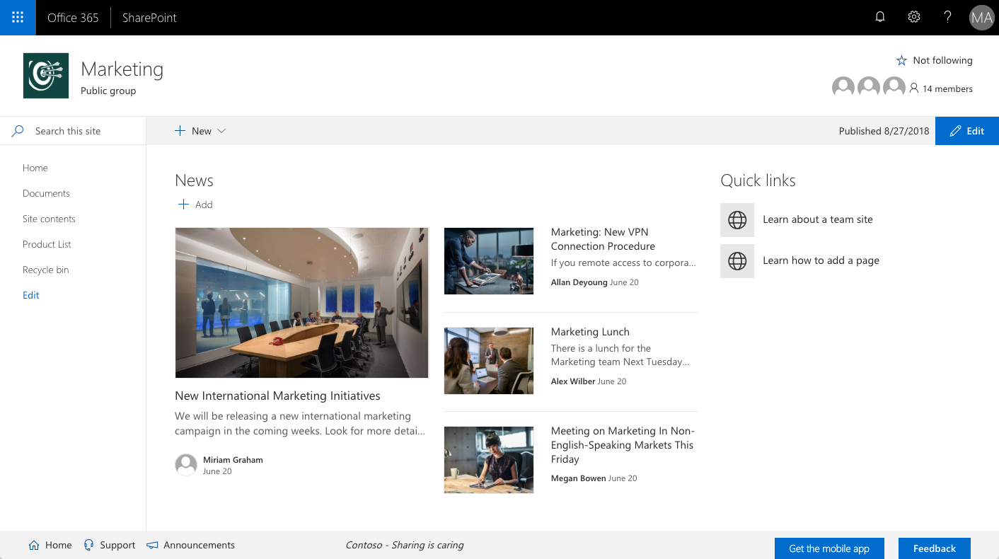
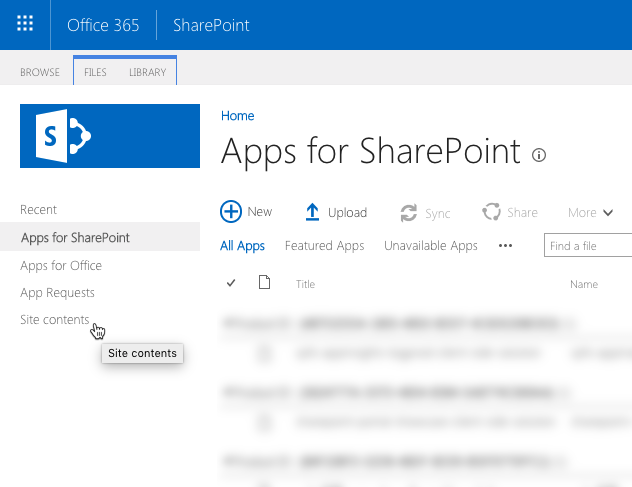
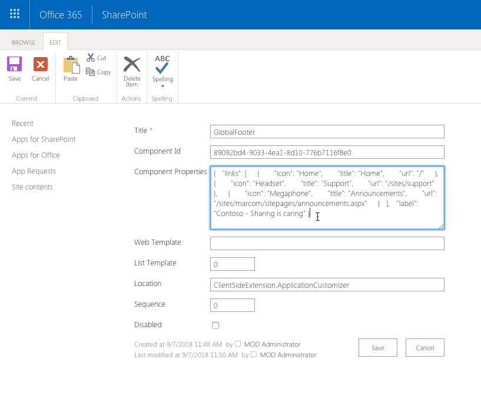

# Global Footer

Add custom footer to all sites in your SharePoint tenant to quickly access important resources in your organization.



## Features

- configurable links
- for each link, you can specify label, icon and target URL
- uses site's theme for consistent user experience
- automatically activated on all sites in the tenant so that users can easily access important information on any site

<a name="installation"></a>

## Installation

1. From the **sharepoint/solution** folder, add the **spfx-global-footer.sppkg** file to the tenant app catalog in your SharePoint tenant

2. When prompted, check the **Make this solution available to all sites in the organization** checkbox

    

<a name="configuration"></a>

## Configuration

To configure links for your portal, after deploying the solution in the app catalog:

1. In the tenant app catalog site, from the **Quick launch** menu, choose the **Site contents** option

    

2. On the **Site contents** page, from the list of contents in the current site, select the **Tenant Wide Extensions** list

    

3. In the **Tenant Wide Extensions** list, select the **GlobalFooter** item, and from the Ribbon, on the **Item** tab, choose the **Edit Item** button

    

4. In the **Component Properties** field, edit the JSON string with the links and the label

    

    For each link, you need to specify a title and a URL and optionally the name of a [Office UI Fabric icon](https://developer.microsoft.com/en-us/fabric#/styles/icons). If you don't specify the icon, no icon will be displayed next to that link.

    Optionally, you can also specify a label, which you can use to display your company motto, etc.

    Following is a sample JSON string, which will display three links and the label:

    ```json
    {
      "links": [
        {
          "icon": "Home",
          "title": "Home",
          "url": "/"
        },
        {
          "icon": "Headset",
          "title": "Support",
          "url": "/sites/support"
        },
        {
          "icon": "Megaphone",
          "title": "Announcements",
          "url": "/sites/marcom/sitepages/announcements.aspx"
        }
      ],
      "label": "Contoso - Sharing is caring"
    }
    ```

    Using this JSON string, would display the footer as follows:

    

## Troubleshooting

### No links are displayed

Check the web browser's developer tools. If you see the `No links have been configured. Please configure links in the footer's properties and refresh the page` error message, it means that the solution has been activated, but either no links are specified in the **Tenant Wide Extensions** list or there is an error in the JSON string and it cannot be parsed. Follow the [configuration steps](#configuration) to verify the extension's configuration.

If you don't see any error messages in the browser's console, verify if the solution is correctly deployed in the tenant app catalog, by following the [installation steps](#installation).

If the **GlobalFooter** entry is missing in the **Tenant Wide Extensions** list, redeploy the solution package in the app catalog.

### Footer is displayed multiple times

In the **Tenant Wide Extensions** list ensure that there is only one entry named **GlobalFooter**. If you see multiple entries, delete them and leave only one.

If in the **Tenant Wide Extensions** list you see only one entry named **GlobalFooter** and the footer is displayed multiple times, then most likely the solution has been explicitly installed on the particular site. Using [PnP PowerShell](https://docs.microsoft.com/en-us/powershell/module/sharepoint-pnp/get-pnpcustomaction?view=sharepoint-ps), [Office 365 CLI](https://pnp.github.io/office365-cli/cmd/spo/customaction/customaction-list/) or the SharePoint APIs deactivate the footer.

## Solution information


### Compatibility

This solution uses capabilities introduced in SharePoint Framework v1.6.0 which are supported only in SharePoint Online.

### Third-party libraries

This solution doesn't use any third-party libraries.

### Author

[Waldek Mastykarz](https://github.com/waldekmastykarz) (MVP, [Rencore](https://rencore.com))

### Version history

Version|Date|Comments
-------|----|--------
1.0.0|September 7, 2018|Initial release

## Disclaimer

**THIS CODE IS PROVIDED *AS IS* WITHOUT WARRANTY OF ANY KIND, EITHER EXPRESS OR IMPLIED, INCLUDING ANY IMPLIED WARRANTIES OF FITNESS FOR A PARTICULAR PURPOSE, MERCHANTABILITY, OR NON-INFRINGEMENT.**

